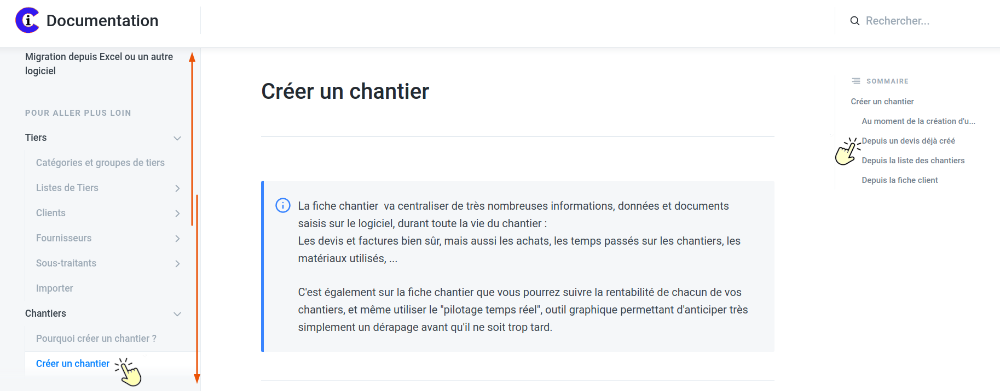

# Bienvenue sur la documentation de votre logiciel de gestion pour le bâtiment

\*\*\*\*💡 Suivez les nouveautés et évolutions de votre logiciel, en temps réel, dans la rubrique "[Nouveautés et évolutions](nouveautes-et-evolutions/annee-2021.md)"

## Comment utiliser la documentation ? 🎯 

Pour trouver rapidement la réponse à votre question :

👉 Saisissez un ou plusieurs mots dans le champ"Rechercher" en haut à droite de cette page

ou

👉 Naviguez dans la liste à gauche de cette page. Cliquez sur un thème et/ou sous-thème.

Accédez ensuite directement à l'information souhaitée grâce aux titres du sommaire à droite de cette page.

Vous trouverez également ci-dessous les questions les plus fréquemment posées par les utilisateurs.

De nombreux liens, [marqués en bleu](./), dans les différentes pages vous permettront de naviguer de manière simple et intuitive, n'hésitez pas à les utiliser.

## Les questions les plus fréquentes :













