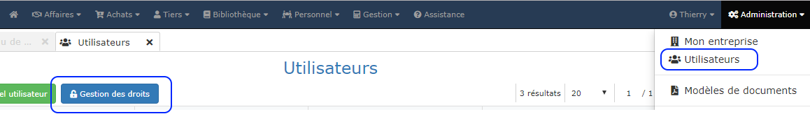

# Gestion des droits

La gestion des droits permet d'autoriser ou de bloquer l'accès de vos utilisateurs à certaines fonctionnalités du logiciel, selon les choix que vous aurez fait en définissant des "rôles", et en attribuant ces rôles à vos utilisateurs.

**3 rôles existent par défaut : le rôle Administrateur, le rôle Utilisateur, et le rôle Expert-comptable **

* **L' administrateur** a accès à toutes les fonctionnalités du logiciel, sans aucune restriction
* **L' utilisateur** n'a pas accès au menu "Administration" du logiciel
* **L' expert-comptable** a accès uniquement à la consultation des factures de vente et d'achat, au paramétrage de l'entreprise et des modèles de documents, aux exports comptables, ainsi qu'à la ProGBox pour exporter vos factures client en un clic. Il aura également accès au support technique via le menu "Assistance".


La gestion des droits utilisateurs est une option activée pendant votre période d'essai, mais n'est pas disponible par défaut.

\
Pour activer cette option, rendez-vous sous le menu "Administration > Ma boutique > Ajouter" des options ou contactez votre revendeur.


## Créer un nouveau rôle

Un rôle est un ensemble de droits que vous donnez à une catégorie d'utilisateurs, comme par exemple un rôle "Conducteur de travaux", un rôle "Administratif", un rôle "Commercial".

:digit_one: Ouvrez le menu "Administration > Utilisateurs"

:digit_two: Cliquez sur le bouton "Gestion des droits"

:digit_three: Cliquez sur le bouton "Nouveau rôle" et donnez un nom à ce rôle

:digit_four: Cochez les [fonctionnalités](gestion-des-droits.md#liste-des-permissions) autorisées pour ce rôle

:digit_five: Enregistrez.


Vous pouvez créer autant de rôles différents que vous le souhaitez.


## Attribuer un rôle à un utilisateur

:digit_one:** **Ouvrez la fiche d'un utilisateur à partir de la liste des utilisateurs

:digit_two: Dans le champs "Droits", sélectionnez le rôle que vous souhaitez attribuer à cet utilisateur

:digit_three: Validez.


Si votre version actuelle (hors période de test) n'intègre pas la gestion des droits, et que vous aviez défini des rôles, les utilisateurs se verront attribuer par défaut le rôle "Utilisateur".


## Modifier un rôle

Vous pouvez à tout moment modifier un rôle à partir de la liste des rôles.


Tous les utilisateurs dépendants de ce rôle verront leurs droits immédiatement mis à jour.


Les rôles "Administrateur", "Utilisateur" et "Expert comptable" sont des rôles définis par défaut et ne sont pas modifiables.

****

## Liste des permissions

### Administration

* Paramétrage de votre entreprise
* Gestion des utilisateurs et droits d'accès
* Gestion des modèles de documents
* Gestion de votre compte.

### Tiers

* Consulter les fiches clients
* Créer / modifier / supprimer des clients
* Consulter les fiches fournisseurs
* Créer / modifier / supprimer des fournisseurs
* Consulter les fiches des tiers (autres que clients et fournisseurs)
* Créer / modifier / supprimer des tiers (autres que clients et fournisseurs)
* Gérer la liste des types de tiers

### Affaires / Chantiers

* Consulter les fiches chantier
* Créer / modifier / supprimer des chantiers
* Consulter les devis
* Créer / modifier / supprimer des devis
* Créer / modifier / supprimer des devis type
* Imprimer les devis
* Consulter les factures client
* Créer / modifier / supprimer des factures clients
* Imprimer les factures clients
* Gérer le planning de chantier

### Achats

* Consulter les commandes fournisseurs
* Créer / modifier / supprimer des commandes fournisseurs
* Imprimer les commandes fournisseurs
* Consulter les bons de livraison
* Créer / modifier / supprimer des bons de livraison
* Consulter les factures fournisseurs
* Créer / modifier / supprimer des factures fournisseurs

### Bibliothèque d'Eléments / Ouvrages

* Consulter les éléments du catalogue
* Créer / modifier / supprimer des éléments du catalogue
* Consulter les ouvrages du catalogue
* Créer / modifier / supprimer des ouvrages du catalogue

### Personnel

* Consulter les fiches du personnel
* Gérer les fiches du personnel
* Consulter les heures travaillées
* Saisir les heures de travail

### Gestion / Comptabilité

* Voir les statistiques de l'activité
* Voir les opérations bancaires
* Saisir des opérations bancaires
* Paramétrage comptable
* Exports comptables

### Fichiers

* Accéder à l'espace d'archivage ProGBox
* Accéder à la galerie d'images

### Utilisateur

* Modifier ses préférences (Envois de documents, taux de TVA, ...etc)
* Accéder à mon agenda

### Support

* Accéder au support technique

