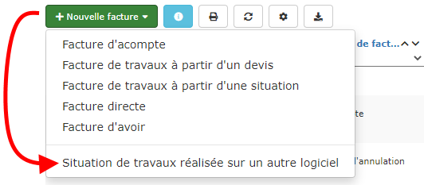

# 4⃣ Migration

#### Vous utilisiez Excel, ou un autre logiciel de devis / facturation, et vous souhaitez migrer sur notre logiciel de gestion.

Voici comment récupérer vos données principales, et assurer la continuité de votre activité.

## :digit_one: Importer vos fichiers clients, fournisseurs, tarifs

Vous pouvez très simplement importer vos fichiers [clients et fournisseurs](../pour-aller-plus-loin/les-tiers/importer.md), [fournitures et ouvrages](../pour-aller-plus-loin/bibliotheque-de-chiffrage/importer/import-de-fichier-fournitures-ou-ouvrages.md) depuis votre ancien logiciel, ou Excel.

Si vous n'y parvenez pas, n'hésitez pas à solliciter votre assistance, par le menu "Assistance" de votre espace client.

## :digit_two: Importer vos devis

L'intérêt est de pouvoir facturer un devis réalisé sur votre ancien logiciel, sans avoir à le ressaisir.

[Voici comment importer un devis](../pour-aller-plus-loin/les-devis/import-export.md#import-de-dpgf-et-devis-au-format-excel).

## :digit_three: Importer vos factures


**Il n'est pas possible d'importer les factures réalisées sur un autre système de facturation.**


Le logiciel est certifié conforme à la loi de finance de 2016 (dite loi anti-fraude à la TVA de 2018) (pour la France).

L'application de cette loi ne permet pas d'importer et de certifier des factures qui n'ont pas été réalisées sur notre propre système.

### Alors comment poursuivre la facturation de situations de travaux commencées sur mon ancien logiciel ?

Vous avez réalisé une ou plusieurs situations de travaux pour un chantier, sur Excel ou un autre logiciel, et souhaitez réaliser la prochaine situation sur ce logiciel.

\
La procédure n'est pas compliquée, mais réclame toute votre attention. Suivez-bien toutes les étapes :

#### :digit_one: Importez le contenu du devis

* Créez le devis sur le logiciel, et [importez son contenu](../pour-aller-plus-loin/les-devis/import-export.md#import-de-dpgf-et-devis-au-format-excel)
*   Bien entendu, vous pouvez importer le contenu de votre dernière situation, comme s'il s'agissait d'un devis.

#### :digit_two: Réalisez une situation de travaux

* Ouvrez la liste des factures
* Cliquez sur "Nouvelle facture"
* Choisissez "Situation de travaux réalisée sur un autre logiciel"

*   Choisissez le devis correspondant à cette situation, et créez la facture

    ****:warning: **Mettez à jour le numéro de la situation**, c'est à dire le numéro de la dernière situation réalisée sur votre ancien logiciel
* Saisissez les avancements de la dernière situation réalisée sur votre ancien logiciel
*   Finalisez la facture :

    :warning: **Le logiciel vous précise que cette facture ne sera pas comptabilisée.** En effet, elle sert juste de support à la prochaine situation que vous réaliserez sur le logiciel. La facture est validée en mode "Test", elle ne sera pas comptabilisée dans votre Chiffre d'affaires.

    ****

#### :digit_three: Réalisez la situation suivante sur le logiciel

* Ouvrez la situation de travaux "Test", et [créez une nouvelle situation](../pour-aller-plus-loin/les-factures/les-factures-en-detail/situation-de-travaux.md#realiser-les-situations-suivantes)
* Mettez à jour les avancements, contrôlez et finalisez la facture
*   Le logiciel vous proposera de continuer en mode apprentissage, ou de passer en mode réel, car la facture précédente est une facture de test :

    ****:warning: **Passez en mode réel**, la facture est ainsi validée en mode "réel", et tiendra bien compte de l'avancement précédent.

### Comment déduire un acompte déjà facturé sous l'ancien logiciel ?

Vous avez émis une facture d'acompte sous l'ancien logiciel et vous devez déduire cet acompte de votre prochaine facture :

:digit_one: Créez un devis sous le logiciel

:digit_two: [Importez le contenu de votre devis](../pour-aller-plus-loin/les-devis/import-export.md#import-de-dpgf-et-devis-au-format-excel) initial, ou saisissez-le manuellement

:digit_three: Créez votre [facture de travaux](broken-reference), ou [situation de travaux](../pour-aller-plus-loin/les-factures/les-factures-en-detail/situation-de-travaux.md), à partir du devis

:digit_four: Dans le pied de la facture, cliquez sur le petit crayon à côté de l'acompte :

Saisissez le montant à déduire (montant net à payer indiqué sur votre facture d'acompte)

