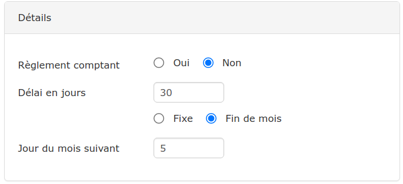
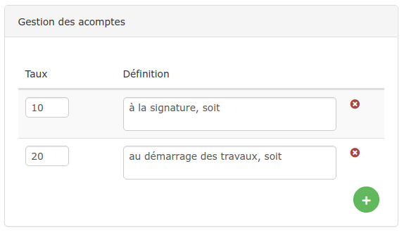
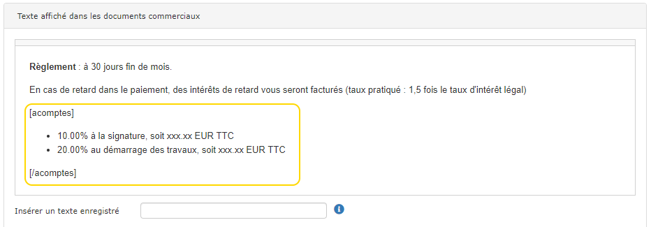
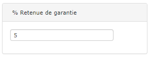
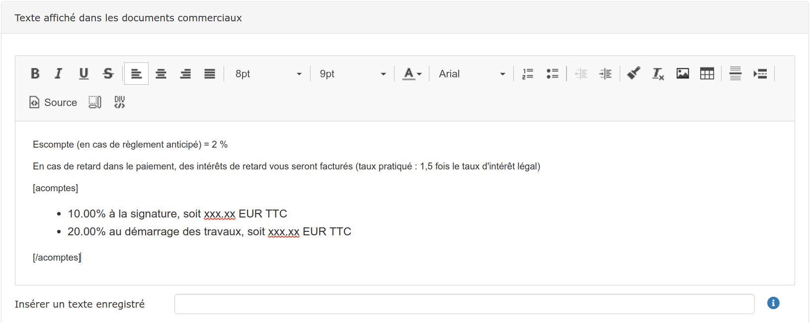

# Conditions de règlement

Vous pouvez définir vos conditions de règlement "par défaut", afin qu'elles soient appliquées à tout nouveau client, chantier, devis ou facture directe.

Les conditions "par défaut" sont personnalisables à tous les niveaux, et sont appliquées "en cascade".

Si vous définissez des conditions spécifiques pour :

* **Un client,** elles seront appliquées aux nouveaux devis réalisés pour ce client à la place des conditions par défaut
* **Un chantier,** elles seront appliquées aux nouveaux devis réalisés pour ce chantier, à la place des conditions spécifiques du client, ou des conditions par défaut
* **Un devis,** elles seront appliquées même si d'autres ont été définies pour le client et le chantier.


La facture "héritera" automatiquement des conditions de règlement du devis.


## Créer ou modifier les conditions de règlement

### 1 Conditions de règlement "par défaut"

* Ouvrez le menu "Administration" &gt; "Mon entreprise"
* Ouvrez la section "Autres paramètres"
* Cliquez sur "Conditions de règlement client"
* Une fois les conditions définies \(voir plus bas\), enregistrez.

### 2 Conditions de règlement spécifiques

#### Pour un client ou chantier :

* Ouvrez une fiche client ou chantier
* Dans le cadre "Conditions de règlement", cliquez sur "Modifier"
* Une fois les conditions définies \(voir plus bas\), enregistrez..
  * 💡 Cliquez sur "Enregistrer comme conditions par défaut" pour que ces conditions soient à la fois  appliquées au client \(ou au chantier\) et définies par défaut.
  *  Pour rétablir les conditions par défaut de votre entreprise, cliquez sur "Appliquer les conditions par défaut".

Ces conditions spécifiques seront appliquées par défaut sur tous les documents créés pour ce client ou ce chantier.

####  Pour un devis ou facture :

* Ouvrez votre devis
* Accédez à l'onglet "Pied" du devis
* Cliquez sur "Modifier les conditions"
* Une fois les conditions définies \(voir plus bas\), enregistrez.
  * 💡 Cliquez sur "Enregistrer comme conditions par défaut" pour que ces conditions soient à la fois appliquées au devis \(ou à la facture\) et définies par défaut.
  * Pour rétablir les conditions par défaut de votre entreprise, cliquez sur "Appliquer les conditions par défaut".

## Définissez vos conditions

### 1 Échéances

Ce paramètre permet au logiciel de calculer automatiquement la date d'échéance d'une facture.

* Règlement comptant : cochez "oui" si vous souhaitez un paiement comptant.
  * la date d'échéance appliquée sera la même que la date de la facture.
* Dans cet exemple, nous avons défini un règlement à 30 jours fin de mois.
  * la date d'échéance pour une facture du 15 Avril sera automatiquement calculée au 31 Mai.


💡 La date d'échéance calculée par le logiciel est proposée, mais pas imposée.  
Vous pourrez la modifier manuellement si nécessaire au moment de la validation de la facture.


### 2 Acomptes

Ce paramètre permet au logiciel de calculer et d'afficher sur le devis le montant du ou des acomptes prévus.

* Dans cet exemple, nous demanderons 10% d'acompte à la signature du devis, et 20% au démarrage des travaux.
* En fonction des taux et des textes que vous aurez saisis, le logiciel va créer un texte "dynamique", qui se mettra à jour dans vos devis en fonction du montant du devis, entouré de 2 "balises" \[acomptes\] et \[/acomptes\].


⚠ **Il est important de ne pas modifier les balises \[acomptes\] et \[/acomptes\] ni leur contenu, le calcul automatique ne se ferait plus.**

Bien entendu, les balises \[acomptes\] et \[/acomptes\] ne seront pas affichées dans le devis, et les xxx.xx seront remplacés par le montant réel de chaque acompte calculé en fonction du montant du devis.


\*\*\*\*

### \*\*\*\*3 **Retenue de garantie**

Le logiciel permet une gestion complète des [retenues de garantie](../../pour-aller-plus-loin/deductions-complementaires/retenue-de-garantie.md), de son application automatique sur chaque facture, à la demande de libération, et à la gestion de son remboursement.

Cela concerne le plus souvent les marchés publics, et n'est que rarement utilisé sur les chantiers aux particuliers.

Ce paramètre permet donc de définir le taux de retenue de garantie qui sera appliqué au marché. 

La retenue de garantie sera calculée automatiquement sur chaque facture au prorata de l'avancement \(situations de travaux\), et sera déduite du Total TTC.

### 4 Texte affiché dans les documents commerciaux

Ce paramètre vous permet de saisir le texte que vous souhaitez afficher dans vos conditions de règlement.

* Comme précisé un peu plus haut, le texte entre balises \[acomptes\] ne doit pas être modifié ici, mais dans le [paramétrage des acomptes](conditions-de-reglement.md#acomptes).
* Les zones de textes avant et après les balises \[acomptes\] sont totalement libres.
* Le champ "insérer un texte enregistré" permet de gagner beaucoup de temps si vous avez par exemple l'habitude de modifier vos conditions de règlement selon le type de chantier ou de client :
  * Cliquez à l'endroit ou vous souhaitez ajouter ce texte, puis dans la barre de recherche "insérer un texte enregistré" 
  * Vous pouvez ici récupérer les textes de vos différentes conditions de règlement

[_Cliquez ici pour apprendre à créer des textes pré-enregistrés._](../../les-plus-du-logiciel/bibliotheque-de-textes.md#les-textes-pre-enregistres)\_\_

