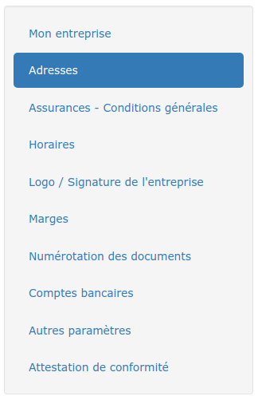
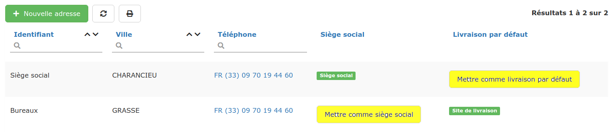
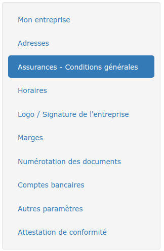
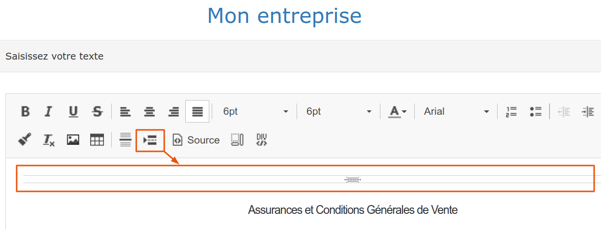

# Coordonnées et assurances de l'entreprise

## Adresses de mon entreprise

### 

### 1 Adresse du siège social

Le logiciel crée automatiquement une adresse fictive pour votre siège social lors de la création du compte. Vous devez bien sur mettre à jour cette adresse :

* Ouvrez la section "Adresses".
* Dans la liste, cliquez sur l'identifiant du siège social.
* Mettez vos coordonnées à jour, et validez.

### 2 Créez des adresses pour des agences, ou des dépôts

Dans la même liste, en cliquant sur le bouton "Nouvelle adresse", vous pourrez créer autant d'adresses que d'établissements de votre entreprise.


Le logiciel appliquera dans vos documents commerciaux l'adresse définie comme "Siège social"

* Pour définir une adresse comme étant le siège social, cliquez sur le bouton "Mettre comme siège social"

* Cliquez sur "Mettre comme livraison par défaut" pour définir le site de livraison.


## Assurances et Conditions générales

Un saut de page est déjà présent dans ce cadre, destiné à recevoir vos données d'assurances ainsi que vos conditions générales.

Il est recommandé de conserver ce saut de page car il permet, en fin de devis ou facture, de passer à la page suivante avant d'indiquer toutes ces informations, qui pourraient surcharger votre document.

Si vous avez supprimé ce saut de page, il est toujours possible de l'ajouter à nouveau :

* Cliquez dans le cadre de saisie, là où le saut de page sera créé
* Cliquez sur l'icône "saut de page" de la barre de traitement de texte :

💡 Si vous utilisez nos modèles de devis proposés par défaut pour imprimer/envoyer vos devis et factures, le contenu de ce cadre "Assurances et conditions générales" sera automatiquement affiché en fin de document, sans rien avoir à faire. Vous pourrez modifier cet affichage en [personnalisant vos modèles de document](../../les-plus-du-logiciel/modeles-de-document.md).

### Assurance professionnelle

Depuis le 20/06/2014, il est obligatoire de mentionner sur tous vos devis et factures \(pour la France\) :

* Les références de votre assurance professionnelle
* Les coordonnées de l'assureur
* La couverture géographique de votre contrat.

👉 Saisissez ces informations dans le cadre de conditions générales, sous le saut de page.

Si vous utilisez nos modèles proposés par défaut pour imprimer/envoyer vos devis et factures, vos donnée d'assurances seront automatiquement affichées au dessus de vos conditions générales de vente, sans rien avoir à faire.

➡ Vous pourrez personnaliser cet affichage en [personnalisant vos modèles de document](../../les-plus-du-logiciel/modeles-de-document.md).

### Conditions générales de vente

Ces conditions sont propres à votre activité, et permettent de vous "protéger", en cas de litige par exemple. C'est à vous de les créer.

Elles doivent être les plus claires et explicites possibles, dans votre intérêt, mais aussi dans l'intérêt du client.

Si vous utilisez nos modèles proposés par défaut pour imprimer/envoyer vos devis et factures, vos conditions générales de vente seront automatiquement affichées en annexe, sans rien avoir à faire.

➡ Vous pourrez personnaliser cet affichage en [personnalisant vos modèles de document](../../les-plus-du-logiciel/modeles-de-document.md).

