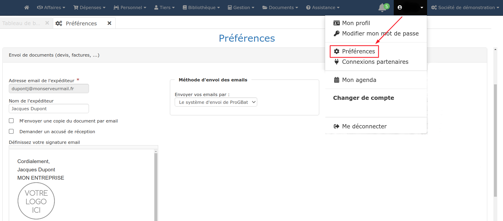
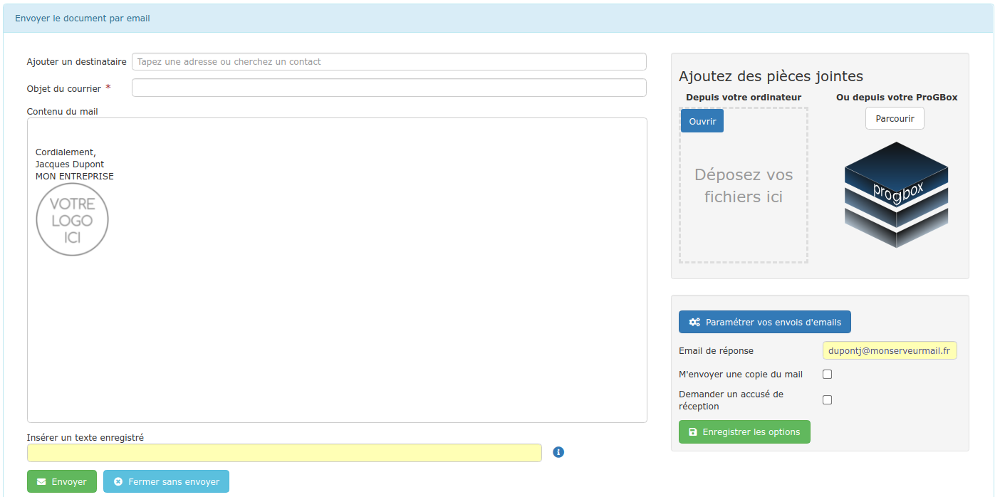
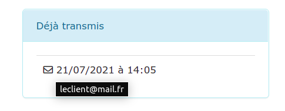

# Envois par mail

:bulb:Optez pour la [signature électronique](../../../les-plus-du-logiciel/signature-electronique/) de vos devis, pour un envoi, réception et archivage en un clic !

Vous pouvez transmettre tous vos documents par mail depuis le logiciel : devis, factures, commandes, ...

Par défaut, le logiciel utilise son propre serveur d'envoi de mails.

Bien que pratique, cette solution a l'inconvénient de considérer plus souvent les mails comme des spams ou indésirables. De plus, vos clients ne reçoivent pas le mail depuis votre adresse mail, mais depuis celle du logiciel.

**Il est donc conseillé de paramétrer votre propre messagerie dans le logiciel**, **en cliquant **[**ici**](parametrer-ma-propre-adresse-mail.md)**,** pour que vos mails soient parfaitement identifiés par vos clients et fournisseurs.

## **Paramétrer ma propre adresse mail**

Cliquez [ici](parametrer-ma-propre-adresse-mail.md).

## **Envoyer vos mails, facilement**

****:point_right:** **Après avoir ouvert un document (devis, facture), cliquez sur le bouton "Imprimer/Envoyer" puis sur "Envoyer par email" :

:digit_one: Cliquez dans la barre de recherche "Ajouter un destinataire" :

:bulb: Les adresses mail de tous les contacts de votre client s'affichent automatiquement, sélectionnez-en un. Vous pourrez juste après en ajouter un ou plusieurs autres

*   D'autres contacts apparaissent, appartenant à d'autres [catégories de tiers](../../../pour-aller-plus-loin/les-tiers/categories-et-groupes-de-tiers.md) (Maîtrise d'oeuvre, Architectes, Collaborateurs...), afin qu'ils aient une copie du mail.

*   Vous pourrez bien sûr saisir manuellement l'adresse mail du ou des destinataires.

:digit_two: Renseignez l'objet du devis ("Devis rénovation ..." par exemple)

:digit_three: Gagnez du temps de saisie, [insérez un texte pré-enregistré](../../../les-plus-du-logiciel/bibliotheque-de-textes.md) dans le contenu de votre mail

:digit_four: Ajoutez un ou plusieurs documents (plans, facture précédente,...), directement depuis votre [ProGBox](../../../les-plus-du-logiciel/progbox-archivage-de-documents.md), ou bien depuis votre ordinateur

:digit_five: Ne modifiez que si nécessaire l'adresse mail de réponse. :warning: Enregistrer les options modifie votre paramétrage d'envoi de mails.

## **Une fois le mail envoyé**

Si le document envoyé est un devis, il passera automatiquement au [statut](../../../pour-aller-plus-loin/les-devis/statut-des-devis.md) d'attente** **de retour client.

Les envois par mail sont automatiquement listés sous votre logiciel.

Accédez aux détails d'envoi depuis votre document, en cliquant sur le bouton "Imprimer/Envoyer".

Survolez la date d'envoi pour voir apparaître l'adresse mail des destinataires.

:bulb: Sur votre liste de devis, factures ou commandes, un document envoyé par mail sera immédiatement identifié :  

L'icôneen bout de ligne passera au bleu  
