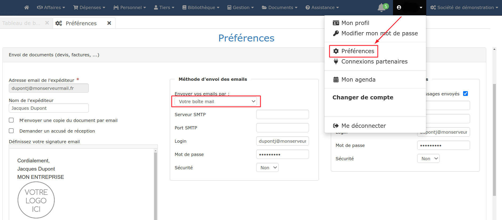

# Paramétrer ma propre adresse mail

:digit\_one: Ouvrez le menu utilisateur, et accédez à la page "Préférences"

:digit\_two: Saisissez (ou vérifiez) votre "Adresse mail expéditeur"

:digit\_three: Dans le menu déroulant central "Méthode d'envoi des emails", sélectionnez "Votre boîte mail"

_Vérifiez les données pré-remplies par le logiciel_

:digit\_four: Cochez la case "Copier vos mails dans votre boîte de messages envoyés" si vous souhaitez retrouver vos mails envoyés, via le logiciel, dans le dossier "Envoyés" ou "Sent" de votre boîte mail

:digit\_five: Enregistrez vos préférences

_Le logiciel va immédiatement tenter de se connecter pour vérifier les informations que vous avez saisies._

__

:bulb: Si vous ne connaissez pas les paramètres SMTP et IMAP de votre boite mail, [**suivez-ce lien**](https://assistance.orange.fr/mobile-tablette/tous-les-mobiles-et-tablettes/installer-et-utiliser/utiliser-internet-mail-et-cloud/mail/l-application-mail-orange/parametrer-et-configurer/mail-configurer-les-serveurs-sortants-et-entrants-des-principaux-comptes-mails\_47992-48856#onglet2), il peut vous aider. Sinon, adressez-vous à votre fournisseur de compte mail


### :bulb:_** **_**Astuces**_** **_:bulb:&#x20;

*   _ _**En cas de saisie incorrecte**, le logiciel va entourer en rouge ce qui pose problème en priorité. Vérifiez vos saisies à l'aide du pas à pas ci-dessus jusqu'à pouvoir enregistrer votre paramétrage. En cas de nouvel échec, adressez une copie écran de la page au support technique.

*   **Votre adresse mail est "grisée" et vous ne pouvez pas la modifier ?**

    * Dans le menu déroulant central "Méthode d'envoi des mails", sélectionnez le système d'envoi du logiciel pour réinitialiser la saisie
    * Modifiez votre adresse mail
    * Dans le menu déroulant central "Méthode d'envoi des emails", sélectionnez "Votre boîte mail" pour paramétrer à nouveau l'envoi via votre boîte mail.

*   **Veillez à ce que l'autorisation d'envoi de mails soit donnée au logiciel** dans les paramètres de votre boîte mail.

    Si vous ne savez pas où chercher, adressez-vous à votre fournisseur de compte mail.

*   **À la connexion ou au premier envoi**, vous recevrez peut-être par mail une alerte sécurité de Google, vous informant que "Quelqu'un s'est connecté à votre compte". C'est normal, ce "quelqu'un", c'est le logiciel.

* **Pour éviter (au maximum) que les serveurs mail de vos destinataires classent vos mails dans les SPAMs ou indésirables**, évitez de renseigner l'objet du mail tout en majuscules. Les logos contenant du texte dans l'image peuvent aussi être considérés comme de la publicité (donc indésirable) par le serveur mail de vos destinataires.


## Les cas particuliers

### Adresses Gmail et adresses professionnelles Google

Vous avez une adresse Gmail ou une adresse mail professionnelle Google, de type contact@monentreprise.com ou j.dupond@monentreprise.com ?

 (1).png>)

:digit\_one: Ouvrez le menu utilisateur (celui portant votre prénom, à côté du menu "Administration"), et accédez à la page "Connexions partenaires".

:digit\_two: Activez le bouton "Gmail - Envoi de documents par email", une fenêtre va s'ouvrir pour vous connecter à votre boîte Gmail / Google Workspace.

_Tous les mails envoyés depuis le logiciel seront disponibles dans votre boite d'envoi Gmail / Google Workspace._


* **Gmail vous demande de renouveler votre authentification au moment où vous envoyez un mail ? **_Cela arrive parfois pour des raisons de sécurité ou après un changement de mot de passe par exemple._
  *   Dans ce cas :

      :digit\_one: Ouvrez le menu utilisateur (celui portant votre prénom, à côté du menu "Administration"), et accédez à la page "Connexions partenaires"

      :digit\_two: Désactivez le bouton "Utilisez votre compte Gmail"

      :digit\_three: Réactivez-le et authentifiez-vous à nouveau.


###

### Adresses Hotmail et Outlook

* SMTP
  * Serveur : smtp-mail.outlook.com
  * Port : 587
  * Sécurité : TLS
* IMAP
  * Serveur : imap-mail.outlook.com
  * Port : 993
  * Sécurité :  SSL

###

### Adresses Exchange OVH

* SMTP
  * Serveur : ex4.mail.ovh.net (remplacer éventuellement "4" par le numéro de version qui vous a été donné par OVH).
  * Port : 587
  * Sécurité : TLS
* IMAP\
  _(Généralement, il n'est pas utile de renseigner l'IMAP pour ce type d'adresse. Dans ce cas, ne cochez pas la case "Copier vos mails dans votre boîte de messages envoyés")_
  * Serveur : ex4.mail.ovh.net (remplacer éventuellement "4" par le numéro de version qui vous a été donné par OVH)
  * Port : 993
  * Sécurité :  SSL ou TLS

###

### Adresses Exchange Office365

* SMTP
  * Serveur : smtp.office365.com
  * Port : 587
  * Sécurité : TLS
* IMAP\
  _(Généralement, il n'est pas utile de renseigner l'IMAP pour ce type d'adresse. Dans ce cas, ne cochez pas la case "Copier vos mails dans votre boîte de messages envoyés")_
  * Serveur : Outlook.office365.com
  * Port : 993
  * Sécurité :  TLS

