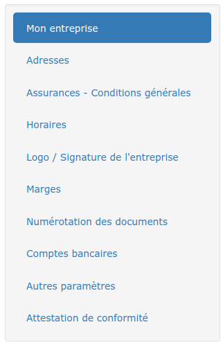

# Informations officielles de mon entreprise

:digit_one: Ouvrez le menu "Administration > Mon entreprise"

:digit_two: Renseignez les informations relatives à votre entreprise.


En France, le numéro SIREN est composé de 9 chiffres (le SIRET), et de 5 autres chiffres correspondant à l'établissement.\
**Dans les informations générales, ne saisissez que les 9 premiers chiffres**, les autres seront saisis en renseignant l'adresse du siège social, ou les adresses de vos différents établissements.


Si vous utilisez nos modèles proposés par défaut pour imprimer/envoyer vos devis et factures, certaines de ces informations seront automatiquement affichées, sans rien avoir à faire.

:arrow_right: Vous pourrez modifier cet affichage, ou ajouter des données officielles à afficher, en [personnalisant vos modèles de document](../../les-plus-du-logiciel/modeles-de-document.md).
