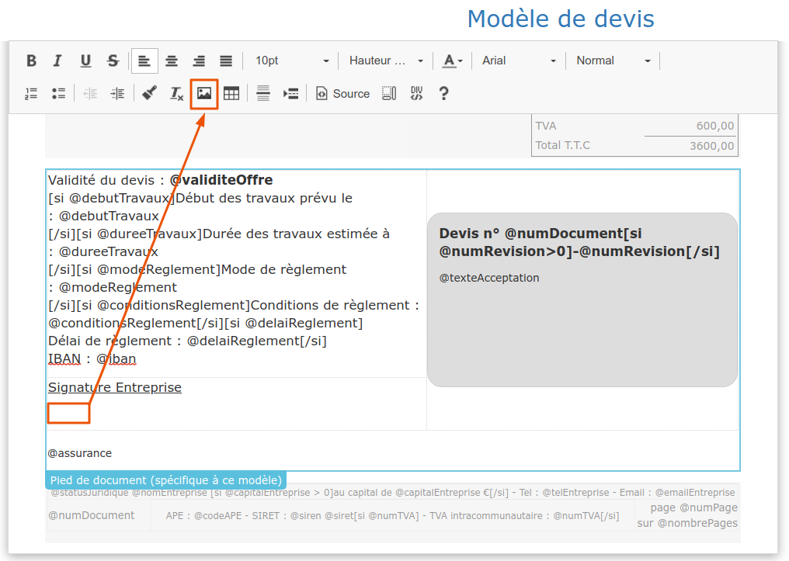

# Logo et signature de l'entreprise

## Ajouter / modifier le logo de mon entreprise

1 Ouvrez le menu Administration &gt; Mon entreprise

2 Ouvrez la section "Logo / Signature de l'entreprise".

3 Recherchez le fichier image de votre logo sur votre ordinateur, et importez-le.

4 Votre nouveau logo sera affiché automatiquement sur vos documents \(devis, factures, etc...\).

  
 💡 Vous pouvez également ajouter ou modifier votre logo à partir de la page d'accueil : Passez la souris sur le logo affiché en haut à droite de la page et cliquez sur le petit crayon qui s'affiche.


* Le fichier image doit être au format "png" ou "jpg".
* Les fichiers .pdf, .docx ne sont pas des images et ne sont pas reconnus.
* Si vous scannez votre logo, le fichier image obtenu aura la taille d'une page A4, mais votre logo n'occupera qu'une petite partie de la page. Si vous importez cette image, votre logo apparaîtra comme minuscule, avec énormément de "blanc" tout autour. Dans ce cas, avant d'importer l'image, ouvrez votre image dans un logiciel de dessin \(Paint par exemple sur Windows\), et supprimez tout le blanc pour ne garder que votre logo dans le fichier image.


Si vous utilisez nos modèles proposés par défaut pour imprimer/envoyer vos devis et factures, votre logo sera automatiquement affiché, sans rien avoir à faire.

➡ Vous pourrez ajouter des logos supplémentaires \(certifications par exemple\) en [personnalisant vos modèles de document](../../les-plus-du-logiciel/modeles-de-document.md), mais ils ne s'afficheront à l'impression/envoi du devis ou de la facture que si l'option "[Galerie d'images](../../les-plus-du-logiciel/galerie-dimages.md)" a été souscrite.

## Ajouter / modifier la signature de mon entreprise

1 Restez sur la section "Logo / Signature de l'entreprise".

2 Recherchez le fichier image de votre signature sur votre ordinateur, et importez-le \(tampon signé pris en photo ou scanné par exemple\)


* Si vous importez une photo de votre signature d'entreprise, le fond est souvent plus jaune que blanc et dénotera alors avec le blanc de la page de votre devis. Dans ce cas, ouvrez votre image dans un logiciel de retouche photo \("Photos" par exemple sous Windows 10\) et passez la photo en noir et blanc et/ou modifiez la luminosité et le contraste à votre convenance.
* Le fichier image doit être au format "png" ou "jpg".
* Les fichiers .pdf, .docx ne sont pas des images et ne sont pas reconnus.


3 Votre signature d'entreprise pourra alors être ajoutée à vos modèles de documents en cliquant sur l'emplacement choisi dans le modèle de document puis en cliquant sur l'icône "image" de la barre de traitement de texte. __[_Cliquez ici pour apprendre comment personnaliser un modèle de document._](https://app.gitbook.com/@batidocs/s/documentation/~/drafts/-McJt5VNooX1r4Tf5gcW/modeles-de-document/@drafts)\_\_

