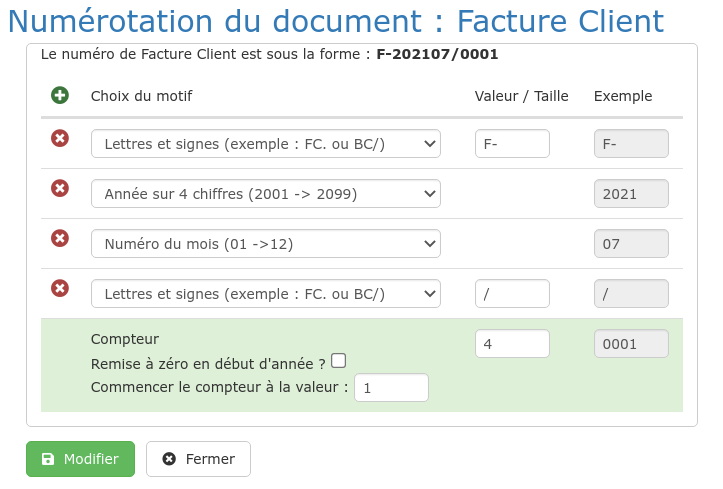

# Numérotation des documents

Le logiciel permet de paramétrer vos propres modèles de numérotation, pour poursuivre une numérotation existante par exemple.


La numérotation, notamment des factures, répond à certaines **exigences légales** :

* Le compteur de facture est toujours à la fin
* La remise à zéro du compteur chaque année est tolérée, mais à éviter
* La remise à zéro du compteur chaque mois n'est pas autorisée


## Numérotation des factures

1 Ouvrez le menu "Administration" &gt; "Mon entreprise"

2 Sélectionnez la rubrique "Numérotation des documents"

3 Cliquez sur "Factures clients"

Lors du paramétrage de votre logiciel, vous pouvez bien sûr ajouter, supprimer et modifier le contenu de chaque partie de votre numérotation pour obtenir le résultat souhaité.

**Dans cet exemple, le numéro :**

* Commence par les lettres et signe "F-". On aurait pu mettre "FAC" ou "F/" par exemple
* L'année \(date de la facture\) sur 4 chiffres
* Puis le numéro du mois \(date de la facture\) sur 2 chiffres
* A nouveau un signe, "/"
* Et enfin un compteur sur 4 chiffres. Dans cet exemple, bien sûr, après la facture 9999, le logiciel affichera bien la facture 10 000. 

_Pour des raisons de tri des numéros de factures, il est conseillé de prévoir un compteur suffisamment grand. Si vous pensez faire plus de 10 000 factures, mettez la taille du compteur à 5._


Par défaut, le logiciel fera démarrer la numérotation du compteur à 1.

Si votre dernière facture sous Excel ou un autre logiciel est la 126, alors saisissez 127 dans le cadre "Commencer le compteur à la valeur".


En regardant en haut du formulaire, vous verrez au fur et à mesure votre modèle tel qu'il sera utilisé par le logiciel. \(**F-202107/0001** dans notre exemple\).

#### 

#### Remise à zéro

Si vous cochez cette case, votre numérotation repartira à 1 chaque année civile.


* La remise à zéro du compteur chaque année est tolérée, mais à éviter
* La remise à zéro du compteur chaque mois n'est pas autorisée


