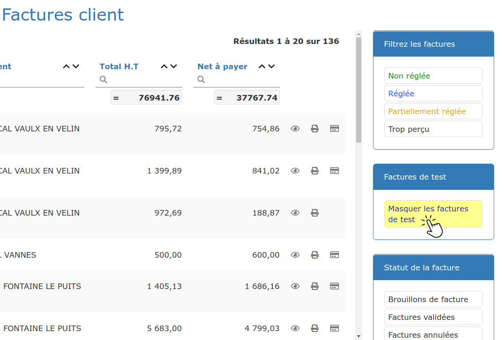

# Tester le logiciel

Lorsque vous, ou votre revendeur, créez pour la première fois votre compte sous le logiciel, vous bénéficiez d'une période d'essai gratuite. Vous pourrez alors utiliser le logiciel, comme s'il était déjà à vous.

Par défaut, **vous pourrez utiliser toutes les fonctionnalités de la licence la plus complète du logiciel**, ainsi que le module complémentaire "[Galerie d'images](../les-plus-du-logiciel/galerie-dimages.md)". Mais vous pourrez aussi effectuer cette période d'essai sur une des autres licences proposées, et par la suite à nouveau basculer sur la licence la plus complète.

Ainsi, vous saurez quelle licence convient le mieux à votre activité, à votre situation actuelle, et à vos besoins. Votre entreprise pourra bien sûr "grandir" avec le logiciel, et il saura s'adapter à votre évolution.

💡 Vous êtes déjà convaincu par le logiciel? Profitez de cette période d'essai gratuite pour commencer à [paramétrer votre entreprise](parametrage-de-mon-entreprise/) et[ importer vos clients et fournisseurs](../pour-aller-plus-loin/les-tiers/importer.md), [vos devis](../pour-aller-plus-loin/les-devis/import-export.md), vos [listes de fournitures et d'ouvrages](../pour-aller-plus-loin/bibliotheque-de-chiffrage/importer/import-de-fichier-fournitures-ou-ouvrages.md) ou [vos tarifs fournisseurs](../pour-aller-plus-loin/bibliotheque-de-chiffrage/importer/import-de-tarifs-fournisseurs.md). Lors de l'achat de votre licence, vous serez déjà prêt\(e\) à travailler sous le logiciel.

ℹ Vous avez plusieurs sociétés et comptez les gérer toutes avec ce logiciel? Passez d'un compte à un autre en 2 clics, grâce au "Compte gestionnaire" \(_contactez votre revendeur_\).

## Devis et factures "de test"

Au cours de votre essai du logiciel, vous bénéficiez du statut "en formation". Vous pourrez alors apprendre à créer des devis, et les facturer en "mode test", jusqu'à ce que vous décidiez de passer en "mode réel".

**Les devis créés pendant votre période d'essai**, qu'ils aient donné lieu à une facturation "de test" ou "réelle", ne pourront pas être supprimés \(sauf bien sûr s'ils n'ont pas été facturés\). Ils resteront dans votre liste de devis, sans aucun impact ni inconvénient, mais vous pourrez éventuellement les passer au [statut "refusé"](../pour-aller-plus-loin/les-devis/statut-des-devis.md), pour qu'ils ne vous "gênent" pas.

**Les factures "test"** porteront un numéro généré automatiquement, qui sera différent de votre [numérotation "officielle" de facture](parametrage-de-mon-entreprise/numerotation-des-documents.md), et précédé du symbole "$". Elles seront estampillées de la mention "Test", pour les identifier facilement. Ainsi, aucun malentendu possible en cas de contrôle fiscal :

**Ces factures "test" ne seront pas comptabilisées dans votre chiffre d'affaires et n'affecteront aucun indicateur de votre compte.**

Vous pourrez par la suite "masquer" vos factures de test, en cliquant sur le bouton dédié, à droite de votre liste de factures :

## Convaincu après ce test ? 

Cliquez ici pour savoir comment souscrire ou même renouveler votre licence.

