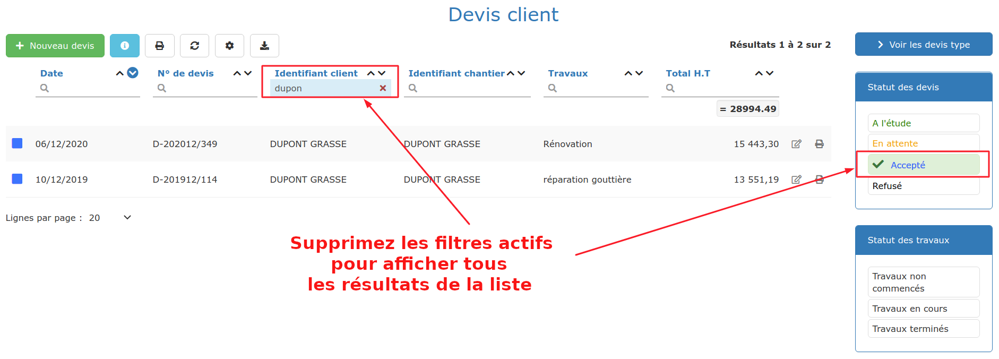
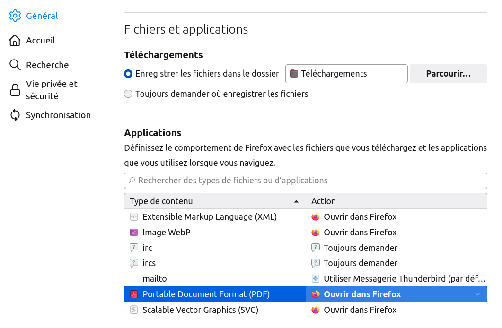

# 🆘 La  Panic'room  !!!

## Petite parenthèse au sujet du "Bug" :

####

#### L'origine du Bug

"Bug", en anglais, signifie "punaise", et plus généralement "insecte". Mais quel rapport entre un insecte, et un dysfonctionnement informatique ?

Même si l'origine réelle semble appartenir au télégraphe et au XIXème siècle, la popularisation du mot et son lien avec l'informatique remonte à 1946. On les doit à  [Grace Murray Hopper](https://en.wikipedia.org/wiki/Grace_Hopper), informaticienne au service de l'armée américaine, et au dysfonctionnement d'un ordinateur à cause d'un papillon de nuit coincé entre 2 relais.... Le bug était né !

#### Le bug d'aujourd'hui

Plus question de papillon coincé entre 2 relais, l'électronique a tout miniaturisé.\
Mais la complexité et la fréquence des mises à jour et évolutions des logiciels d'aujourd'hui entraîne souvent de petits bugs pour l'utilisateur, généralement agaçants, et la plupart du temps très vite corrigés.

Mais tout aussi souvent, ce que l'utilisateur pense être un bug, ne l'est pas, et les informaticiens s'amusent à dire que le bug est "entre la chaise et l'écran", c'est à dire dans l'utilisation du logiciel.

Voici donc ce qui parfois vous met en panique, vous agace, vous énerve, mais qui n'est pas un bug... 

## Tous mes devis ou factures ont disparu ! 

****

****:point_right: **Votre liste de devis (ou toute autre liste) est vide, ou presque ?**

****:point_right: **Vous ne retrouvez pas votre document dans la liste ?**

:digit_one: Vérifiez dans les entêtes de colonne qu'une recherche n'est pas active. Effacez les recherches en cours.

:digit_two: Vérifiez dans la partie droite de la page (cachée sur tablettes) qu'un filtre ou plusieurs filtres ne sont pas activés. Désactivez les filtres, ou sélectionnez uniquement ceux que vous souhaitez.

:digit_three: Vérifiez que vous n'êtes pas sur la dernière page de la liste, qui n'afficherait alors peut-être que les 2 ou 3 derniers devis.

Votre liste retrouvera tous ses petits.


:bulb: Si plusieurs utilisateurs utilisent le logiciel, chacun dispose de ses propres listes, avec ses propres filtres et recherches. Aucun risque de faire une mauvaise blague involontaire à votre collaborateur.


## Je viens de faire un devis, et il n'est pas dans la liste  

_"Et pourtant, je n'ai aucuns filtre ou recherche activés."_

Le plus souvent, c'est parce que vous venez de faire votre 21ème devis. 

La liste des devis est paramétrée par défaut pour afficher 20 devis sur une page.

Lorsque vous validez votre 21ème devis, celui-ci se retrouve en page 2, vous ne le voyez donc pas immédiatement à l'écran.


:bulb: L'idéal est de [trier vos listes de devis et factures par date](trucs-et-astuces.md#les-tris), de la plus récente à la plus ancienne. Ainsi, dès l'ouverture de la liste, la liste affichera les derniers documents réalisés.


## Impossible de travailler à plusieurs en même temps  

_"Le logiciel est pourtant bien prévu pour que plusieurs utilisateurs travaillent en même temps, mais dès que mon boss se connecte, je suis déconnecté."_

Pour que plusieurs personnes puissent travailler en même temps sur le logiciel, il faut que chacun ait son propre accès au logiciel, son propre espace "utilisateur".

En créant votre compte sur le logiciel, vous avez créé l'utilisateur principal, avec votre identifiant (adresse mail), et votre mot de passe.

Si vous souhaitez que d'autres personnes puissent se connecter au compte de votre entreprise, il faut créer des comptes "utilisateurs", chacun ayant son propre identifiant et son propre mot de passe, confidentiel et sécurisé.

[Cliquez ici pour apprendre à créer des comptes utilisateurs.](../aide-au-demarrage/les-utilisateurs/gerer-utilisateurs.md)

## Le Chiffre d'affaires affiché est faux  

_"Sur la liste des factures, le total de la colonne Total H.T. ne correspond à mon chiffre d'affaires, et en plus, il est différent du chiffre d'affaires affiché sur le graphique du tableau de bord. En fait, tout est faux ! "_

Rassurez-vous, tout est juste, mais il faut bien comprendre à quoi correspondent tous ces chiffres :

*   La liste des factures affiche un total en tête de colonne, mais ce total n'est absolument pas un chiffre d'affaires, **c'est simplement le total des lignes affichées**. 

    Dans votre liste de factures, vous avez des factures validées, des factures provisoires, des factures annulées, et des acomptes. Toutes ces factures seront ajoutées au total de la liste. 

    Evidemment, **ce total n'aura rien à voir avec votre chiffre d'affaires.**

*   Les factures d'acompte : Il faut bien comprendre qu'une facture d'acompte n'est pas une facture de travaux, et que fiscalement et comptablement, **les factures d'acompte ne sont pas du chiffre d'affaires.**

    Les factures d'acompte ne sont donc pas intégrées au chiffre d'affaires affiché sur le graphique du tableau de bord.

    Pas de panique ! Une fois la facture de travaux ou de situation de travaux effectuée, c'est la déduction de l'acompte qui permettra sa comptabilisation dans votre chiffre d'affaires.

    [Cliquez ici pour comprendre la différence entre acompte et situations de travaux](../pour-aller-plus-loin/les-factures/la-facture-dacompte.md#ne-pas-confondre-facture-dacompte-et-facture-davancement-situation-de-travaux).


**Pour connaître simplement et avec précision votre chiffre d'affaires :**

Ouvrez le menu "Gestion > Chiffres clé"

Les différentes sections vous donneront de nombreuses informations sur votre entreprise, vos chantiers, vos clients, et votre carnet de commandes.


## Le correcteur orthographique ne fonctionne pas 

Le logiciel utilise le correcteur orthographique de votre navigateur.

Lorsqu'un mot est souligné en rouge, cliquez sur ce mot et appuyez simultanément sur la touche **CTRL +  clic droit de votre souris **pour afficher la liste des corrections.

## Impossible d'imprimer ou envoyer mon devis - facture 

Il arrive parfois que la configuration de l'affichage des PDF se modifie lors d'une mise à jour du navigateur web, empêchant les devis et factures de s'afficher en impression.

****

### ****:point_right: **Mon devis & facture s'ouvre dans une autre fenêtre que le logiciel**

### ****:point_right: **Mon devis & facture s'enregistre en PDF dans mon ordinateur, avant que je ne puisse l'envoyer ou l'imprimer !**

****

Un exemple avec le navigateur Firefox **(à adapter à votre navigateur) :**

* Ouvrez le menu de Firefox (les 3 petits traits en haut à droite)
* Choisissez "Paramètres"
* Choisissez "Général"
* Descendez jusqu'à "Applications"
* Dans le type de contenu PDF, sélectionnez "Ouvrir dans Firefox"

## **Mon devis, ma facture, deviennent fous **

** **

### ****:point_right: **La numérotation des lignes du devis & facture est incohérente**

Le logiciel raisonne de façon logique et ordonnée, mais si on ajoute les titres après des lignes par exemple, la numérotation des lignes peut ne plus être cohérente. Il faut alors simplement réorganiser votre devis : commencez toujours votre devis par un titre, puis si nécessaire, déplacez-les pour que la numérotation des lignes reprenne du sens [Comment faire ? ](../pour-aller-plus-loin/les-devis/saisir-un-devis/nouveau-devis/saisir-les-lignes-du-devis/le-menu-de-lignes.md#deplacement-de-ligne)

### ****:point_right: **Le titre ou sous-titre du devis & facture est à 0 !**

En cliquant sur un titre & sous-titre, vous pourrez voir quelles lignes son total contient (fond bleu). Vous avez dû ajouter ou déplacer le titre après avoir créé les lignes du devis, le titre n'a donc pas encore de contenu (il est seul à avoir ce fond bleu) : il faut ajouter les lignes dans le contenu du titre grâce à la double flèche de déplacement. [Comment faire ? ](../pour-aller-plus-loin/les-devis/saisir-un-devis/nouveau-devis/saisir-les-lignes-du-devis/le-menu-de-lignes.md#deplacement-de-ligne)

### ****:point_right:** Le total du titre & sous-titre est incorrect**

Comme juste au dessus, en cliquant sur le titre, vous verrez que toutes les lignes ne sont pas contenues dans le titre (fond bleu). Il vous faut alors ajouter les lignes dans le contenu du titre grâce à la double flèche de déplacement.** **[Comment faire ? ](../pour-aller-plus-loin/les-devis/saisir-un-devis/nouveau-devis/saisir-les-lignes-du-devis/le-menu-de-lignes.md#deplacement-de-ligne)

****
