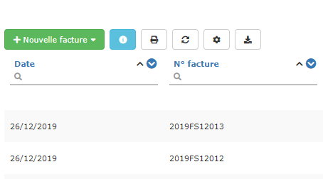
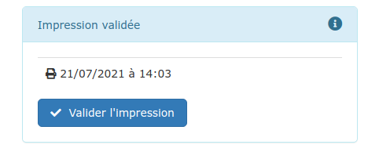

# Trucs et astuces

## Correcteur orthographique

Le logiciel utilise le correcteur orthographique de votre navigateur.

Lorsqu'un mot est souligné en rouge, cliquez sur ce mot et appuyez simultanément sur la **touche** **CTRL +  clic droit de votre souris **pour afficher la liste des corrections.

## Les listes

### **Les Recherches**

Cliquez dans un champ de recherche en entête de colonne :

* Pour une recherche **"Commence par"**, saisissez quelques lettres, la recherche commence automatiquement après 1 seconde.
*   Pour une recherche **"Contient"**, commencez votre recherche par % .

    % signifie "n'importe quels lettre, mot ou phrase" : tapez par exemple %platre%13 pour rechercher tout ce qui contient "platre" et "13", comme par exemple "Plaque de plâtre BA13."
* Rechercher une **date** :
  * Un système de recherche intuitif permet de faire une recherche en un clic ("ce mois-ci", "cette année", etc...).
  * Saisissez une date au format jj/mm/aaaa ou aaaa-mm-jj pour un jour précis.
  * Saisissez le mois et l'année au format mm/aaaa ou aaaa-mm pour un mois précis.
  * Saisissez l'année au format aaaa pour une année précise.
  * Saisissez 2 dates séparées par "deux point" pour une période : par exemple 01/02/2015:30/04/2015

Vous pouvez faire des recherches sur plusieurs colonnes en même temps.

### **Les tris**

Vous pouvez trier les colonnes en ascendant  ou en descendant, en cliquant simplement sur l'une ou l'autre des flèches** ******a.png>)****

Lorsqu'un tri est actif, la flèche apparaît dans une pastille bleue a.png>)

Pour changer l'ordre du tri, cliquez simplement sur l'autre flèche

Pour désactiver le tri d'une colonne, il suffit de cliquer sur la pastille pour la désactiver.

****:warning: **Attention**, le tri est réalisé dans l'ordre dans lequel vous l'activez :

Si vous triez la colonne Date, puis la colonne N° de facture, la liste sera triée d'abord par Date, puis par numéro de facture.

Ceci peut donner parfois l'impression que le tri ne fonctionne pas.

****:point_right: **En cas de doute sur l'ordre des tris, désélectionnez tous les tris et recommencez.**

### **Les fonctions**

 pour ouvrir cette page d'aide

 affiche la liste dans un nouvel onglet, dans un format que vous pouvez imprimer

 permet de rafraîchir la liste

 permet de paramétrer votre liste : ajouter des colonnes 

 exporte le contenu de la liste (toutes les pages) dans un fichier CSV, utilisable sur Excel, et le télécharge sur votre ordinateur. Activez les filtres et les tris 

 Le nombre de fonctions disponibles dépend de la liste affichée.

### **Nombre de lignes**

Par défaut, les listes contiennent 20 lignes par page. Vous pouvez modifier le nombre de lignes à afficher en bas à gauche de la liste.

Si le nombre de lignes de la liste dépasse le nombre de lignes affichées, un système de navigation apparaît en bas à droite de la liste.

## Les textes pré-enregistrés

Vous pouvez, à de nombreux endroits, insérer des textes pré-enregistrés, afin de gagner du temps: 

* Textes pour vos mails
* Commentaires récurrents dans devis et factures
* Objet de devis
* etc...

Cliquez [ici](../les-plus-du-logiciel/bibliotheque-de-textes.md) pour apprendre à créer ces textes pré-enregistrés.

## Les champs numériques : mini-calculatrices !

La plupart des champs numériques du logiciel sont des mini-calculatrices, dont le résultat est évalué lorsque vous sortez du champ (touche "Entrée).

Par exemple, pour le prix unitaire dans une ligne de devis, si vous tapez le texte suivant "5\*25", en sortant du champ, il prendra automatiquement la valeur 125.

## Champ "remise", et autres majorations/déductions des devis et factures

Dans ces champs qui se trouvent dans l'onglet "Pied" d'un devis ou facture, vous pouvez choisir de saisir : 

*   **Un montant :** 300 par exemple

* **Un taux**, en terminant votre saisie par le caractère " % " : 3% par exemple, le montant sera calculé automatiquement.

## **Historique d**'envoi**s** par mail

Les envois par mail sont automatiquement listés sous votre logiciel.

Accédez aux détails d'envoi depuis votre document, en cliquant sur le bouton "Imprimer/Envoyer".

Survolez la date d'envoi pour voir apparaître l'adresse mail des destinataires.

Si le document envoyé est un devis, il passera automatiquement en statut d'attente.

:bulb: Sur votre liste de devis, factures ou commandes, un document envoyé par mail sera immédiatement identifié : l'icôneen bout de ligne passera au bleu  

## Validation de l'impression d'un document

Pour que le logiciel se souvienne que vous avez imprimé un document, Appuyez sur le bouton "Valider l'impression".

:bulb: Sur votre liste de devis, factures ou commandes, un document dont l'impression a été validée sera immédiatement identifié : l'icôneen bout de ligne passera au bleu  

## Affichage en plusieurs colonnes

Il arrive souvent de vouloir afficher des textes sur plusieurs colonnes, souvent vos conditions générales de vente et assurance. Pour se faire, il y a une petite astuce vous permettant de la faire simplement :

* Saisissez votre texte
* Sélectionnez tout le texte que vous souhaitez faire apparaître en colonne et cliquer sur le bouton .png>)tout à droite du menu
* Dans le formulaire de création de division qui apparaît, Choisissez le Style "bloc 3 colonnes" pour afficher votre texte sur 3 colonnes. 
* Il est possible d'afficher sur 2, 3 4 ou 5 colonnes votre texte

.png>)

Si vous souhaitez annuler vos blocs, faîtes un clic-droit sur votre texte, et cliquer sur "Enlever la division"
