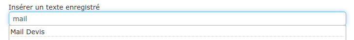

# Bibliothèque de textes

## Les textes pré-enregistrés

Vous pouvez, à de nombreux endroits, insérer des textes pré-enregistrés, afin de gagner du temps. 


:bulb: Les textes pré-enregistrés dans la bibliothèque de textes pourront être utilisés dans de nombreuses circonstances :

* Dans le contenu des mails que vous envoyez à vos clients, pour définir par exemple un mail type d'envoi de devis
* Dans les [conditions de règlement](../aide-au-demarrage/parametrage-de-mon-entreprise/conditions-de-reglement.md)
* Dans le contenu des devis et factures, sous forme de commentaires (gestion des déchets par exemple)
* Dans les textes d'acceptation des devis, si vous changez régulièrement ce texte en fonctions des types de marchés
* etc...


### Créer un texte pré-enregistré :

:digit_one: Ouvrez le menu "Bibliothèque > Textes"

:digit_two: Cliquez sur "Nouveau texte"

:digit_three: Saisissez un texte, et donnez-lui un identifiant pour le retrouver et l'utiliser facilement

:digit_four: Enregistrez.

### **Insérer un texte pré-enregistré :**

De nombreux champs sous le logiciel permettent d'ajouter des textes pré-enregistrés, afin de vous faire gagner du temps de saisie (Envois par mail, Objet du devis, Conditions de règlement, Texte d'acceptation du devis, ...).

:digit_one: Cliquez à l'endroit où vous souhaitez faire apparaître le texte pré-enregistré

:digit_two: Saisissez les premières lettres de l'identifiant du texte pré-enregistré, ou cliquez simplement dans la barre de recherche, et sélectionnez-le dans la liste proposée. Le texte apparaît, et peut être modifié au besoin.

