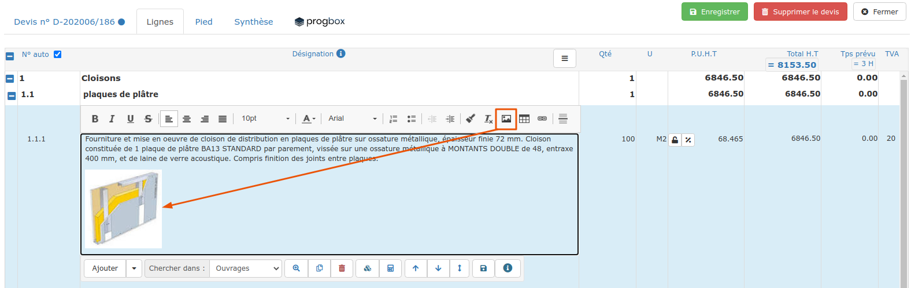

# Galerie d'images

:bulb: Le logiciel vous permet de gérer une bibliothèque d'images, notamment pour agrémenter vos devis, en apportant à votre client une information visuelle, claire et professionnelle.

Vous pouvez gérez les images sur 2 niveaux :

## ****:digit_one: **Dans vos devis et factures, et dans votre bibliothèque**

Quand le champ de saisie est un traitement de texte, comme par exemple le champ du libellé d'un ouvrage, vous pouvez insérer une image dans votre texte :

:point_right: En cliquant sur l'icone imagedu traitement de texte

:point_right: Ou bien en glissant / déposant vos images directement.

Une fenêtre s'ouvre, vous permettant de rechercher, choisir, ou ajouter une image, et de l'intégrer dans votre texte à l'endroit souhaité.

Si vous ajoutez une image dans la fiche de l'ouvrage depuis votre bibliothèque, cette image sera automatiquement affichée dans votre devis ou facture, en "appelant" cet ouvrage.


### Astuce

#### Rotation d'une image :

Il arrive parfois que l'image ne soit pas dans le bon sens.

Cliquez sur l'image avec le bouton droit de la souris, et choisissez le sens de rotation.


## ****:digit_two: **En attachant une ou des images, à une fiche**

Vous pouvez attacher une ou plusieurs images à :

:point_right: Une fiche Ouvrage : Attachez plusieurs photos de l'ouvrage

Lorsque vous demanderez à afficher une image dans une ligne de votre devis, la galerie vous proposera les images attachées à l'ouvrage, ou de choisir dans toute la galerie.

:point_right: Une fiche Personnel : Archivez directement dans la fiche personnel la carte vitale, le permis de conduire, la photo d'identité, etc...

:information_source: Attachez tous vos plans et documents à vos chantiers, clients, fournisseurs, etc..., et retrouvez-les en un clic depuis plusieurs endroits en un clic, grâce à la [ProGBox](progbox-archivage-de-documents.md).

