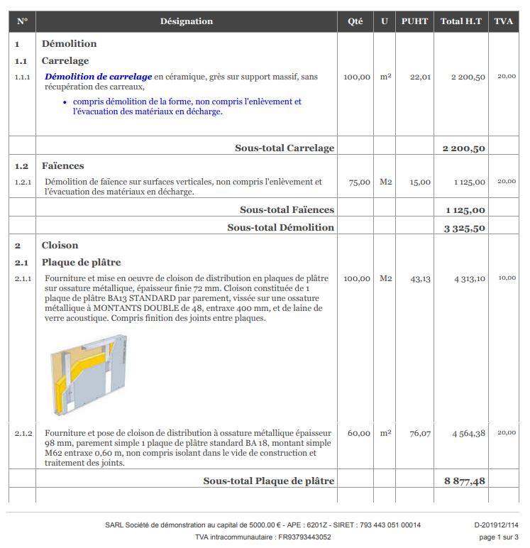
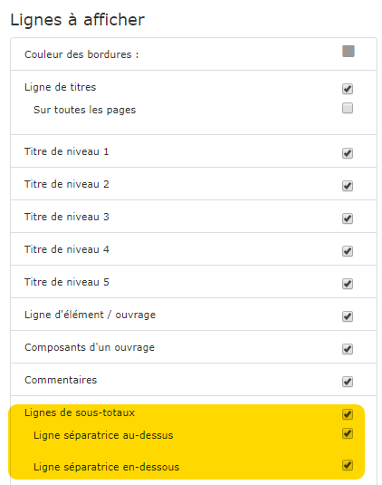

# Modèles de document

Des modèles de devis, factures, commandes fournisseur, courriers, ...., sont mis à votre disposition.\
Vous pouvez créer et personnaliser vos propres modèles pour des documents uniques, aux couleurs de votre entreprise.

## Afficher mon logo, les coordonnées et la signature de mon entreprise

Il n'est pas indispensable de créer ou personnaliser des modèles pour afficher votre logo et les coordonnées de votre entreprise sur les documents mis à votre disposition.\
Il suffit de mettre à jour les informations de votre entreprise pour qu'elles soient automatiquement prises en compte dans les modèles de documents.

_****_[_**Cliquez ici pour apprendre comment mettre à jour le logo et les coordonnées de mon entreprise.**_](../aide-au-demarrage/parametrage-de-mon-entreprise/logo-et-signature-de-lentreprise.md)_****_

## Créer un modèle

### Exemple : modèle de devis

Il est recommandé de partir d'un modèle existant pour créer et personnaliser votre propre modèle.

* Ouvrez le menu "Administration->Modèles de documents"
* La page s'ouvre sur les modèles de devis.
* Choisissez dans le tableau de gauche le modèle que vous souhaitez personnaliser, et dupliquez le.
* Donnez un nom à votre modèle, et enregistrez.
* Vous pouvez maintenant personnaliser toutes les sections de ce modèle.

#### Sections personnalisables (en-tête de page, en-tête générique, en-tête de document, pied de document, pied de page) 

Ces sections contiennent chacune un éditeur enrichi qui va vous permettre de renseigner le contenu, avec la mise en forme, que vous souhaitez voir apparaître sur la section du document. 

**Insérer des données avec les tags @abcDef**\
****Les tags sont les données qui vont être mises à jour automatiquement au moment de l'impression du document, comme par exemple les coordonnées du client.

Les tags disponibles sont sur la partie droite de la page, dans les différentes rubriques.\
Positionnez votre curseur à l'endroit ou vous souhaitez intégrer un tag, et cliquez sur le tag.\
Il s'affichera automatiquement à l'endroit souhaité, en commençant par un @.

Le tag @nomTiers par exemple imprimera le nom du client dans un devis ou une facture, ou du fournisseur dans une commande.

**Les conditions : \[si condition] ... \[sinon] ... \[/si]**\
****Les conditions permettent d'afficher du texte ou des données selon certaines conditions. Les conditions s'écrivent de la manière suivante : \
`[si @tag] ...texte à afficher... [sinon] ...autre texte... [/si]`

`[sinon]` est facultatif, et `@tag` représente une valeur dynamique, que vous trouvez dans les différentes rubriques sur la droite.

* Exemple (situation de travaux) : `[si @estSituation]Situation n° @numSituation[/si]`
* Exemple (retenue de garantie) : `[si @tauxRetenueGarantie > 0] Retenue de garantie : @tauxRetenueGarantie % [/si]`
* Exemple d'égalité : \
  `[si @tauxRetenueGarantie == 0] Aucune retenue de garantie n'est appliquée [/si]`
* Exemple (date du devis) : `[si @numRevision] @dateRevision [sinon] @dateCreation [/si]`

**Les "méta-tags"**\
****Certains tags affichent beaucoup plus qu'une simple valeur :

* **Type de document : **(@TypeDocument) affiche automatiquement le type de document : Devis, Facture, Avoir, Acompte, Commande.
* **Numérotation automatique du document : **(@numerotationDocument) affiche le type et la date du document, y compris les numéros de révision ou de situation, ainsi que le devis d'origine pour une facture.
* **Récapitulatif : **(@recapMarche) affiche un tableau récapitulatif du marché, si on coche la case "avec récapitulatif" dans la page d'édition.
* **RIB : **(@rib) affiche un RIB sous forme d'un tableau, tel qu'il a été saisi dans le menu "Comptabilité->Comptes bancaires"
* ****[**Récapitulatif des lots**](modeles-de-document.md#recapitulatif-des-lots) : (@recaptulatifLots) affiche un tableau récapitulant de tous les titres de 1er niveau de votre devis ou facture.

#### Section Corps de document

* Sélectionnez un type de ligne (Titre, ouvrage, commentaire).
* Le menu vous permet de définir de nombreux paramètres pour cette ligne, comme la police de caractère, la couleur, la taille, la couleur de fond, etc....


:bulb: Astuce : La dernière icône du menu, représentant le signe €, permet d'afficher ou non les prix  de la ligne sélectionnée.

* Ceci permet par exemple de créer un modèle "estimatif" dans lequel vous n'afficheriez que les totaux des titres,  et pas ceux des lignes de travaux.


### Lignes de sous-totaux

Par défaut, le logiciel affiche les sous-totaux au niveau des lignes de titres et de sous-titres.

Il est  possible d'afficher ces sous-totaux sous forme de lignes de sous-totaux.

#### Activer les lignes de sous-totaux

* Ouvrez la section "Corps de document"
* Sur la droite de la page, descendez dans les "Lignes à afficher" jusqu'à "Lignes de sous-totaux".
* Cochez la case.
* Choisissez d'ajouter ou non un trait au dessus et/ou au dessous du sous-total.
* Dans le visuel, les lignes de sous-totaux apparaissent.
* Elles prennent automatiquement la mise en forme des titres et sous-titres.

#### Choisir les sous-totaux à afficher.

Vous pouvez par exemple afficher uniquement les sous-totaux des titres de niveau 1 et 2 :

* Sélectionnez la ligne "Titre de niveau 3",
* Dans le menu, activez ou désactivez le signe €.
* Le sous-total s'affichera en fonction de votre choix.
* Faites de même pour les sous-titres de niveau 4 et 5

### Récapitulatif des lots

Le tableau récapitulatif des lots est paramétré pour occuper toute la largeur disponible.

Autrement dit, si vous insérez simplement le tag @recaptulatifLots dans le pied de votre facture, le tableau occupera toute la largeur de la page, ce qui risque de ne pas être très joli.

Il est donc conseillé de procéder comme suit :

* Créez un tableau de 1 ligne et 1 colonne.
* Insérez le tag dans la seule cellule disponible de ce tableau.
* Cliquez avec le bouton de droite sur le tableau, et sélectionnez "Propriétés du tableau".
* Modifiez la largeur du tableau, par exemple 50%, pour qu'il n'occupe que la moitié de la page.

.png>)

.png>)
