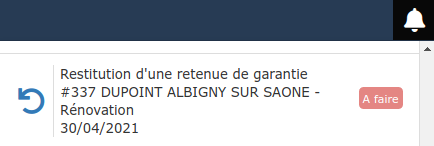

# Notifications

Le logiciel dispose d'un système de notifications qui se caractérise par une petite cloche en haut à droite de la barre de menu, en vous signalant si de nouvelles notifications sont à lire.

En cliquant sur la petite cloche, les notifications s'affichent.

## Notifications automatiques

### :digit_one: Facture en retard de paiement

* Cliquez sur la notification pour afficher la liste des échéances. La facture concernée sera en surbrillance dans la liste
* Vous pourrez immédiatement [saisir le règlement](../pour-aller-plus-loin/les-reglements/courriers-de-relance-ou-de-situation.md#saisir-un-reglement-depuis-la-liste-des-factures-impayees) s'il s'agissait d'un oubli, ou envoyer un [courrier de relance](../pour-aller-plus-loin/les-reglements/courriers-de-relance-ou-de-situation.md#envoyer-un-courrier-de-relance)
* Une fois le règlement saisi, la notification passera à  .

### :digit_two: Attestation de TVA en attente de réception

* Cliquez sur la notification pour afficher la liste des attestations de TVA
* La notification restera active tant que vous n'aurez pas coché la case "Retour client"

:bulb: En faisant [signer électroniquement l'attestation de TVA](signature-electronique/envoyer-une-attestation-de-tva-en-signature-electronique.md), en même temps que le devis ou non, la validation du retour client est automatique et vous est notifiée via cette même cloche.

### :digit_three: Signature électronique validée, d'un devis et/ou d'une attestation de TVA

(cf [signature électronique](signature-electronique/))

* Cliquez sur la notification pour afficher le devis, le statut du devis est automatiquement passé à "Accepté".
* Le devis signé se trouve dans l'onglet [ProGBox](progbox-archivage-de-documents.md) du devis
* Cliquez sur le statut "A faire" pour le faire passer à "Fait".

### :digit_four: Restitution de la retenue de garantie

(cf gestion des [retenues de garantie](../pour-aller-plus-loin/deductions-complementaires/retenue-de-garantie.md#gerer-les-retenues-de-garantie))

* Si vous avez bien renseigné la date de réception des travaux, et la durée de la retenue de garantie, une notification apparaîtra 15 jours avant terme. (généralement 12 mois après la date de réception)
* En cliquant sur la notification, vous pourrez immédiatement générer le courrier de demande de libération
* Dès le remboursement de la retenue de garantie saisi, la notification disparaîtra.

