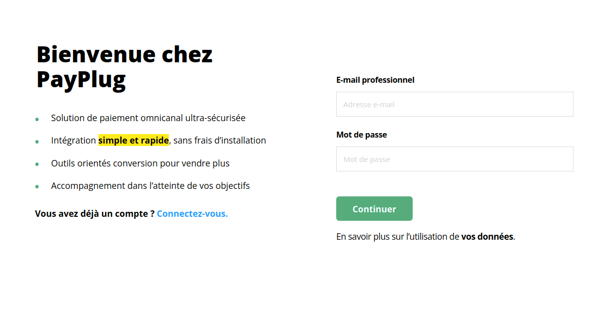
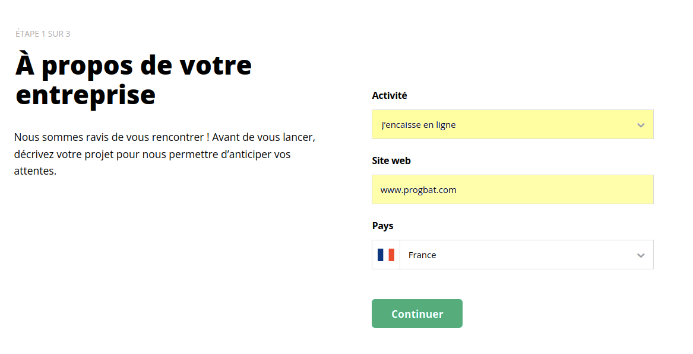
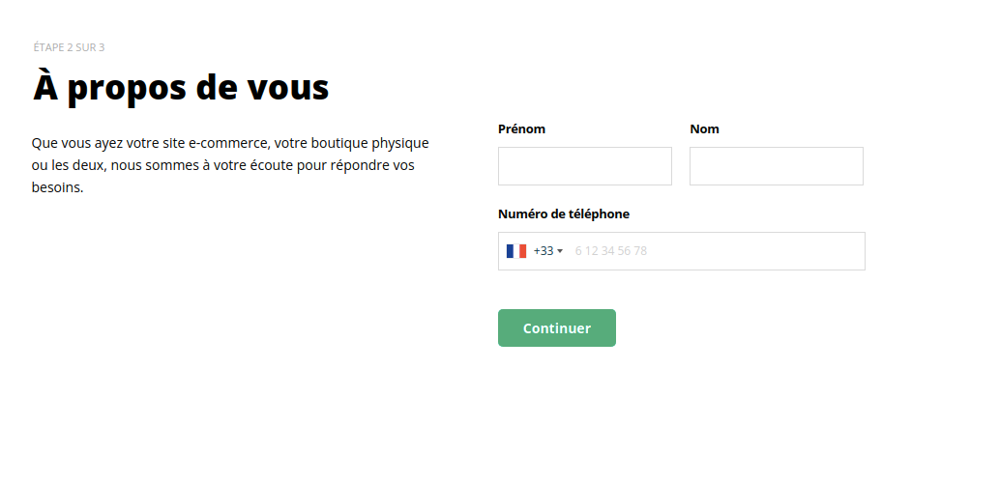
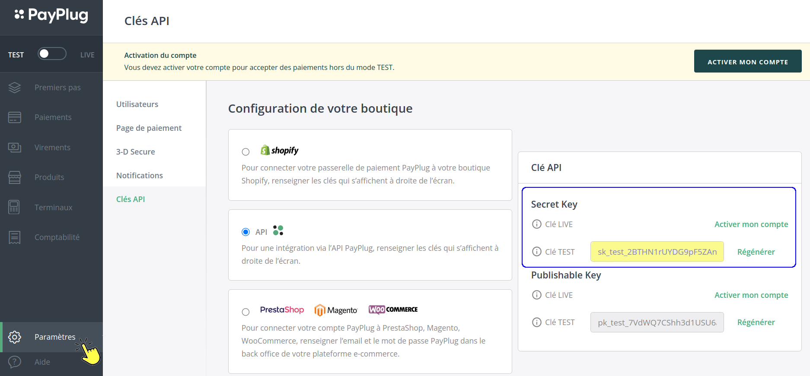

# 📎 Activer PayPlug©

## :digit\_one: Créez un compte PayPlug©

Cliquez sur le lien [https://portal.payplug.com/signup?sponsor=1494 ](https://portal.payplug.com/signup?sponsor=1494)et créez votre compte PayPlug© en 4 étapes simples, présentées ci-dessous :&#x20;

:arrow\_down:

:arrow\_down:

:arrow\_down:

.png>)

## :digit\_two: Lier PayPlug© à votre compte entreprise

****:point\_right: **Sur votre compte PayPlug**©** :**

* Cliquez sur l'onglet "Paramètres"
*   Récupérez votre "Clé secrète" (Secret Key)

    _Clé Test : Si vous souhaitez dans un premier temps tester PayPlug_©_, récupérez cette clé Test_

    _Clé Live : Si vous souhaitez de suite pouvoir encaisser vos règlements clients, activez votre compte puis récupérez cette clé Live._

:point\_right: **Sur votre compte logiciel :**

* Ouvrez le menu utilisateur (celui portant votre prénom) > Extensions (plugins)
* Activez le partenaire PayPlug© - Paiement en ligne
* Saisissez la clé secrète que vous avez récupérée dans vos paramètres PayPlug© (ci-dessus)
* Validez.

.png>)

Après activation de votre compte, et validation par PayPlug© (sous 2 jours ouvrés en moyenne), un lien de paiement sera automatiquement envoyé à vos clients en même temps que la facture, sans rien avoir à faire de plus qu'avant !

**Mais, d'abord, personnalisez votre page de paiement et paramétrez PayPlug© :**


[tester-payplug-c.md](tester-payplug-c.md)



[parametrer-payplug-c.md](parametrer-payplug-c.md)



[utiliser-payplug-c-depuis-le-logiciel.md](utiliser-payplug-c-depuis-le-logiciel.md)



[payplug-c-comptabilite.md](payplug-c-comptabilite.md)


:bulb:** Encore plus d'informations sur : **[**https://support.payplug.com/hc/fr**](https://support.payplug.com/hc/fr)****
