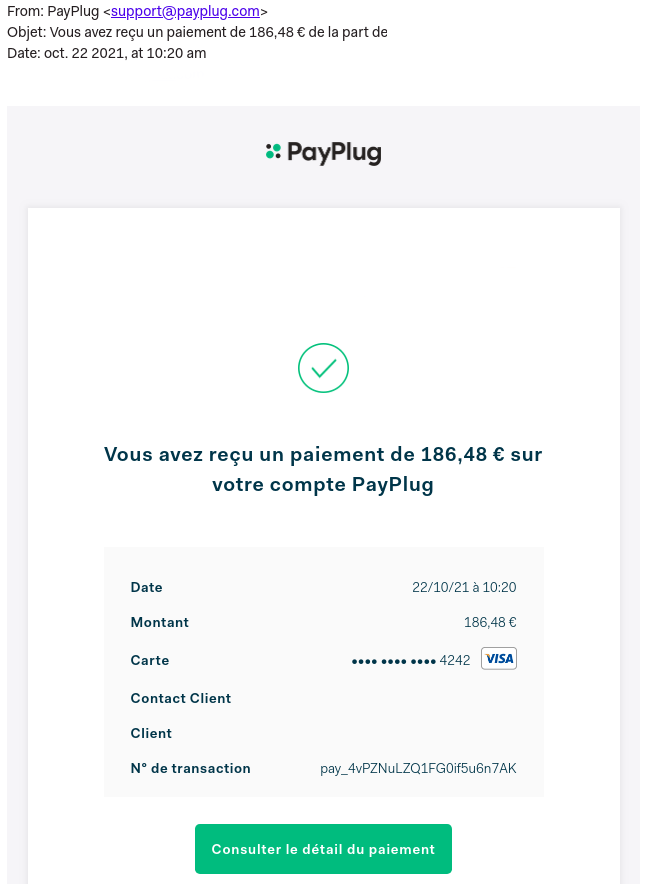

# 📎 Utiliser PayPlug© depuis le logiciel

## Passer en "mode réel"

Pour passer du mode "Test" au mode "Live" (mode réel), et commencer à encaisser les paiements de vos clients :

Activez votre compte PayPlug©, cliquez sur le lien ci-contre pour savoir comment faire : [https://support.payplug.com/hc/fr/articles/360021328991-Comment-activer-mon-compte-](https://support.payplug.com/hc/fr/articles/360021328991-Comment-activer-mon-compte-)

:information\_source: PayPlug© devra ensuite valider votre demande d'activation de compte (sous 2 jours ouvrés en moyenne), pour enfin passer au mode "Live".

:warning: **Une fois votre compte activé, pensez à remplacer la clé "Test" par la **[**clé "Live" sous le logiciel**](activer-payplug-c.md#lier-payplug-c-a-votre-compte-entreprise)**.**

****

## **Utiliser PayPlug**©** au quotidien**

Une fois votre compte activé, et votre clé "Live" saisie sous le logiciel, PayPlug© est totalement intégré au logiciel.

### Etape 1 : Envoi du lien de paiement, avec la facture&#x20;

:digit\_one: Validez / Finalisez votre facture, comme vous l'avez toujours fait sous le logiciel

:digit\_two: Cliquez sur le bouton "Imprimer/Envoyer"

:digit\_three: Ajoutez le destinataire (les adresses mail de tous les contacts de votre client s'affichent automatiquement), et saisissez l'objet de votre mail

:digit\_four: Préparez un texte pré-enregistré :&#x20;

* Ouvrez le menu "Bibliothèque > Textes"​
*   Créez un nouveau texte :

    Identifiant : "Mail Payplug" par exemple

    Libellé : "_Madame, Monsieur, Veuillez trouver ci-joint la facture N° xxx relative au devis N° xxx. Je vous invite à cliquer sur le lien de paiement ci-contre afin de vous acquitter de cette facture simplement, et en toute sécurité_" par exemple.

:digit\_five: Insérez le texte pré-enregistré, en saisissant les premières lettre de l'identifiant dans le champ dédié

:digit\_six: Cliquez à l'endroit où vous souhaitez faire apparaître le lien de paiement (sans expiration), puis cliquez sur le bouton .png>) dans la barre de mise en forme du texte de votre mail :&#x20;

 (1).png>)

:digit\_seven: Cliquez sur "Envoyer".

### Etape 2 : Votre client clique sur le lien de paiement

Après avoir cliqué sur le lien de paiement (qui n'expirera qu'après paiement), votre client est automatiquement redirigé vers une page récapitulative du paiement demandé

Il choisira son moyen de paiement (type de carte bancaire), et sera redirigé vers la page de [paiement sécurisée PayPlug© que vous aurez au préalable personnalisée](parametrer-payplug-c.md#parametrage-essentiel).

Il pourra alors finaliser son paiement.

### Etape 3 : Votre client a réalisé le paiement

:digit\_one: Vous et votre client êtes automatiquement notifiés par email du paiement effectué

:digit\_two: Le paiement est automatiquement enregistré sous le logiciel, avec le numéro de transaction

:digit\_three: La facture est automatiquement acquittée.

## Suivi des règlements

Depuis le menu "Paiements" de votre compte PayPlug©, vous pourrez suivre tous les règlements effectués par vos clients.

Ce menu est très utile pour identifier les raisons d'un paiement échoué (paiement sans provision par exemple). Bien sûr, ce paiement échoué ne validera en aucun cas le paiement de la facture sous le logiciel.

Pour les paiements ayant abouti, il vous suffit simplement de consulter le logiciel, ils apparaîtront tous dans la liste des règlements, depuis le menu "Gestion > Règlements".

L'export des règlements s'effectuera ainsi toujours de la même manière depuis le logiciel !

## Récupérer les paiements de vos clients

Les paiements effectués par vos clients via PayPlug© sont immédiatement placés dans un compte de cantonnement.&#x20;

Conformément à la réglementation bancaire française, le compte de cantonnement permet que les fonds dont vous disposez sur votre compte PayPlug© ne soient en aucun cas confondus avec ceux d'autres marchands ou de la société PayPlug© elle-même.

**L'argent disponible sur votre compte PayPlug© ne travaille donc pas et reste votre propriété**, même lorsqu'il n'est pas encore transféré sur votre compte bancaire. PayPlug© impose simplement l’immobilisation des montants des frais à prévoir (abonnement et frais de transactions).

À tout moment, il vous suffira de faire une demande de virement depuis votre compte PayPlug© :&#x20;

:digit\_one: Rendez-vous dans le menu "Virements"

:digit\_two: Cliquez sur "Transférer mon solde"

:digit\_three: Une fenêtre s'ouvre et affiche par défaut la totalité du montant pouvant être transféré (c'est-à-dire la totalité des paiements de vos clients, déduction faite des frais d'abonnement et de transactions à prévoir). Vous aurez la possibilité de modifier le montant demandé.

:digit\_four: Vous recevrez votre argent sans frais par virement sur le compte bancaire dont vous avez enregistré les coordonnées lors de votre inscription.

## Frais&#x20;

Le premier jour du mois suivant les paiements de vos clients, une facture est émise et prélevée (TTC) directement en une seule fois sur votre compte PayPlug©, réunissant les frais d'abonnement et de transaction indiqués lors du choix de votre offre.

:bulb:** Encore plus d'informations sur : **[**https://support.payplug.com/hc/fr**](https://support.payplug.com/hc/fr)****
