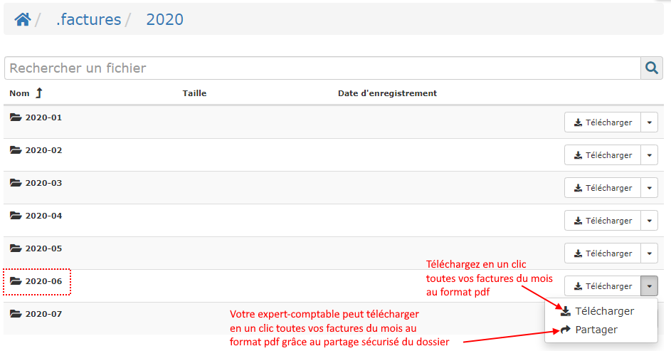
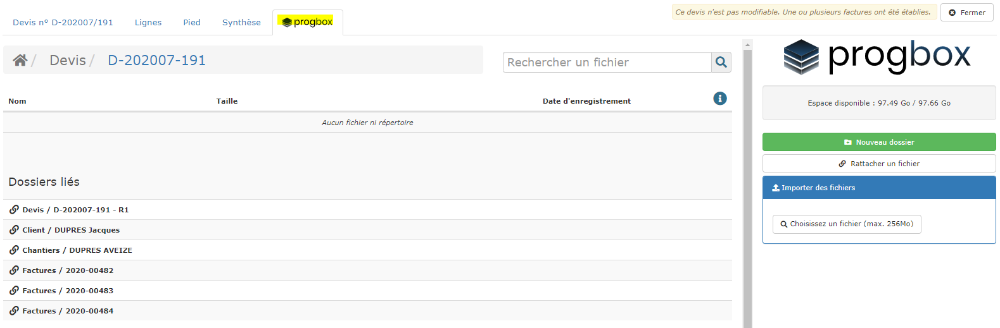

# Progbox - Archivage de documents

Vous connaissez Google Drive, Dropbox, ou encore Onedrive, que vous utilisez déjà probablement pour stocker et archiver tous les documents de votre entreprise, abandonnant ainsi petit à petit les classeurs et boites d'archive qui s'accumulent au fil des ans.

Ces services, bien que très performants, trouvent leur limite dans la quantité de dossiers et sous-dossiers créés et de fichiers téléchargés, et dans laquelle il devient parfois compliqué de s'y retrouver pour rechercher une facture client, la copie d'un devis signé, un plan, un compte-rendu, ou encore une facture fournisseur.

## ProGBox, un cloud intégré pour tous vos documents

100% intégré au logiciel, ProGBox permet de centraliser vos documents, en  les déposant et  les recherchant de manière particulièrement simple et intuitive.

### Archivage des factures clients.

De manière totalement automatisée, ProGBox archive sans aucune intervention de votre part toutes vos factures client, au fur et à mesure que vous les réalisez.

* Ouvrez le menu "Documents-&gt;Archivage"
* Ouvrez le dossier ".factures" :
  * Ce dossier contient, classées par années et par mois, toutes les factures clients que vous avez éditées, au format pdf.
* Il est alors possible :
  * De consulter une facture,
  * De la télécharger,
  * Mais également de télécharger en un clic toutes les factures du mois,
  * Ou encore de partager le dossier avec votre expert-comptable, pour qu'il les télécharge de son côté, en un clic.

Le dossier .factures est inaltérable, c'est à dire que vous ne pouvez ni modifier, ni ajouter, ni supprimer le dossier, ces sous-dossiers, ou les factures archivées, constituant ainsi un archivage sûr et sécurisé de vos factures clients.

L'archivage de vos factures est inclus dans la licence du logiciel, même si vous n'avez pas souscrit l'option ProGBox.

### Archivage de tous vos documents

Devis signés, plans, compte-rendus de réunions de chantier, copie du chèque, photos du chantier, les documents à archiver sont nombreux.

**ProGBox**, c'est la possibilité de les déposer très simplement sur le logiciel :

* Le scan du devis signé ou de l'attestation de TVA retournée par le client, directement dans le devis,
* La copie du chèque, directement sur la facture,
* Associer la copie de la facture fournisseur à la facture saisie sur le logiciel,
* Déposez les comptes rendus, les plans, les pièces écrites, sur la fiche chantier
* Archivez des documents dans la fiche client, 
* Stockez dans chaque fiche salarié le contrat de travail, la copie du permis de conduire, de la carte de séjour.

**ProGBox**, c'est aussi la possibilité de retrouver tous ces documents archivés de manière particulièrement simple et rapide :

#### Déposer et rechercher un document sur ProGBox

En ouvrant un devis, une facture, une fiche client, une fiche chantier, ou encore une fiche salarié, remarquez l'onglet "ProgBox"

Dans cet exemple, nous avons ouvert un devis, et cliqué sur l'onglet ProGBox.

* Je peux ajouter le scan du devis signé en le "déposant" sur la page \(drag & drop\), ou en le recherchant sur mon ordinateur dans le cadre bleu "Importer des fichiers" à droite de la page.
* Je peux également ouvrir les dossiers ProGBox automatiquement créés et liés à ce devis, pour y déposer ou consulter des documents.


Ainsi, en déposant la copie de mon devis signé sur la ProGBox du devis, je retrouverai immédiatement ce document depuis le devis bien sur, mais aussi depuis la fiche client, la fiche chantier, ou encore depuis la facture associée au devis.



Ou encore, en déposant la copie du chèque sur la ProGBox de la facture, je retrouverai immédiatement la copie du chèque depuis la facture, mais aussi depuis la fiche client, la fiche chantier, ou encore depuis le devis associé.



Quant à la fiche technique ou au plan déposé sur la ProGBox de la fiche chantier, vous y aurez accès instantanément en ouvrant le devis, la facture, ou la fiche client.


Le document est déposé une seule fois, mais il est disponible et consultable de partout, de manière logique et intuitive.

**C'est ça, la révolution ProGBox !**

