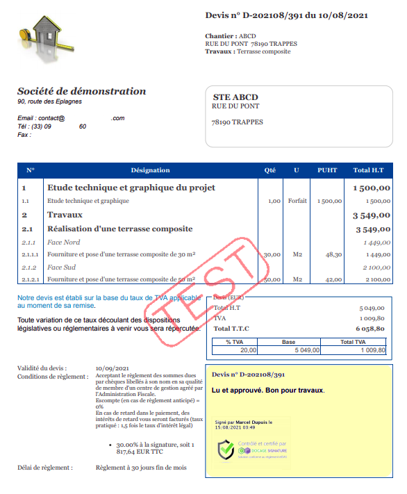

# Envoyer un devis en signature électronique

Vous avez [ouvert un compte Docage](./#creez-un-compte-docage), vous avez [lié votre compte Docage](./#liez-docage-a-votre-compte-entreprise) à votre compte logiciel, vous êtes prêts à envoyer vos devis en signature électronique à vos clients.

## Etape 1 - Utiliser un modèle personnalisé incluant la signature

Pour pouvoir envoyer un devis en signature électronique, votre modèle doit obligatoirement contenir le tag "@signatureClient".

Nous avons créé pour vous un modèle "Signature électronique", mais vous pouvez très simplement ajouter le tag _**"@signatureClient"**_ sur vos propres modèles.

Vous voulez, vous aussi, signer électroniquement ce devis ? Ajoutez le tag _**"@signatureEntreprise"**_.

## Etape 2 - Envoyer un devis en signature électronique

:digit_one:_ _Votre devis est prêt, cliquez comme d'habitude sur le bouton "Imprimer / Envoyer"

:digit_two: Sélectionnez un modèle de document adapté à la signature électronique, comme indiqué [ci-dessus](envoyer-un-devis-en-signature-electronique.md#utiliser-un-modele-personnalise-incluant-la-signature)

:bulb: Pour faire signer en même temps le devis et l'attestation de TVA, cochez simplement la case correspondante

:digit_three: A droite de la page, cliquez sur le bouton bleu "Signature électronique".

Un formulaire s'ouvre :

#### Section "Signataire" :

Il s'agit de la personne qui va signer le devis :

* Si le client est un particulier, le signataire sera normalement le client lui-même
  * Dans ce cas, le logiciel va pré-remplir le formulaire avec les informations de la fiche client
  *   Si besoin, vous pourrez bien sûr modifier ces informations.

* Si le client est un professionnel :
  * Si un ou plusieurs contact ont été créés dans la fiche client, les informations du contact principal seront affichées
  * Vous pourrez choisir un autre contact de ce client, en cliquant dans le champ "Nom"
  *   Et si aucun contact n'a été renseigné dans la fiche client, il faudra saisir les informations manuellement.

Tous les champs sont obligatoires, pour garantir l'authentification de la signature électronique.

Assurez-vous que l'adresse mail et le numéro de téléphone du client sont à jour.

#### Section "Email" :

Il s'agit de l'email que votre client recevra de la part de Docage, et qui lui permettra de consulter et signer le devis.

Modifiez le texte et la mise en forme du mail comme vous le souhaitez.

****:warning: **Ne modifiez / supprimez pas tout ce qui est entre { } . **Ces données sont indispensables pour le bon fonctionnement de la signature électronique

En envoyant le mail, votre nouveau texte sera enregistré et proposé au prochain envoi.

:digit_four: Vous pouvez maintenant envoyer le devis à votre client.

## Etape 3 - Faire signer électroniquement un devis

Votre client reçoit un email contenant un lien vers le devis et sa signature. Ce lien est valable jusqu'à la [date d'échéance du devis](broken-reference).

Votre client doit maintenant :

:digit_one: Cliquer sur ce lien et parcourir l'ensemble des pages du/des documents à signer

:digit_two: Cliquer sur le bouton "Signer ou refuser", confirmer son choix et cocher la case d'acceptation des conditions

:digit_three: Demander à recevoir un code de confirmation par SMS, et le saisir pour signer le/les documents

## Etape 4 - Le devis est signé par votre client

:digit_one: Vous et votre client recevez un mail confirmant la signature du devis, ainsi que ce devis en pièce jointe

:digit_two: Vous recevez une [notification](../notifications.md#signature-electronique-validee-dun-devis-et-ou-dune-attestation-de-tva)sur votre tableau de bord, vous informant que votre client a signé le devis

:digit_three: Le devis passe automatiquement au statut "Accepté"

:digit_four: Le devis signé est automatiquement archivé dans la [ProGBox](../progbox-archivage-de-documents.md#progbox-un-cloud-integre-pour-tous-vos-documents) du devis, vous pourrez également le retrouver depuis la fiche chantier, ainsi que la fiche client.

