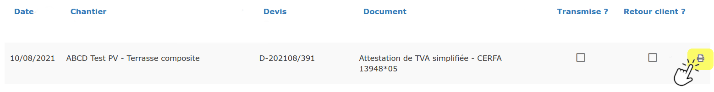
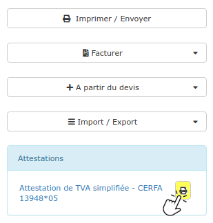
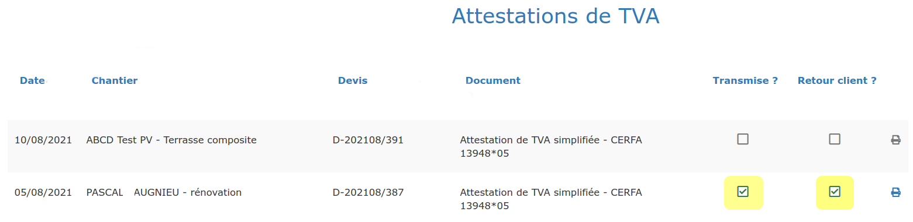

# Envoyer une attestation de TVA en signature électronique

__[_Cliquez ici_](../attestation-de-tva.md)_ pour apprendre pourquoi et comment créer une attestation de TVA simplifiée._

## Envoyer l'attestation de TVA en même temps que le devis

Cliquez [ici](envoyer-un-devis-en-signature-electronique.md#etape-2-envoyer-un-devis-en-signature-electronique) pour connaître la marche à suivre.

## Envoyer l'attestation de TVA, seule

:digit_one: Ouvrez l'attestation de TVA en cliquant sur l'icône :

Depuis le menu "Gestion > Attestations de TVA", en bout de ligne :

Ou bien depuis le devis, à côté de l'attestation de TVA déjà créée :

:digit_two: A droite de la page, cliquez sur le bouton bleu "Signature électronique".

Un formulaire s'ouvre :

#### :point_right: Section "Signataire" :

Il s'agit de la personne qui va signer l'attestation :

* Si le client est un particulier, le signataire sera normalement le client lui-même
  * Dans ce cas, le logiciel va pré-remplir le formulaire avec les informations de la fiche client
  *   Si besoin, vous pourrez bien sûr modifier ces informations.

* Si le client est un professionnel :
  * Si un ou plusieurs contact ont été créés dans la fiche client, les informations du contact principal seront affichées
  * Vous pourrez choisir un autre contact de ce client, en cliquant dans le champ "Nom"
  *   Et si aucun contact n'a été renseigné dans la fiche client, il faudra saisir les informations manuellement.


Tous les champs sont obligatoires, pour garantir l'authentification de la signature électronique.

Assurez-vous que l'adresse mail et le numéro de téléphone du client sont à jour.


#### :point_right: Section "Email" :

Il s'agit de l'email que votre client recevra de la part de Docage, et qui lui permettra de consulter et signer l'attestation.

Modifiez le texte et la mise en forme du mail comme vous le souhaitez.

****:warning:** Ne modifiez / supprimez pas tout ce qui est entre { } **. Ces données sont indispensables pour le bon fonctionnement de la signature électronique

En envoyant le mail, votre nouveau texte sera enregistré et proposé au prochain envoi.

:digit_three: Vous pouvez maintenant envoyer l'attestation à votre client.

:bulb: Pour connaître les actions à réaliser par le client pour signer, [cliquez ici](envoyer-un-devis-en-signature-electronique.md#etape-3-faire-signer-electroniquement-un-devis).

## Une fois le/les documents signés par le client

:digit_one: Vous et votre client recevez un mail confirmant la signature du/des documents, ainsi que ces mêmes documents en pièce jointe

:digit_two: Vous recevez une [notification](../notifications.md#signature-electronique-validee-dun-devis-et-ou-dune-attestation-de-tva)sur votre tableau de bord, vous informant que votre client a signé

:digit_three: L'attestation de TVA est automatiquement indiquée "Transmise" (à l'envoi) et "Retournée par le client" (à la signature), vous gagnez du temps sur le suivi administratif :

:point_right: Si l'attestation de TVA est envoyée avec le devis :

* Le devis passe automatiquement au statut "Accepté"
* Les documents signés sont automatiquement archivés dans la [ProGBox ](../progbox-archivage-de-documents.md)du devis.

:point_right: Si l'attestation de TVA est envoyée seule : l'attestation signée est automatiquement archivée dans la [ProGBox](../progbox-archivage-de-documents.md) du client.
