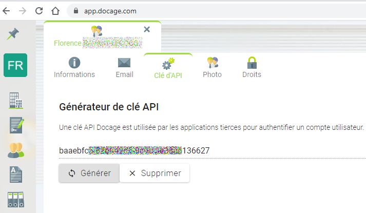
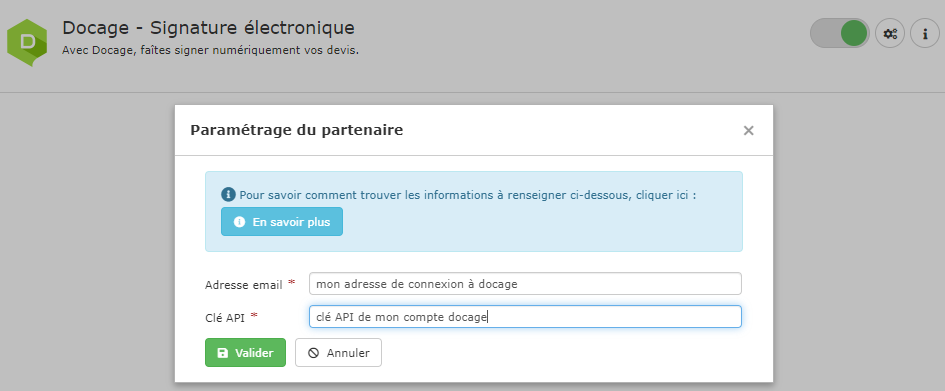

# Activer la signature électronique

## 1 Créez un compte Docage

Rendez-vous sur la page contact de [docage.com](https://www.docage.com/contact), et contactez le service commercial pour créer votre compte.

## 2 Liez Docage à votre compte Entreprise

\*\*\*\*

\*\*\*\*👉 **Sur votre compte Docage :**

* Ouvrez votre fiche utilisateur
* Cliquez sur l'onglet "Clé d'API"
* Cliquez sur Générer pour créer votre clé

👉 **Sur votre compte logiciel :**

* Ouvrez le menu utilisateur \(celui portant votre prénom\) > Connexions partenaires
* Activez le partenaire Docage - Signature électronique
* Saisissez votre ****adresse email de connexion à docage.com
* Saisissez la clé API que vous avez générée sur docage.com
* Validez.

Vous êtes prêts à proposer la signature électronique à vos clients, et vous faciliter la gestion des retours de devis :





