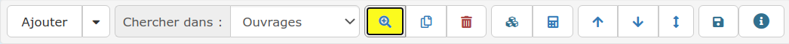
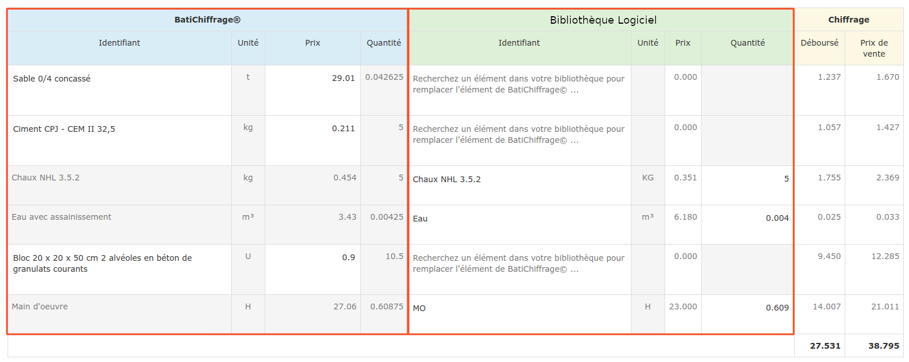

# ➖ Utiliser BatiChiffrage© au quotidien

.png>)

## Depuis un devis ou une facture

* Cliquez sur la petite loupe dans le menu de ligne de votre devis / de votre facture directe, et cliquez sur l'onglet de **votre bibliothèque BatiChiffrage©**

* Cherchez un ouvrage en cliquant sur les familles et sous-familles dans la colonne de gauche, les ouvrages s'affichent au fur et à mesure dans la colonne de droite.

.png>)

* Sélectionnez l'ouvrage, un formulaire s'affiche :

.png>)

*   Que faire ?

    * **Identifiant ** : un identifiant est automatiquement proposé, vous pouvez le modifier.\
      C'est grâce à cet identifiant que vous "appellerez" facilement cet ouvrage dans vos devis.
    * **Libellé** : Vous pouvez modifier le libellé proposé, et lui appliquer du style.
    * **Unité** : Vous pouvez modifier l'unité, mais ce n'est pas conseillé.
    * **Déboursé** : C'est le prix de revient unitaire de l'ouvrage. Il se modifie automatiquement en fonction des éléments composant l'ouvrage.
    * **Prix de vente** : Le prix est calculé automatiquement, mais vous pouvez le modifier manuellement. C'est ce prix qui sera proposé dans vos devis lorsque vous appellerez cet ouvrage.

* Le tableau suivant affiche la composition de l'ouvrage (en bleu), les éventuelles correspondances avec votre bibliothèque personnelle (en Vert), et les prix de référence de chaque composant.

* Que faire ?
  * Partie BatiChiffrage© (Bleue)
    * **Identifiant** : c'est le "code article", tel qu'il sera créé dans votre bibliothèque, en même temps que l'ouvrage. Ce code est modifiable et vous permettra de retrouver facilement votre ouvrage depuis le devis / facture ou dans votre bibliothèque d'ouvrage.
    * **Unité** : Information non modifiable.
    * **Prix** : c'est le prix d'achat "moyen" de l'élément. Vous pouvez le modifier.
    * **Quantité** : Vous pouvez la modifier.\

  * Partie Logiciel (Verte)
    * **Identifiant** : permet de lier un élément de votre bibliothèque personnelle. Les éléments liés ne sont pas créés lors de l'import de l'ouvrage pour éviter les doublons. Les éléments non liés seront créés et enregistrés dans votre bibliothèque d'éléments.


* Les éléments liés ne sont pas créés lors de l'import de l'ouvrage pour éviter les doublons.
* Le logiciel apprend tout seul, et se souviendra des éléments liés au prochain import.
* Les éléments non liés seront créés et enregistrés dans votre bibliothèque d'éléments.
* Lorsqu'un élément est lié, c'est son prix d'achat qui est utilisé pour calculer le déboursé et le prix de vente**.**


#### Une fois le paramétrage de votre ouvrage terminé, cliquez sur "Importer cet ouvrage" :

**Il est immédiatement ajouté à votre devis / facture et enregistré dans votre bibliothèque d'ouvrages pour l'ajouter à votre devis / facture encore plus rapidement la prochaine fois.**

## Depuis votre bibliothèque **BatiChiffrage©**

* Accédez à votre bibliothèque BatiChiffrage© depuis l'onglet "Bibliothèque" > "Tarifs BTP"
* Cherchez un ouvrage en suivant les indications ci-dessus.
