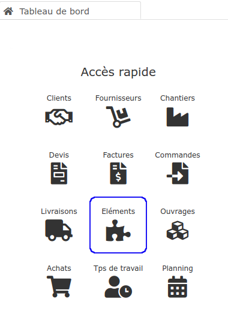
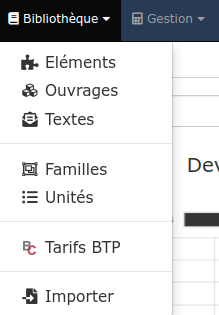
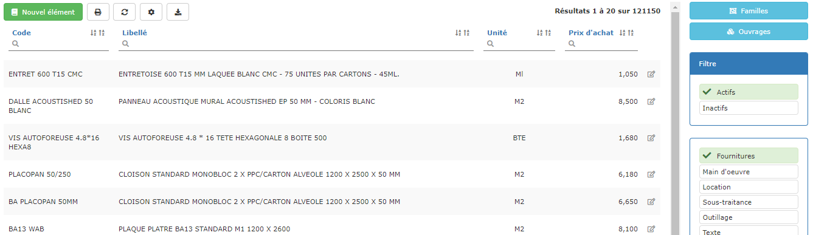
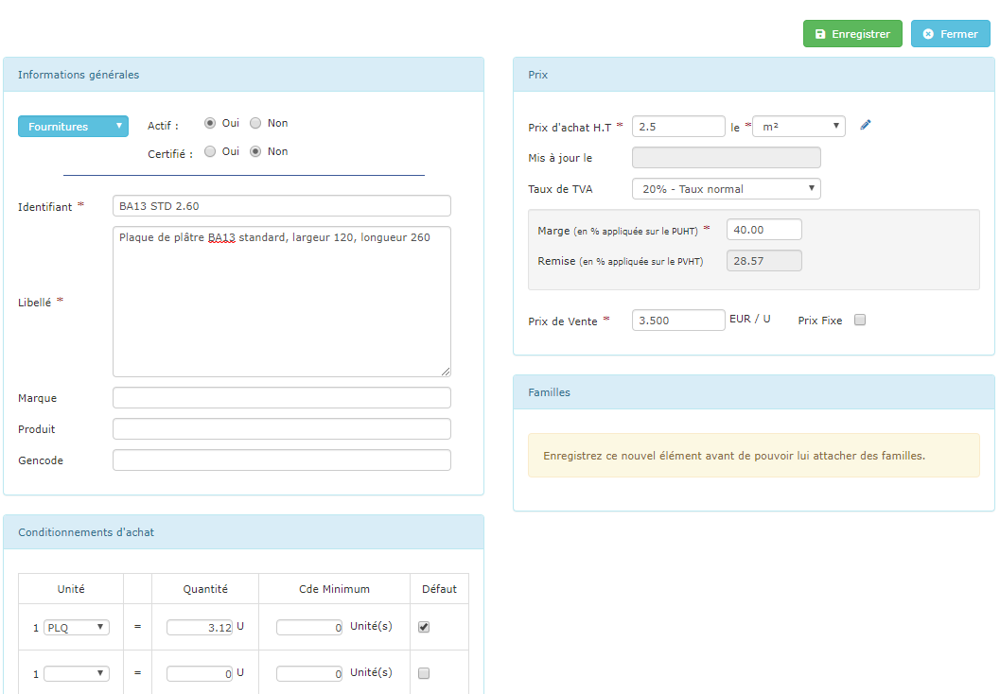

# Bibliothèque d' Éléments

**La bibliothèque d'éléments contient tout ce qui "coûte" pour réaliser un chantier :**

* Les fournitures (matériaux par exemple)
* La main d'oeuvre
* La location de matériel
* Les travaux confiés à des sous-traitants
* L'outillage

Depuis le menu "Bibliothèques > Eléments", accédez aux différents types d'éléments en les sélectionnant sur la droite de la page.


Ces différents éléments pourront être regroupés pour ["composer" un ouvrage](la-bibliotheque-douvrages/#la-composition-des-ouvrages). Par exemple, l'élément de fourniture "Cloison PVC 35 mm" et l'élément de main d'oeuvre "Pose cloison simple", entre autres,  pourront composer l'ouvrage "Pose de cloisons PVC".

**En composant vos ouvrages, vous pourrez visualiser rapidement leur coût, le temps à consacrer, et le prix auquel le vendre, pour être sûr que votre travail est "rentable".**


## Les Fournitures

Vous allez pouvoir gérer ici les matériaux, fournitures, consommables, etc, que vous utilisez sur vos chantiers.

### Créer un élément fourniture

3 méthodes existent sous le logiciel :

****:digit_one: **La plus simple, et surtout la plus rapide, est d'importer un fichier de fournitures**

Vous avez le choix :

* [Importez le tarif de votre fournisseur ](importer/import-de-tarifs-fournisseurs.md)principal
* [Importez votre propre fichier de fournitures](importer/import-de-fichier-fournitures-ou-ouvrages.md), récupéré sur votre ancien logiciel (Excel ou autre). 

Vous aurez en quelques minutes un fichier complet, avec vos propres prix d'achat.

:digit_two: **Vous pouvez également créer manuellement vos articles**, simplement en cliquant sur le bouton "Nouvel élément" depuis votre bibliothèque d'éléments :

**Actif/Inactif**

Si un article a été utilisé dans un bon de commande, un devis, une composition d'ouvrage, etc..., il ne pourra plus être supprimé, même s'il n'existe plus chez vos fournisseurs.

Pour éviter que cet article soit toujours affiché dans les listes, cochez "Actif : non".

**L'identifiant**

Saisissez dans ce champ un identifiant pour vous permettre de retrouver cet article très rapidement par la suite, quand vous saisirez une commande fournisseur par exemple.

Pour une_"Plaque de plâtre BA13 standard, largeur 120, longueur 260"_, un identifiant du type _"BA13 STD 2.60" _ pourrait convenir.

**Le libellé**

Saisissez dans ce champ le libellé complet (désignation) de l'article, par exemple_ "Plaque de plâtre BA13 standard, largeur 120, longueur 260", ou "Baignoire acrylique modèle standard longueur 160"._ C'est ce libellé qui sera affiché dans un bon de commande, ou dans un devis...

#### :digit_three: Créer un élément depuis une commande fournisseur (ou une demande de prix)

Depuis le [bon de commande](../les-achats/les-bons-de-commande/bon-de-commande-fournisseur.md), ou même une [demande de prix](../les-achats/demandes-de-prix.md) :

* Saisissez les données de l'article à commander
*   Cliquez sur les trois petits pointsen bout de ligne de l’élément à enregistrer, et choisissez "Enregistrer l'élément".

## La main d'oeuvre

Créez un élément de main d'oeuvre différent selon le coût de votre personnel, par exemple "Main d'oeuvre - Personnel", "MO - Conducteur de travaux".

Vous pouvez choisir de créer un élément de main d'oeuvre en heures, ou bien en m² par exemple. Mais il est recommandé de choisir l'unité "heure" car elle permettra une [estimation rapide et claire du temps à consacrer à vos ouvrages](../les-devis/prevoir-le-temps-passe.md), dès la saisie du devis.

:information_source: C'est ce 

## La sous-traitance

De la même manière que vous avez créé vos éléments de main d'oeuvre, vous pourrez créer vos éléments de sous-traitance : en heures s'il ne s'agit que de main d'oeuvre, à l'unité s'il s'agit de travaux réalisés en totalité, ou encore en m² par exemple.

Indiquer la sous-traitance en heures vous permettra une [estimation rapide et claire du temps de travaux](../les-devis/prevoir-le-temps-passe.md), dès la saisie du devis.

## L'outillage

Cette catégorie d'éléments vous permet par exemple d'ajouter des coûts d'amortissement suite à l'achat d'outils (marteau-piqueur, pelle, ...), ou bien même des coûts d'usage (essence, électricité) et d'usure, pré-calculés par vos soins.

## Mettre à jour un élément

:point_right: Depuis la bibliothèque, ouvrez la fiche de l'élément pour mettre à jour les informations souhaitées.

:point_right: Depuis un bon de commande (ou une demande de prix) :

Cliquez sur les trois petits pointsen bout de ligne, et choisissez "Enregistrer l'élément" : comme l'article existe déjà, le logiciel vous propose de le mettre à jour, pratique par exemple pour enregistrer un nouveau prix.

:point_right: **Mettre à jour plusieurs éléments en même temps :**

* Exportez votre bibliothèque d'éléments depuis le menu "Gestion > Exporter mes données > Bibliothèque > Éléments"
* Effectuez votre modification "en masse" (augmentation du prix d'achat de 3% par exemple)
* Réimportez votre fichier fournitures, depuis le menu "Bibliothèque", le logiciel vous indique combien d'articles, et combien d'ouvrages contenant ces articles, seront mis à jour.

