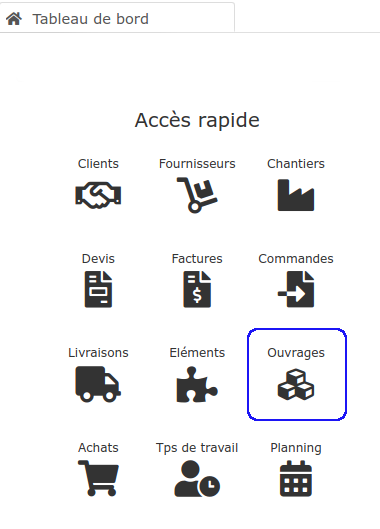

# Bibliothèque d' Ouvrages

La bibliothèque d'ouvrages contient les travaux, les prestations, que vous allez vendre à vos clients :

* "Fourniture et mise en oeuvre d'une cloison de distribution en plaques de plâtre..."
* "Fourniture et réalisation de semelles filantes..."
* "Fourniture et pose d'un mitigeur évier..."
* Etc...

**Cette bibliothèque a 2 rôles essentiels :**

👉 [Simplifier la saisie de vos devis](../../les-devis/nouveau-devis/saisir-les-lignes-du-devis/#methodes-de-saisie), en y insérant les ouvrages déjà enregistrés, plutôt que de tout retaper à chaque fois

👉 Chiffrer vos ouvrages, c'est à dire calculer précisément le coût de revient \(déboursé\) d'un ouvrage, et en déterminer très précisément son prix de vente.







