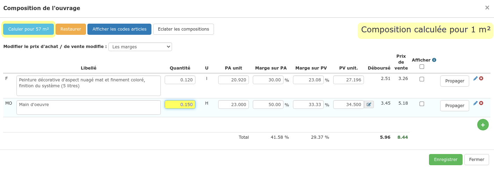

# Composer un ouvrage

**Composer un ouvrage permet de savoir avec précision à quel prix le vendre afin de réaliser du bénéfice, tenant compte de tous les coûts \(éléments\) à prévoir pour la réalisation de cet ouvrage.**

La composition des ouvrages ajoutés au devis alimente automatiquement la [synthèse du devis](../../les-devis/synthese-du-devis.md), vous permettant de visualiser en un clin d’œil tous les éléments nécessaires à la réalisation du chantier dans sa totalité. Depuis cette même synthèse, vous pourrez créer en un clic un bon de préparation, une demande de prix ou encore un bon de commande par exemple.

La composition des ouvrages permet également d'établir un "prévisionnel" de coûts et de temps nécessaires pour réaliser le chantier dans sa totalité. Il vous sera donc possible, depuis la [fiche chantier](../../les-chantiers-1/la-fiche-chantier-en-detail.md#onglet-travaux), de [suivre en temps réel](../../les-chantiers-1/pilotage-temps-reel.md) les coûts occasionnés par le chantier \(matériaux, main d'oeuvre et sous-traitance\) en fonction de l'avancement des travaux et des montants prévus, afin d'anticiper un "dérapage" et de suivre clairement la rentabilité de votre chantier.

\*\*\*\*

De suite après la [création d'un ouvrage](./#creer-un-ouvrage-dans-votre-bibliotheque), il vous sera possible de le composer, voici comment procéder :

### **Depuis le devis**

1 Cliquez sur les 3 petits cubes   dans le menu de ligne :

2 Une composition "par défaut" s'affiche :

👉 **Composition "rapide" :**

Renseignez les champs proposés en évaluant le coût global des matériaux nécessaires à la réalisation du chantier, idem pour la main d'oeuvre.

_Le prix de vente de la main d'œuvre "par défaut" et la marge à appliquer "par défaut", peuvent être paramétrés en cliquant sur le petit crayon_  _à côté du prix de vente de la main d'oeuvre_

\_\_

👉 **Composition "précise" :**

Effacez les lignes de composition par défaut, puis ajoutez à l'aide du boutonles différents [éléments](../la-bibliotheque-delements.md) nécessaires à la réalisation de cet ouvrage : fournitures, main d'oeuvre, sous-traitance, outillage, ... _Si votre main d'oeuvre est exprimée en heures, le_ [_temps prévu_](../../les-devis/prevoir-le-temps-passe.md) _pour réaliser cet ouvrage sera automatiquement affiché._

\_\_

3 Indiquez les quantités nécessaires de ces éléments pour réaliser cet ouvrage

\_\_4 __Vérifiez ou modifiez les prix \(d'achat et de vente\) et/ou les marges

5 Enregistrez.

### Depuis la bibliothèque d'ouvrages

1 Cliquez sur l'onglet "Composition" de l'ouvrage créé

2 Ajoutez les différents [éléments](../la-bibliotheque-delements.md) nécessaires à la réalisation de cet ouvrage : fournitures, main d'oeuvre, sous-traitance, outillage, ... _Si votre main d'oeuvre est exprimée en heures, le_ [_temps prévu_](../../les-devis/prevoir-le-temps-passe.md) _pour réaliser cet ouvrage sera automatiquement affiché_

3 Indiquez les quantités nécessaires de ces éléments pour réaliser cet ouvrage

\_\_4 __Vérifiez ou modifiez les prix \(d'achat et de vente\) et/ou les marges

5 Enregistrez.

