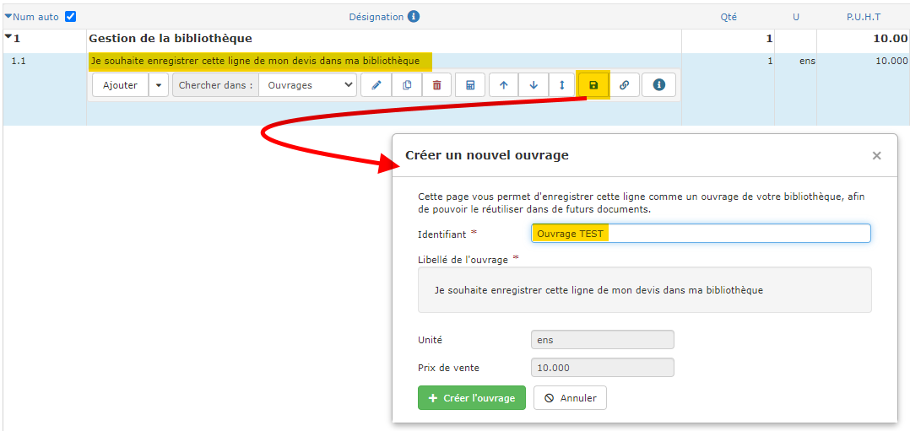

# ➖ Créer un ouvrage dans votre bibliothèque

### :point_right: Depuis le devis

Il existe une méthode très simple pour enrichir votre bibliothèque d'ouvrage, au fur et à mesure que vous créez vos premiers devis :

:digit_one: Saisissez manuellement une ligne dans votre devis

:digit_two: Cliquez sur la petite disquette dans le menu de ligne

:digit_three: Saisissez un identifiant, pour retrouver facilement cet ouvrage

:digit_four: Cliquez sur le bouton "Créer l'ouvrage".

Selon l'exemple ci-dessus, il me suffira de taper **"**TEST" dans une ligne de devis pour que le logiciel me propose l'ouvrage que je viens de créer.

****


**Vous pourrez de suite **[**"composer" cet ouvrage**](./#la-composition-des-ouvrages)**, pour que son prix de vente soit automatiquement calculé en fonction de ce qu'il vous coûte, et de vos marges prévues.**


### :point_right: Depuis la bibliothèque d'ouvrages

:digit_one: Ouvrez le menu "Bibliothèques > Ouvrages" pour afficher la liste de vos ouvrages

:digit_two: Cliquez sur le bouton "Nouvel ouvrage"

:digit_three: Renseignez les différents champs du formulaire :

* _L'Identifiant_ : Quelques mots pour retrouver facilement cet ouvrage
* _Le Libellé_ : C'est le texte qui s'affichera dans vos devis
* _Le Déboursé_ : Si vous connaissez le prix de revient de votre ouvrage, saisissez-le, le prix de vente sera automatiquement appliqué en fonction de la marge définie pour votre entreprise
* _L'Unité de vente_
* _La Marge_ : La marge appliquée par défaut est celle renseignée dans les [paramètres de votre entreprise](../../../aide-au-demarrage/parametrage-de-mon-entreprise/). Vous pouvez modifier la marge pour ajuster le prix de vente
* _Prix de vente_ : C'est le prix qui sera proposé dans votre devis :
  * Si vous n'avez pas renseigné de Déboursé, saisissez directement le prix de vente, un déboursé sera calculé automatiquement en fonction de la marge
  * Si vous avez saisi un déboursé, la marge se mettra à jour en fonction du prix de vente que vous allez saisir.
*   _Prix fixe_ : en cochant la case, le logiciel ne mettra pas à jour le prix de vente même si vos coûts augmentent, ou si vous appliquez un coefficient dans votre devis.


[composer-un-ouvrage.md](composer-un-ouvrage.md)



[modifier-un-ouvrage-de-votre-bibliotheque.md](modifier-un-ouvrage-de-votre-bibliotheque.md)

