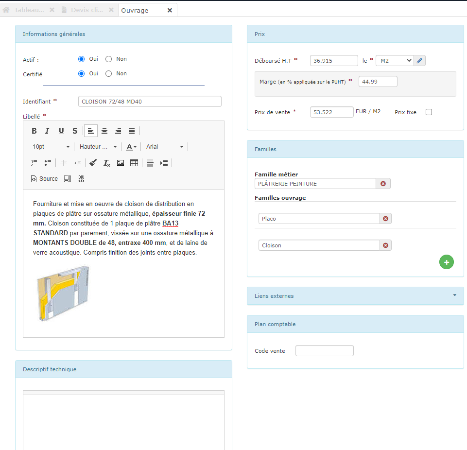

# ➖ Créer un ouvrage dans votre bibliothèque

### :point_right: Depuis le devis

Il existe une méthode très simple pour enrichir votre bibliothèque d'ouvrage, au fur et à mesure que vous créez vos premiers devis :

:digit_one: Saisissez manuellement une ligne dans votre devis

:digit_two: Cliquez sur la petite disquette dans le menu de ligne

:digit_three: Saisissez un identifiant, pour retrouver facilement cet ouvrage

:digit_four: Cliquez sur le bouton "Créer l'ouvrage".

Selon l'exemple ci-dessus, il me suffira de taper **"**TEST" dans une ligne de devis pour que le logiciel me propose l'ouvrage que je viens de créer.

****


**Vous pourrez de suite **[**"composer" cet ouvrage**](./#la-composition-des-ouvrages)**, pour que son prix de vente soit automatiquement calculé en fonction de ce qu'il vous coûte, et de vos marges prévues.**


### :point_right: Depuis la bibliothèque d'ouvrages

:digit_one: Ouvrez le menu "Bibliothèques > Ouvrages" pour afficher la liste de vos ouvrages

:digit_two: Cliquez sur le bouton "Nouvel ouvrage"

:digit_three: Renseignez les différents champs du formulaire : 

* _**L'Identifiant**_** : **Quelques mots pour retrouver facilement cet ouvrage
* _**Le Libellé**_** :** C'est le texte qui s'affichera dans vos devis
* _**Le Déboursé**_** :** Si vous connaissez le prix de revient de votre ouvrage, saisissez-le, le prix de vente sera automatiquement appliqué en fonction de la marge définie pour votre entreprise
* _**L'Unité de vente**_
*   _**La Marge**_** :** La marge appliquée par défaut est celle renseignée dans les [paramètres de votre entreprise](../../../aide-au-demarrage/parametrage-de-mon-entreprise/). Vous pouvez modifier la marge pour ajuster le prix de vente.

    :warning: Si vous modifiez individuellement cette marge, et si vous souhaitez ultérieurement modifier la marge de tous vos éléments grâce au paramétrage de votre entreprise (menu "Administration > Mon entreprise"), cet élément ne verra pas sa marge modifiée, il faudra alors effectuer la modification manuellement.

    Il en sera de même si vous importez votre fichier de fournitures et que vous indiquez un prix d'achat et de vente, la marge calculée ne sera alors modifiable qu'individuellement et manuellement.
* _**Prix de vente**_** :** C'est le prix qui sera proposé dans votre devis :
  * Si vous n'avez pas renseigné de Déboursé, saisissez directement le prix de vente, un déboursé sera calculé automatiquement en fonction de la marge
  * Si vous avez saisi un déboursé, la marge se mettra à jour en fonction du prix de vente que vous allez saisir.
* _**Prix fixe**_** : **en cochant la case, le logiciel ne mettra pas à jour le prix de vente même si vos coûts augmentent, ou si vous appliquez un coefficient dans votre devis.

:digit_four: Composez votre ouvrage :


[composer-un-ouvrage.md](composer-un-ouvrage.md)



[modifier-un-ouvrage-de-votre-bibliotheque.md](modifier-un-ouvrage-de-votre-bibliotheque.md)

