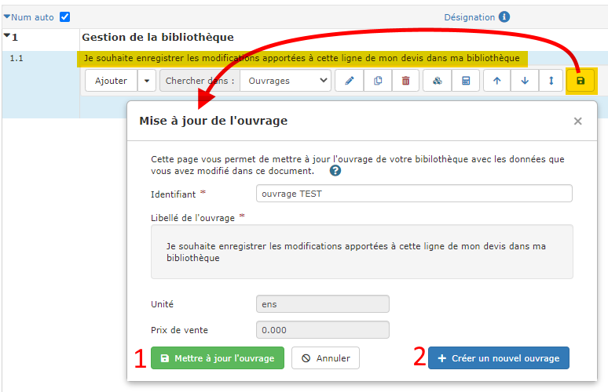

# Modifier un ouvrage de votre bibliothèque

## Modifier un ouvrage de votre bibliothèque

### :point_right: Depuis le devis

Vous avez modifié un ouvrage dans votre devis, et souhaitez enregistrer cette modification dans votre bibliothèque ?

Exactement comme pour la création d'un ouvrage depuis le devis, cliquez sur la petite disquette dans le menu de ligne :

1. Vous pouvez mettre à jour l'ouvrage existant
2. Vous pouvez créer un nouvel ouvrage. Dans ce cas, un nouvel identifiant vous sera demandé.

### :point_right: Depuis la bibliothèque d'ouvrages

Recherchez l'ouvrage à modifier dans la liste des ouvrages, et ouvrez le formulaire pour apporter les modifications souhaitées.

:warning: La modification d'un ouvrage dans la bibliothèque ne modifiera aucune ligne de devis ou de factures déjà créés.

_****_
