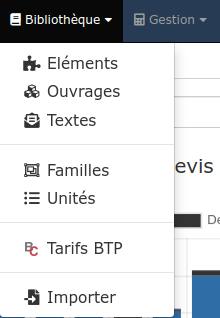
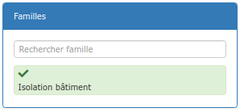
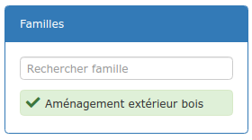
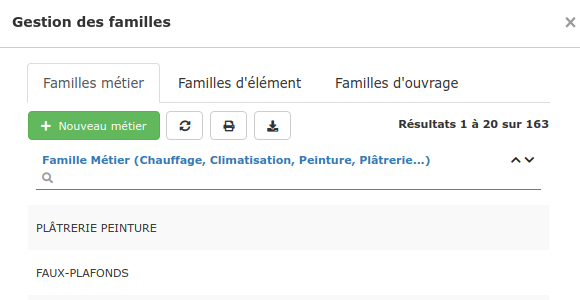

# 📎 Les familles

## :digit_one: Familles métier

Regrouper vos ouvrages et éléments en familles métier, ou corps d'état, permet :

:point_right: **Une recherche facile et ciblée :** 

Depuis la [recherche avancée](../les-devis/saisir-un-devis/nouveau-devis/saisir-les-lignes-du-devis/le-menu-de-lignes.md#recherche-rapide-ou-avancee) du devis, ou bien dans votre bibliothèque d'ouvrages ou d’éléments, saisissez les premières lettres de la famille métier, et sélectionnez-la dans la liste proposée.

Tous les ouvrages/éléments appartenant à cette famille apparaîtront.

****:point_right: **Un suivi comptable plus précis de vos achats et ventes :**

Le logiciel propose d'affecter chacune de vos familles métier à un [compte comptable](../exports-comptables/parametrage-1/).

Lors de l'[export de vos données comptables](../exports-comptables/export.md), il sera alors possible, par exemple, d'identifier les familles métier les plus "vendues", ou encore dans quelle famille métier vous réalisez l'essentiel de vos achats.

## :digit_two: Familles d'ouvrages et d'éléments

Regroupez vos ouvrages et/ou éléments en familles, par type de travaux (Isolation, Peinture, ...) ou de matériaux (Carreaux, Accessoires, ...) par exemple.

Dans la section "Familles" de vos bibliothèques, saisissez les premières lettres d'une famille pour activer un filtre "Famille" pour ne voir que les éléments qu'elle contient :

## Créer une famille

* Ouvrez le menu "Bibliothèques > Familles"
* Sélectionnez le type de famille à créer, puis cliquez sur le bouton vert
  * Création d'une famille métier : Seul le libellé est obligatoire, mais vous pouvez renseigner les comptes comptables d'achat et de vente dès la création, ou bien le faire plus tard, depuis le [paramétrage comptable ](../exports-comptables/parametrage-1/)de votre entreprise.

:information_source: Les comptes comptables ne pourront être affectés qu'aux familles **métier**. 

## Modifier ou supprimer une famille

* Ouvrez le menu "Bibliothèques > Familles"
* Sélectionnez le type de famille à modifier / supprimer
* Ouvrez la famille à modifier / supprimer en cliquant simplement dessus.
