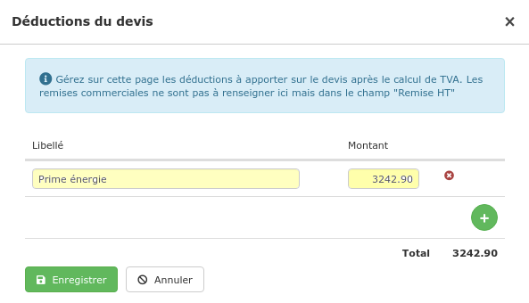

# La Prime énergie

La prime énergie est une somme prise en charge par des sociétés "polluantes" comme les fournisseurs d'énergie sur le montant des travaux d'isolation ou d'économie d'énergie.

Cette prime est soumise à un certain nombre d'obligations sur les documents devis et factures que vous remettez à vos clients.

Le montant de la prime doit être clairement affiché, et être déduit du total TTC, pour un net à payer pouvant descendre jusqu'à 1 euro. 

#### Dès le devis, le client doit être parfaitement informé de son "reste à charge", la prise en charge de cette prime en dépend.

## Saisir le montant de la prime

:digit_one: Ouvrez le pied du devis

:digit_two: Cliquez sur le petit crayon du champ "Déductions" 

:digit_three: Saisissez une nouvelle déduction, par exemple :

:digit_four: Enregistrez.

La prime est déduite du total TTC, le net à payer pour ce devis est de 1 euro.

## Ajouter la mention demandée par votre organisme de financement

### **Préparez un texte pré-enregistré**

:digit_one: Ouvrez le menu "Bibliothèque > Textes"

:digit_two: Créez un nouveau texte :

* Identifiant : "Prime énergie"
* Libellé : "_Le texte réglementaire demandé par votre organisme de financement_".

### **Ajoutez la mention au devis**

:digit_one: Cliquez sur "Modifier les conditions de règlement" dans le pied du devis

:digit_two: Placez-vous à la fin du texte de vos conditions de règlement, et cherchez le texte "Prime énergie" dans les textes pré-enregistrés

Le texte est immédiatement inséré, et facilitera l'acceptation du dossier de votre client.
