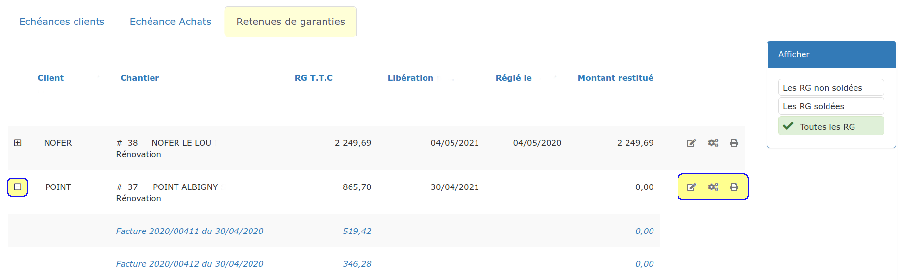

# Retenue de garantie

La retenue de garantie, communément appelée "RG", est une somme retenue sur le montant TTC de chaque facture d'avancement d'un chantier.

Elle sert à garantir au client \(le Maître d'Ouvrage\) le parfait achèvement des travaux dans l'année qui suit la réception du chantier.

Si des désordres sont constatés, et que l'entreprise n'intervient pas, le maître d'oeuvre fera intervenir une autre entreprise, en la payant grâce à la retenue de garantie.

Si tout s'est bien passé, le Maître d'Ouvrage doit restituer aux entreprises les sommes retenues tout au long du chantier.

## 1 Définir la retenue de garantie

La retenue de garantie est toujours calculée en pourcentage du montant TTC de la facture, le plus souvent 5%.

Vous pouvez la définir :

👉 Dès le devis \(recommandé\) :

* Ouvrez le devis
* Ouvrez l'onglet "Pied"
* Cliquez sur "Modifiez les conditions" dans le cadre "Conditions de règlement"
* Dans le champ "Retenue de garantie", saisissez par exemple "5" pour une RG de 5%.

👉 Dans la [facture](../les-factures/deductions-et-majorations.md#retenue-de-garantie-plus-dinformations)

👉 Dans les paramètres "par défaut", depuis le menu "Administration &gt; Mon entreprise", dans les [Conditions de règlement](../../aide-au-demarrage/parametrage-de-mon-entreprise/conditions-de-reglement.md#retenue-de-garantie).

## 2 Application de la retenue de garantie

Dès qu'une retenue de garantie est définie dans les conditions de règlement d'une facture, elle est automatiquement calculée et déduite du total TTC de la facture.

Le "net à payer" de la facture devient inférieur au total TTC. C'est ce "net à payer" que le client devra régler.

### 

#### Retenue de garantie sur facture d'acompte


Il n'est pas possible d'appliquer une retenue de garantie ou du compte prorata à une facture d'acompte, simplement parce qu'aucun travaux n'est facturé, et que ces 2 déductions s'appliquent uniquement sur les travaux, pas sur les mouvements financiers.

L'acompte n'est en fait que le reçu justifiant d'une somme versée avant le démarrage des travaux, comme si le client avait payé une partie de la première situation de travaux à l'avance.

Par définition, vous n'avez pas encore réalisé de travaux à garantir, et n'avez pas utilisé les moyens mis à sa disposition au titre du compte prorata, il n'y a donc aucune justification à les imputer à une facture d'acompte.  
De ce fait, le logiciel ne permet pas cette imputation.

Si votre client souhaite réellement appliquer une retenue de garantie et un compte prorata à cette facture, il ne faut pas faire de facture d'acompte, mais une première situation, avec en avancement global, le montant de l'acompte.


## 3 Gérer les retenues de garantie

Vous pouvez suivre et gérer vos retenues de garanties en ouvrant le menu "Gestion &gt; Échéances", onglet "Retenues de garantie".

Le tableau affiche tous les chantiers pour lesquels une retenue de garantie a été appliquée. Un filtre sur la droite de la page vous permet de n'afficher par exemple que les RG non soldées.

Cliquez sur le  +  en début de ligne pour afficher le détail des retenues de garantie d'une affaire, par facture.

### 👉 Planifier la demande de libération

Généralement 12 mois après la date de réception officielle des travaux, la retenue de garantie doit vous être restituée par le Maître d'Ouvrage.

* Cliquez sur les petites roues crantées  en bout de ligne de l'affaire concernée
* Précisez la durée de la retenue de garantie et la date de réception officielle des travaux.


🔔 Ces informations vont générer une [notification](../../les-plus-du-logiciel/notifications.md#notification-pour-restitution-de-la-retenue-de-garantie), qui vous alertera automatiquement quelques jours avant terme, afin de réclamer la restitution de la retenue de garantie, sans risque d'oubli


### 👉 Courrier de demande de libération

* Cliquez sur l'imprimante  en bout de ligne de l'affaire concernée
* Un courrier de demande de libération est automatiquement édité, avec toutes les informations nécessaires.


💡 Bien que parfois réclamée, **la restitution de la retenue de garantie ne fait pas l'objet d'une facture**. Les travaux ont déjà été facturés dans leur totalité, la retenue de garantie est simplement une somme restant due, et n'est pas facturable.

Elle doit être libérée sur simple demande, et pourra faire l'objet d'une [attestation de libération](retenue-de-garantie.md#attestation-de-liberation-de-la-retenue-de-garantie) de la retenue de garantie.


### 👉 Enregistrement de la restitution de la retenue de garantie

* Cliquez sur le petit crayonen bout de ligne de l'affaire concernée
* Confirmez \(ou corrigez\) le montant reçu
* La retenue de garantie est maintenant totalement \(ou partiellement\) soldée.

### 👉 Attestation de libération de la retenue de garantie

Une fois le [remboursement saisi](retenue-de-garantie.md#enregistrement-de-la-restitution-de-la-retenue-de-garantie), vous pouvez imprimer un courrier à l'attention du Maître d'Ouvrage, attestant de ce remboursement :

* Cliquez sur l'imprimante  en bout de ligne de l'affaire concernée
* Une attestation de libération est automatiquement éditée, avec toutes les informations nécessaires.


💡 Si le remboursement n'est pas complet, le courrier précisera les sommes remboursées et restant dues au titre de la retenue de garantie.


