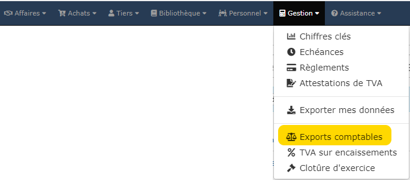
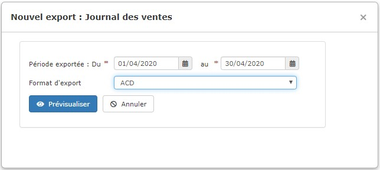

# 📎 Exports comptables

&#x20;Avant de réaliser un export comptable, il est important de bien [**paramétrer votre plan comptable**](parametrage-1/).

:point\_right: Ouvrez le menu "Gestion > Exports comptables"

La liste des exports comptables déjà réalisés s'affiche :&#x20;

.png>)

## Créer un export comptable

:digit\_one: Ouvrez le menu "Gestion > Exports comptables"

:digit\_two: Cliquez sur le bouton vert "Nouvel export", et choisissez le journal à exporter : Ventes, Achats, Règlements

:digit\_three: Sélectionnez la période d'export, et le format du logiciel de comptabilité (Quadratus, ACD, EBP, Coala, etc...)

:digit\_four: Cliquez sur Prévisualiser

Si vous avez sélectionné une période déjà exportée, le logiciel n'exportera que les pièces éventuellement ajoutées à cette période. Le nombre de pièces exportées sur le nombre total des pièces de la période est précisé en tête de la prévisualisation :&#x20;

.png>)

:digit\_five: Après vérification à l'écran, vous pouvez exporter le journal :

* Un fichier sera créé et téléchargé sur votre ordinateur au format d'export demandé
*   L'export sera enregistré sous le logiciel et affiché dans la liste des exports.

## Consulter/annuler un export comptable déjà réalisé

Si vous exportez une période déjà exportée, la plupart du temps, la prévisualisation sera vide, car le logiciel empêche d'exporter 2 fois les mêmes pièces pour éviter les doublons en comptabilité.

Mais si vous souhaitez refaire l'extraction de cette période, suite à des modifications, ou une erreur de format d'export par exemple, vous pouvez l'annuler :

* Cliquez sur la ligne de l'export à annuler,
* Un formulaire vous permet de contrôler les pièces déjà exportées.
* Cliquez sur le bouton "Annuler" pour annuler cet export.

## 3 - Télécharger à nouveau un export réalisé

Vous avez peut-être égaré le fichier d'export d'une période.

Vous pouvez le régénérer, en cliquant simplement en bout de ligne sur la petite icône de téléchargement.

