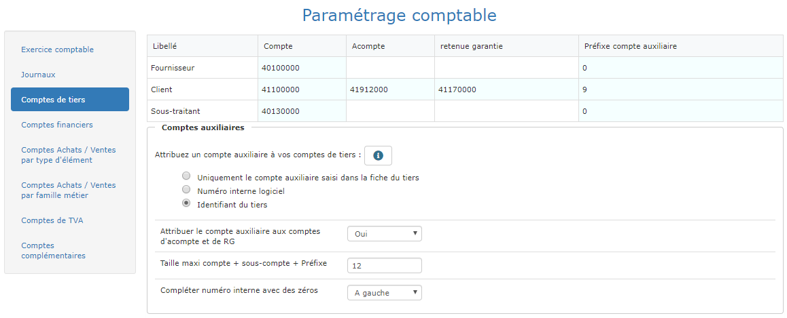

# Comptes de tiers

## Les comptes

* Définissez le compte de tiers pour chaque type : Fournisseur, client, sous-traitant.
* Le compte pour les acomptes clients est utilisé pour définir un compte d'attente.
  * Les acomptes sont gérés sous forme de comptes d'attente de Tiers et de TVA.
* Le préfixe de compte auxiliaire est requis par certains logiciels de comptabilité.

## Les comptes auxiliaires

Les comptes auxiliaires de Tiers sont utilisés en comptabilité pour différencier chaque client. Il y a plusieurs manière de paramétrer les comptes auxiliaires :

* **Uniquement le compte auxiliaire saisi dans la fiche du tiers** Aucun compte auxiliaire ne sera ajouté au compte de tiers, sauf si vous avez saisi un compte auxiliaire directement dans la fiche du tiers \(client, fournisseur, ...\) 
* **Numéro interne** Chaque Tiers dispose d'un numéro interne, du type 1,2,3,...,1526,1527... Si vous avez saisi le compte client "4111-" et que vous cochez cette option, le compte de chaque tiers sera du type 4111-0001, ..., 4111-0437, ..., 4111-1527, ... \(si la taille maximum du compte est de 9 et que vous avez complété avec des zéros à gauche\) 
* **Identifiant** Pour chaque Tiers, vous avez saisi un identifiant. Si vous avez saisi le compte client "4111" et que l'identifiant de votre client est "Dupont Jean Bordeaux", le compte du tiers sera "4111DUPONTJEANB" \(si la taille maximum du compte est de 15 caractères\). 
* **Dans tous les cas, si vous saisissez un compte auxiliaire dans la fiche d'un Tiers, c'est ce compte qui sera utilisé.**

