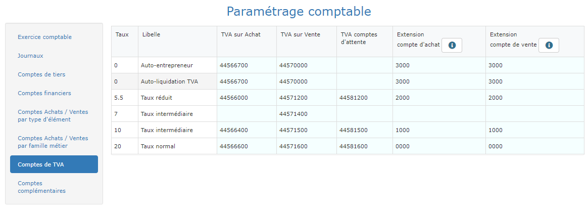

# Comptes de TVA

* Dans la 3ème colonne, les comptes de TVA sur achats pour chaque taux.
* Dans la 4ème colonne, les comptes de TVA sur ventes pour chaque taux.
* Dans la 5ème colonne, les comptes de TVA d'attente, par exemple pour les factures d'acompte.
* Dans la 6ème et la 7ème colonne, les extensions de comptes d'achat et de vente.
  * L'extension sera ajoutée au compte d'achat ou de vente, afin de ventiler vos achats et vos ventes par taux de TVA.


:bulb: Au moment de l'export comptable, le "Code vente", par exemple 7071, sera complété par l'extension du compte de vente, en fonction du taux de TVA de la ligne dans la facture.

Si l'extension TVA à 10% est paramétrée à 1000 par exemple, et que la ligne est facturée à 10% de TVA, le code comptable utilisé sera 70711000.

Ainsi, avec un seul code, vous obtenez toutes les ventilations possibles par taux de TVA.

