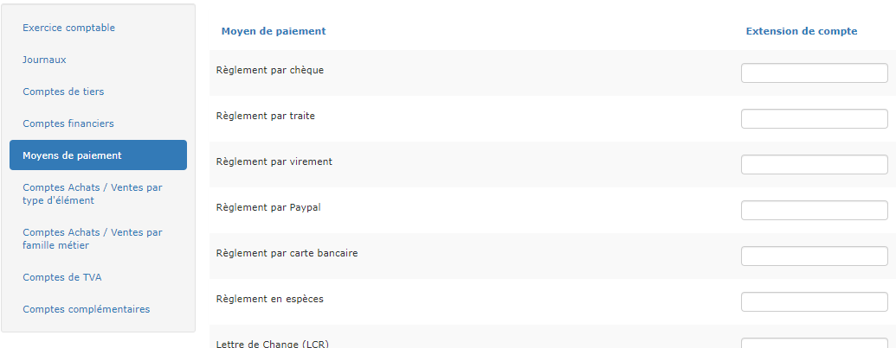
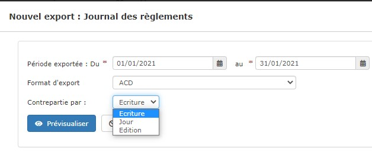

# ➖ Moyens de paiement

## Extensions de compte

Le principe est de préciser une extension qui sera ajoutée au compte comptable du compte bancaire, pour ventiler les règlements par moyen de paiement.

Par exemple :

* Vous avez défini 5121 pour votre banque.
* Vous définissez 01 pour les règlements par chèque, 02 pour les règlement par traite, etc...
* Au moment de l'export des règlements, le logiciel va analyser chaque règlement, et attribuer à l'écriture le compte 
  * 512101 pour un règlement par chèque,
  * 512102 pour un règlement par traite.

## Options d'export.

Au moment de l'export, vous pourrez choisir le niveau de contrepartie :

* Une contrepartie à chaque écriture,
* Une contrepartie par jour,
* Une contrepartie par export.


Le choix du format d'export et du niveau de contrepartie s'enregistrent automatiquement en validant l'export.

Au prochain export, ces options apparaitront par défaut.

