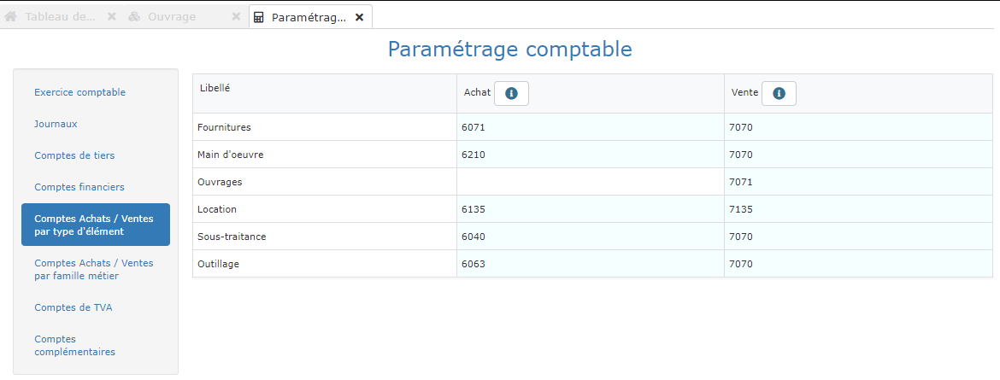
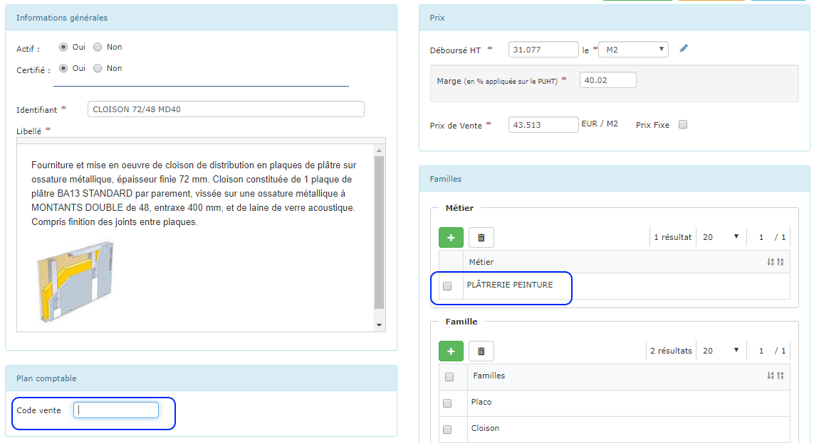
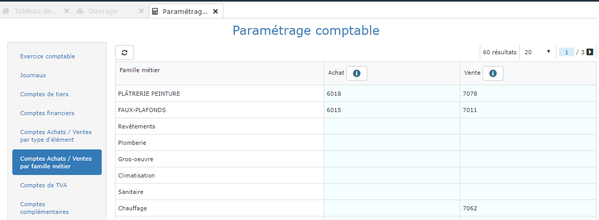

# Comptes d'achat et de vente

## Code général

Vous souhaitez par exemple exporter vos ventes pour le mois de Janvier.  
Le logiciel recherche toutes les factures du mois de Janvier, et analyse chaque ligne de chaque facture.

Dans le paramétrage défini ci-dessus, le logiciel utilisera le code comptable 7071 pour chaque ligne d'ouvrage \(travaux\) qu'il rencontre.

Mais le logiciel permet d'aller beaucoup loin en précisant des comptes spécifiques à certains ouvrages ou certaines familles métier.

## Code spécifique à un ouvrage

Imaginons qu'une ligne facturée soit un ouvrage de réalisation d'une cloison en plaques de plâtre.

* Le logiciel regarde d'abord si cet ouvrage est enregistré dans votre [**bibliothèque d'ouvrages**](../../bibliotheque-de-chiffrage/la-bibliotheque-douvrages/), et si un code comptable spécifique a été défini pour cet ouvrage dans le "Code vente" de la section "Plan comptable".
* Si un code est précisé, c'est ce code qui sera attribué à la ligne de facture.
* Dans cet exemple, le Code Vente est vide. Le logiciel cherche donc si une ****[**famille Métier**](../../bibliotheque-de-chiffrage/les-familles.md) est attachée à cet ouvrage, et si un code comptable spécifique a été défini pour cette famille.

## Code spécifique à une famille

* Dans cet exemple, le logiciel utilisera le code vente 7078 à chaque fois qu'il rencontrera une ligne de facturation d'un ouvrage sans code vente spécifique, et lié à la famille "Plâtrerie peinture".

## Code spécifique par TVA


💡 Au moment de l'export comptable, le "Code vente", par exemple 7071, sera complété par [**l'extension du compte de vente**](les-comptes-de-tva.md), en fonction du taux de TVA de la ligne dans la facture.

Si l'extension TVA à 10% est paramétrée à 1000 par exemple, et que la ligne est facturée à 10% de TVA, le code comptable utilisé sera 70711000.

Ainsi, avec un seul code, vous obtenez toutes les ventilations possibles par taux de TVA.


