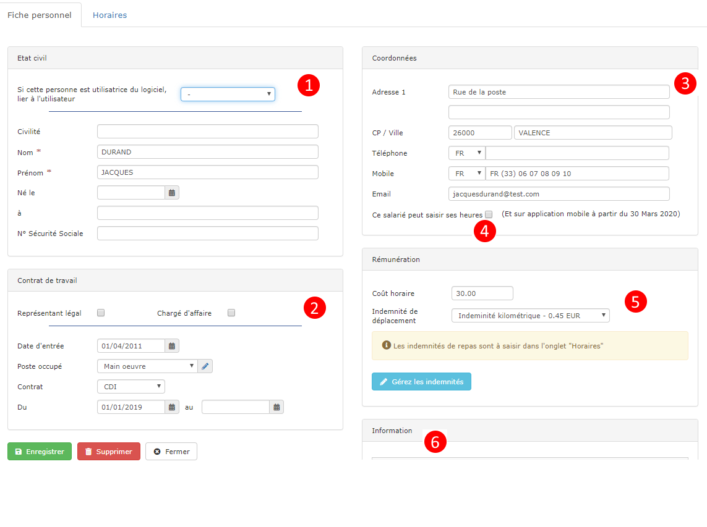

# Fiche personnel

Le logiciel vous permet d'enregistrer les informations de vos salariés, dans le respect du [RGPD](https://www.batiment-gestion.com/politique-confidentialite-progbat-v1.pdf)

## Créer ou modifier une fiche personnel

* Ouvrez le menu "Personnel > Personnel"
* Créez ou ouvrez une fiche personnel.

##  :digit_one: Etat civil

Le premier champ permet de rapprocher un utilisateur du logiciel à sa fiche "personnel". 

Saisissez simplement les données d'état civil de la personne.

## :digit_two: Contrat de travail

* "Représentant légal" permettra au logiciel de nommer le responsable légal dans certains documents comme les contrats de sous-traitance.
* "[Chargé d'affaire](les-charges-daffaire.md)" permettra de retrouver et sélectionner cette personne dans la liste des "suivi par" des chantiers, devis et factures.
* La date d'entrée est informative, elle vous permettra par exemple de modifier les dates de contrats d'un intérimaire, tout en gardant en mémoire la date de sa première entrée dans l'entreprise.
* Le poste occupé est lié à la [bibliothèque d'éléments](../bibliotheque-de-chiffrage/la-bibliotheque-delements.md) "main d'oeuvre".

### Les dates du contrat

Les dates de contrat sont très importantes à renseigner, car elles vont décider de l'affichage de ce personnel dans la liste de saisie des heures, pour éviter d'afficher dans cette liste des personnes ne faisant plus parti de l'entreprise.

## :digit_three: Coordonnées

Saisissez simplement les coordonnées de postales et de contact du salarié

## :digit_four: Saisie des heures par le salarié

Vous pouvez donner à votre salarié la possibilité de saisir ses propres heures travaillées, depuis son smartphone.\
Pour cela :

* Renseignez dans les coordonnées (point 3) son adresse mail.
* Cochez la case "Ce salarié peut saisir ses heures".
  * Le salarié recevra automatiquement un mail à son adresse, avec son mot de passe provisoire.
  * A sa première connexion, il sera invité à créer son mot de passe personnel et sécurisé.
  * Il pourra ensuite saisir ses propres heures.

## :digit_five: Rémunération

### Le coût horaire

Renseignez ici le coût réel de ce salarié, incluant salaire, charges salariales et patronales, caisse de congés payés, ProBTP.... En clair, tout ce que vous coûte ce salarié par heure travaillée.


**Il s'agit d'une donnée statistique destinée à calculer la rentabilité d'un chantier, et pas d'une donnée comptable destinée à réaliser les bulletins de salaire.**

