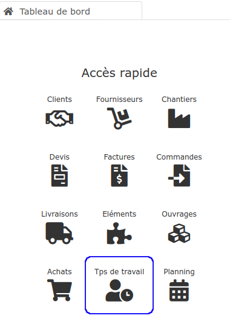
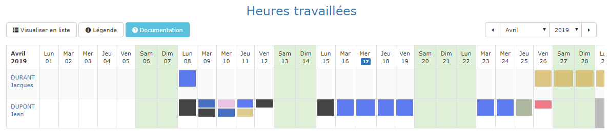
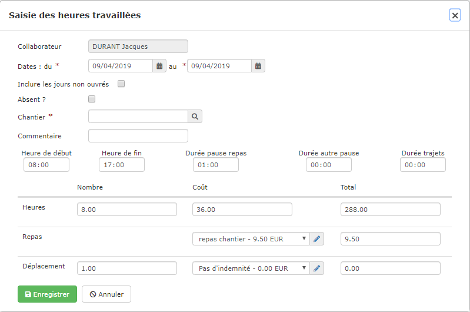

# 📎 Gestion des heures

Le logiciel permet de saisir les heures de vos compagnons, et de les ventiler par chantier.

Les heures peuvent être [saisies "au bureau"](gestion-des-heures.md#saisie-des-heures-au-bureau), sur la base de relevés d'heures papier, mais aussi [par vos salariés eux-mêmes,](gestion-des-heures.md#saisie-des-heures-par-les-compagnons) en sortant du chantier, directement sur leur smartphone.

Les heures saisies sont automatiquement valorisées sur vos chantiers, pour en suivre la rentabilité.

## Saisie des heures "au bureau"

La page de saisie des heures se présente sous la forme d'un tableau affichant tous les jours du mois, et tous les salariés en contrat dans l'entreprise sur le mois affiché.

* Par exemple, si le contrat d'un salarié ou d'un personnel intérimaire se termine le 31 Mars, le salarié sera affiché dans le tableau du mois de Mars, mais plus dans le tableau du mois d'Avril.
* Pensez donc bien à mettre à jour les dates de début et de fin de contrats de vos personnels afin d'éviter les lignes inutiles.

### Saisir une journée

* Placez la souris dans la cellule correspondante au jour et au salarié, et cliquez sur le bouton "+".
* Le formulaire s'affiche, prérempli avec les heures "habituelles" de ce salarié, définies dans sa fiche personnel.

* Choisissez et sélectionnez le chantier,
* Modifiez éventuellement les heures passées ce jour là.
* Vous pouvez bien sur saisir 4 heures sur un chantier, et faire une nouvelle saisie de 4 heures le même jour pour la même personne, mais sur un autre chantier.
* Enregistrez.
* Chaque chantier se verra attribuer une couleur différente.\
  En cliquant sur le bouton "Légende", vous affichez la liste des chantiers de la page, avec leurs couleurs respectives.

### Saisir plusieurs jours

Votre salarié à passé toute la semaine sur le même chantier, et à fait les mêmes horaires chaque jour ?

* Sélectionnez une plage de dates : du ...... au .......
* Sélectionnez le chantier,
* Modifiez éventuellement les heures passées chaque jour, 
* Si vous définissez une plage de 15 jours par exemple, les week-end et jours feriés ne seront pas pris en compte, sauf si vous cochez la case "Inclure les jours non ouvrés".
* Enregistrez.
* La saisie va être automatiquement dupliquée sur tous les jours demandés.

### Saisir une absence

* Pour saisir une période d'absence, cochez la case "Absence".
* Le champ "heures" reste modifiable.
  * Vous pouvez donc, pour la même personne et le même jour, saisir 4 heures sur un chantier, et 3 heures d'absence

### Modifier une saisie

* Cliquez simplement sur la vignette du chantier pour afficher le formulaire, et modifier ou supprimer votre saisie.

## Saisie des heures par les compagnons

Le logiciel permet à vos compagnons de saisir eux-mêmes leurs heures depuis l’application mobile. 

Ainsi, vous n’aurez plus qu’un travail de vérification et de validation des heures.


La saisie des heures par les salariés nécessite [d'affecter le personnel sur le planning](../les-chantiers-1/planning-de-chantiers.md#affecter-du-personnel-a-un-chantier) chantier 


### Donner l'accès à la saisie des heures.

Pour que vos salariés puissent saisir leurs heures, il faut leur en autoriser l'accès, depuis la [fiche personnel.](fiche-personnel.md#4-saisie-des-heures-par-le-salarie-lui-meme)

### L'application mobile

.png>)

L'interface de l'application mobile permet à chacun de vos compagnons :

* De consulter son planning de la semaine, tel qu'il a été saisi "au bureau".
* De voir avec qui il est, sur chaque chantier,
* De consulter l'adresse des chantiers prévus, avec un lien vers Google map pour obtenir l'itinéraire automatiquement.
* En fin de journée, de saisir simplement ses heures :
  * Soit en cliquant sur le bouton "Saisir mes heures" de l'emploi du temps,
  * Soit en sélectionnant la date depuis le menu "Saisie des heures".

####

### Saisie des heures sur l'application mobile

Sur le panneau de saisie des heures, le compagnon peut renseigner différents éléments : 

* Signaler une absence. 
* La sélection du chantier
  * Le compagnon n'a pas accès à la liste des chantiers, et aura uniquement le choix entre le chantier prévu, et "Autre chantier".
* La possibilité de laisser un commentaire. 
* Les heures travaillées et la pause repas. 

Une fois les informations vérifiées, le compagnon n’a plus qu’à les enregistrer.

### Sécurité de la saisie

* Les compagnons ont accès à l'application uniquement si vous leur en avez [donner l'accès](fiche-personnel.md#4-saisie-des-heures-par-le-salarie).
* Ils ont un accès strictement limité aux fonctionnalités d'emploi du temps et de saisie des heures.
* Ils n'ont pas accès à la liste des chantiers de l'entreprise.
* Il suffit de décocher l'accès dans la fiche personnel pour que ce compagnon n'ait plus accès à l'application.

### Contrôle de la saisie

Toutes les heures saisies par vos compagnons sont affichées dans la page de saisie des heures (menu Personnel -> Saisie des heures), en attente de validation.

* Vérifiez les heures saisies par vos compagnons,
* Validez la saisie en bout de ligne.
* Une fois les heures d'un compagnon validées, elle ne pourront plus être modifiées par le compagnon sur l'application mobile. 

## Consultation des heures saisies

* Cliquez sur le bouton "Visualiser en liste".
* Le planning est remplacé par la liste des heures travaillées.
* Vous pouvez maintenant filtrer votre liste (champs de recherche dans les entêtes de colonne) pour afficher les heures d'un chantier, d'un salarié, d'une période, etc...

## Exporter / imprimer les heures saisies

Vous pouvez également imprimer ou exporter la liste filtrée, pour par exemple la transmettre à votre comptable ou votre société d'intérim pour la réalisation des fiches de paie.
