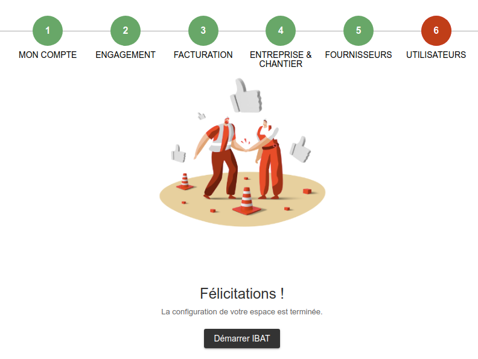

# ➖ Activer iBAT©

## :digit\_one: Créez un compte IBAT©

* Rendez-vous sur le site iBAT© ou cliquez sur le lien ci-contre :[https://www.ibat-solution.com/solution/solution-ibat-achat/#mdesktop](https://www.ibat-solution.com/solution/solution-ibat-achat/#mdesktop)
* Choisissez la formule ACHAT la plus adaptée à vos besoins (en bas de page), puis cliquez sur le bouton "**Tester gratuitement pendant 7 jours**". _N'hésitez pas à vous faire assister par un conseiller iBAT© pour votre choix : _[_https://infos.ibat-solution.com/demande\_contact\_ibat_](https://infos.ibat-solution.com/demande\_contact\_ibat)__
* &#x20;Saisissez vos informations jusqu'à la sélection de vos fournisseurs
* Choisissez une clé de validation (code), qui vous servira à confirmer vos actions (commandes, ...)
* Votre compte est créé, et votre période d'essai démarre immédiatement !

## :digit\_two: Liez iBAT© à votre compte Entreprise

* Ouvrez le menu utilisateur (celui portant votre prénom) > Extensions (plugins)
* Activez le partenaire iBAT©
* Saisissez votre** **adresse email et mot de passe
* Validez
*   Autorisez l'accès au logiciel pour iBAT©.

Vous êtes prêts à commander !

