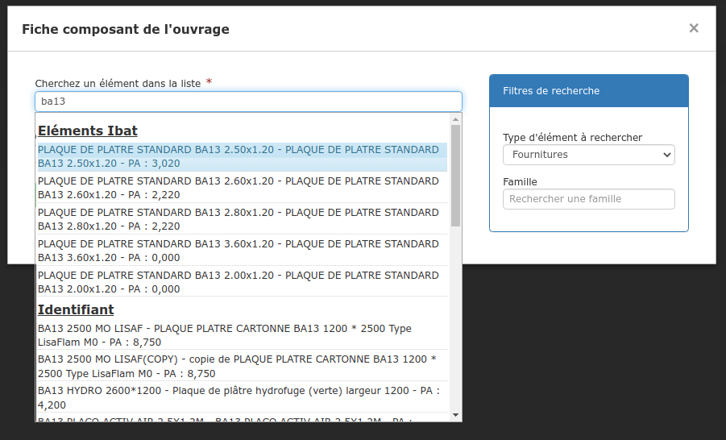

# ➖ Chiffrer précisément grâce à iBAT©

Le logiciel vous permet de composer vos ouvrages, depuis la bibliothèque, ou directement depuis le devis, grâce à :&#x20;

* &#x20;Votre bibliothèque d'éléments
* &#x20;Votre / Vos bibliothèques BatiChiffrage©
* &#x20;**Et maintenant, iBAT© !**

:ballot\_box\_with\_check: Récupérez directement vos prix d'achat fournisseurs !

Rien de plus simple, tout se déroule sous le logiciel :&#x20;

### **Depuis le devis**

:digit\_one: Cliquez sur les 3 petits cubes   dans le menu de ligne :

:digit\_two: Une composition "par défaut", ou la composition déjà créée par vos soins, s'affiche

:digit\_three: Cliquez sur le bouton et saisissez les premières lettres de l'élément fourniture à ajouter :&#x20;

Les éléments iBAT© sont automatiquement proposés dans la liste déroulante, les prix d'achat sont ceux que vous avez négocié avec votre fournisseur, ou à défaut, ceux proposés sur la plateforme iBAT©

:digit\_three: Indiquez les quantités nécessaires de ces éléments pour réaliser cet ouvrage

__:digit\_four:_ _Vérifiez ou modifiez les prix et/ou les marges si nécessaire

:digit\_five: Enregistrez.

### Depuis la bibliothèque d'ouvrages

:digit\_one: Cliquez sur l'onglet "Composition" de l'ouvrage créé

:digit\_two: Cliquez sur le bouton "Ajouter" et saisissez les premières lettres de l'élément fourniture à ajouter :&#x20;

Les éléments iBAT© sont automatiquement proposés dans la liste déroulante, les prix d'achat sont ceux que vous avez négocié avec votre fournisseur, ou à défaut, ceux proposés sur la plateforme iBAT©

:digit\_three: Indiquez les quantités nécessaires de ces éléments pour réaliser cet ouvrage

__:digit\_four:_ _Vérifiez ou modifiez les prix et/ou les marges si nécessaire

:digit\_five: Enregistrez.
