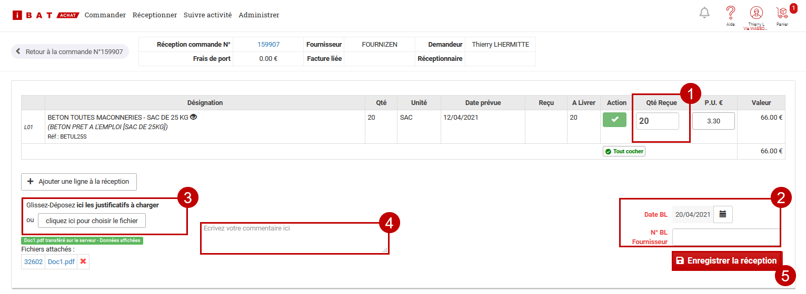

# ➖ Commander avec iBAT©


\
Votre [compte iBAT© est créé](activer-ibat-c.md#creez-un-compte-ibat-c), la [connexion avec le logiciel est établie](activer-ibat-c.md#liez-ibat-c-a-votre-compte-entreprise) : iBAT© est maintenant totalement intégré à votre logiciel.

Vous pouvez dès à présent envoyer vos demandes de prix (dits "devis" sous iBAT©), commander, réceptionner et saisir vos factures d'achat sur iBAT© en toute fluidité, directement depuis le logiciel.

Les avantages ? Cliquez [ici](./).

## Demandes de prix sur iBAT**©**, pour optimiser ses coûts d'achat :dart:&#x20;

iBAT**© **permet d'effectuer des demandes de prix ("devis") à un ou plusieurs fournisseurs : gain de temps et d'argent ! Une fois votre choix effectué, vous pourrez transformer ce "devis" en commande.

Ne changez pas vos habitudes sous le logiciel ! Pour créer une demande de prix avec iBAT©, initiez-la comme d'habitude :

### :point\_right: Depuis la synthèse du devis

****:information\_source: Gain de temps considérable! ** **La [synthèse du devis](../../les-devis/les-indispensables-du-devis/synthese-du-devis.md) permet de constituer automatiquement la liste des éléments à commander, sans avoir à les saisir.

\
\
:digit\_one: Depuis l'onglet "Synthèse" du devis, cliquez sur le bouton "Actions", puis choisissez de "Créer une demande de prix fournisseur"

:digit\_two: **Vous êtes automatiquement redirigé sur iBAT© **pour créer votre demande de prix rapidement, efficacement, et bénéficier des avantages de cette plateforme multi-fournisseurs

:digit\_three: Les informations du logiciel remontent sur iBAT**© **: les éléments à commander et les données du chantier sont automatiquement reportées !

:digit\_four: Pour ajouter un élément à votre demande de prix, cliquez sur le bouton "Ajouter un article", puis choisissez de rechercher dans les articles référencés, ou de le saisir librement.

:bulb: Sélectionnez plusieurs fournisseurs pour tenter d'obtenir le prix le plus intéressant !

:digit\_five: Cliquez sur "Demander un devis", et effectuez une nouvelle recherche si vous souhaitez obtenir le prix de plusieurs articles

:digit\_six: Cliquez sur l'icône "Devis" en haut de page pour accéder à la liste de vos devis en cours, par chantier

:digit\_seven: Ouvrez le devis, puis cliquez sur "Continuer vers l'étape suivante" pour vérifier / modifier les informations fournisseurs et de livraison

:digit\_eight: Cliquez en bas de page sur "Finaliser la demande de devis", saisissez votre clé de validation. Suivre mes demandes de prix : Cliquez [ici](commander-avec-ibat-c.md#suivre-mes-demandes-de-prix).

### :point\_right: Créer "librement" une demande de prix

:digit\_one: Ouvrez le menu "Dépenses > Commandes", ou cliquez simplement sur l'accès rapide "Commandes" de votre tableau de bord

:digit\_two: Cliquez sur le bouton "Nouveau document", et choisissez "Demande de prix fournisseur"

:digit\_three: **Vous êtes automatiquement redirigé sur iBAT© **pour créer votre demande de prix rapidement, efficacement, et bénéficier des avantages de cette plateforme multi-fournisseurs

:digit\_four: Sélectionnez un article catalogue ou effectuez une saisie libre :

:bulb: Depuis la saisie libre, sélectionnez plusieurs fournisseurs pour tenter d'obtenir le prix le plus intéressant !

:digit\_five: Cliquez sur "Demander un devis", et effectuez une nouvelle recherche si vous souhaitez obtenir le prix de plusieurs articles

:digit\_six: Cliquez sur l'icône "Devis" en haut de page pour accéder à la liste de vos devis en cours, par chantier

:digit\_seven: Ouvrez le devis, puis cliquez sur "Continuer vers l'étape suivante" pour vérifier / modifier les informations fournisseurs et de livraison

:digit\_eight: Cliquez en bas de page sur "Finaliser la demande de devis", saisissez votre clé de validation. Suivre mes demandes de prix : Cliquez [ici](commander-avec-ibat-c.md#suivre-mes-demandes-de-prix).

## Suivre mes demandes de prix

:digit\_one: Votre fournisseur reçoit immédiatement la notification de votre demande de prix par email, et doit confirmer sa prise en charge

:digit\_two: Vous recevrez un email lorsque le devis a été mis à jour par le fournisseur, sur votre liste de devis iBAT**©**, il passe alors au statut "Attente de confirmation client"

:digit\_three: Cliquez sur "Accepter le devis et passer la commande" pour transformer le devis en commande.

## Commander sur iBAT**©, **depuis le logiciel

Ne changez pas vos habitudes sous le logiciel ! Pour créer une commande avec iBAT©, initiez-la comme d'habitude :

### :point\_right: Depuis la synthèse du devis

****:information\_source: Gain de temps considérable! ** **La [synthèse du devis](../../les-devis/les-indispensables-du-devis/synthese-du-devis.md) permet de constituer automatiquement la liste des éléments à commander, sans avoir à les saisir.

:digit\_one: Depuis l'onglet "Synthèse" du devis, cliquez sur le bouton "Actions", puis choisissez de "Créer un bon de commande fournisseur".

:digit\_two: **Vous êtes automatiquement redirigé sur iBAT© **pour créer votre commande rapidement, efficacement, et bénéficier des avantages de cette plateforme multi-fournisseurs

:digit\_three: Les informations du logiciel remontent sur iBAT**© **: les éléments à commander et les données du chantier sont automatiquement reportées !

:digit\_four: Pour ajouter un élément à votre commande, suivez simplement les étapes décrites dans cette vidéo : [https://www.youtube.com/watch?v=1\_RR2T\_M\_Eg\&t=64s](https://www.youtube.com/watch?v=1\_RR2T\_M\_Eg\&t=64s)

:bulb: Sélectionnez plusieurs fournisseurs pour tenter d'obtenir le prix le plus intéressant !

:digit\_five: Votre fournisseur reçoit immédiatement la notification de votre commande par email, et doit confirmer sa prise en charge

:digit\_six: Le statut de commande se met à jour à chaque action. Suivre mes commandes : Cliquez [ici](commander-avec-ibat-c.md#suivre-mes-commandes).

### :point\_right: Créer "librement" une commande

:digit\_one: Ouvrez le menu "Dépenses > Commandes", ou cliquez simplement sur l'accès rapide "Commandes" de votre tableau de bord

:digit\_two: Cliquez sur le bouton "Nouveau document", et choisissez "Commande fournisseur"

****:digit\_three: **Vous êtes automatiquement redirigé sur iBAT© **pour créer votre commande rapidement, efficacement, et bénéficier des avantages de cette plateforme multi-fournisseurs

:digit\_four: Suivez simplement les étapes décrites dans cette vidéo : [https://www.youtube.com/watch?v=1\_RR2T\_M\_Eg\&t=64s](https://www.youtube.com/watch?v=1\_RR2T\_M\_Eg\&t=64s)

:bulb: Sélectionnez plusieurs fournisseurs pour tenter d'obtenir le prix le plus intéressant !

:digit\_five: Votre fournisseur reçoit immédiatement la notification de votre commande par email, et doit la confirmer

:digit\_six: Votre fournisseur reçoit immédiatement la notification de votre commande par email, et doit confirmer sa prise en charge

:digit\_seven: Le statut de commande se met à jour à chaque action. Suivre mes commandes : Cliquez [ici](commander-avec-ibat-c.md#suivre-mes-commandes).

## Suivre mes commandes

Toutes les commandes passées sur iBAT**© **seront visibles depuis le menu "Réceptionner" d'iBAT**©,** mais également depuis la liste de vos commandes sous le logiciel.

La vidéo ci-contre vous explique comment s'effectue le suivi de commandes sur iBAT**©**, jusqu'à la réception **: **[https://youtu.be/hN5rz8LBb7A](https://youtu.be/hN5rz8LBb7A) .

## Créer une liste d'articles favoris

**Vous achetez souvent les mêmes articles ? **

Constituez une liste d'articles favoris pour renouveler votre commande en quelques clics, à chaque fois que vous en aurez besoin.

Pour savoir comment faire, consultez la vidéo ci-contre : [https://www.youtube.com/watch?v=fVQjmkM838M\&t=65s](https://www.youtube.com/watch?v=fVQjmkM838M\&t=65s)

## Réceptionner avec iBAT**©**

Ici encore, ne changez pas vos habitudes sous le logiciel ! Pour créer une réception de marchandise (Bon de livraison) avec iBAT©, initiez-la comme d'habitude :

### :point\_right:Créer "automatiquement" un bon de livraison ( Gain de temps )

:digit\_one: Ouvrez la commande, et cliquez à droite de la page sur "Réceptionner"

**ou**

Ouvrez la liste des bons de livraison, depuis le menu "Dépenses > Bons de livraison". Cliquez sur "Nouveau document", puis choisissez "Bon de livraison à partir d'une commande", et enfin sélectionnez la commande à réceptionner

:digit\_two: **Vous êtes automatiquement redirigé sur iBAT© **pour saisir votre réception de marchandise

:digit\_three: Renseignez pour chaque ligne article la quantité à réceptionner – modifiez le prix unitaire si besoin

:digit\_four: Renseignez la date et le numéro du Bon de Livraison

:digit\_five: Si nécessaire, ajoutez une pièce-jointe (ex : bon de livraison)

:digit\_six: Si nécessaire, vous pouvez ajouter un commentaire

:digit\_seven: Puis cliquez sur « Enregistrer la réception »

****

### :point\_right: Créer "Librement" un bon de livraison

:digit\_one: Ouvrez la liste des bons de livraison, depuis le menu "Dépenses > Bons de livraison", puis cliquez sur "Nouveau document", et enfin choisissez "Bon de livraison sans commande"

:digit\_two: **Vous êtes automatiquement redirigé sur iBAT© **pour saisir votre réception de marchandise

:digit\_three: Renseignez pour chaque ligne article la quantité à réceptionner – modifiez le prix unitaire si besoin.

:digit\_four: Renseignez la date et le numéro du Bon de Livraison

:digit\_five: Si nécessaire, ajoutez une pièce-jointe (ex : bon de livraison)

:digit\_six: Si nécessaire, vous pouvez ajouter un commentaire

:digit\_seven: Puis cliquez sur « Enregistrer la réception »


**Informations complémentaires :**

*   Il est possible de réceptionner **plus** que la quantité commandée

*   Il est possible de réceptionner des quantités négatives (dans le cas de retour de matériel)

*   Il est possible d’ajouter un article non prévu dans une commande initiale

* Tout BL enregistré dans iBAT**©** peut être modifié ou supprimé tant qu’il n’est pas lié à une facture.


## Créer un nouveau fournisseur

Si vous souhaitez passer commande auprès d'un fournisseur qui n'existe pas encore, vous pourrez le créer depuis votre compte iBAT**©**, il sera automatiquement créé dans le logiciel :\

:digit\_one: Cliquez sur "Administrer", puis sur "Ajouter un fournisseur"

:digit\_two: Une fenêtre s'ouvre, renseignez les informations du fournisseur

:digit\_three: Si le fournisseur existe déjà dans la base iBAT**©**, cliquez sur "Configurer la spécificité agence" et indiquez les coordonnées du contact commercial, puis enregistrez.\
&#x20;        Si le fournisseur n'existe pas encore dans a base iBAT**©**, vous pouvez le créer en cliquant sur "**Créer un fournisseur**", puis en renseignant l'adresse mail d'un contact commercial.&#x20;

:warning: Il est normal qu'il n'apparaisse pas encore dans la "Liste des Fournisseurs", puisqu'il n'a pas encore d'articles qui lui sont rattachés.


Pour plus d'informations :

*   Consultez la documentation iBAT**©** : [https://support-zen.ibat-solution.com/hc/fr](https://support-zen.ibat-solution.com/hc/fr)

*   Prenez contact avec un conseiller iBAT**© : **[https://infos.ibat-solution.com/demande\_contact\_ibat](https://infos.ibat-solution.com/demande\_contact\_ibat)



