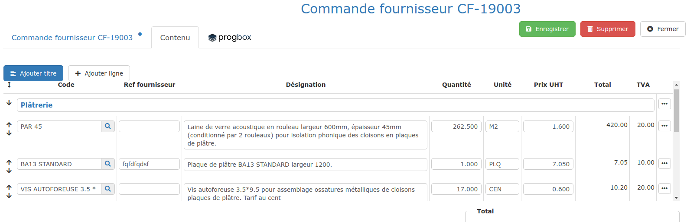
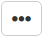

# Commandes Fournisseur

## Créer une commande fournisseur_ _

_Cliquez _[_ici_](../../les-devis/saisir-un-devis/synthese-du-devis.md#le-bouton-actions)_ pour créer une demande de prix, avant de commander._

__

Il y existe 2 manières de créer une commande fournisseur :

### :point_right: Créer "automatiquement" une commande fournisseur

**Gain de temps considérable!  **La [synthèse du devis](../../les-devis/saisir-un-devis/synthese-du-devis.md) permet de créer automatiquement votre bon de commande, sans avoir à en saisir les lignes :

:digit_one: Depuis l'onglet "Synthèse" du devis, cliquez sur le bouton "Actions", puis choisissez de "Créer un bon de commande fournisseur"

:digit_two: Recherchez ou créez un Fournisseur, puis recherchez un Chantier. _Si vous ne sélectionnez pas de chantier, la demande de prix est considérée comme destinée à une commande pour le stock_

:digit_three: Précisez la Date de Commande et de Livraison, puis le lieu de Livraison

:digit_four: Validez. Le formulaire de saisie de commande s'ouvre, déjà pré-rempli.

### :point_right: Créer "librement" une commande fournisseur

:digit_one: Ouvrez le menu "Dépenses > Commandes", ou cliquez simplement sur l'accès rapide "Commandes" de votre tableau de bord

:digit_two: Cliquez sur le bouton "Nouveau document", et choisissez "Commande fournisseur"

:digit_three: Recherchez ou créez un Fournisseur, puis recherchez un Chantier. _Si vous ne sélectionnez pas de chantier, la demande de prix est considérée comme destinée à une commande pour le stock_

:digit_four: Précisez la Date de Commande et de Livraison, puis le lieu de Livraison

:digit_five: Validez. Le formulaire de saisie de commande s'ouvre :

## Saisir des lignes d'une commande

:digit_one:Ouvrez l'onglet "Contenu"

:digit_two: Cliquez sur "Ajouter titre" pour ajouter une ligne de titre à votre commande, et saisissez ce titre librement (Plâtrerie dans l'exemple)

:digit_three: Cliquez sur "Ajouter ligne" pour ajouter une ligne à votre commande. 

Retrouvez ci-dessous les 2 méthodes de saisie d'une ligne de commande_ _:

### :point_right: Saisie "automatique" :  Les articles à commander existent déjà dans ma bibliothèque de fournitures

Il est recommandé d'utiliser votre bibliothèque de fournitures pour passer des commandes chiffrées très rapidement :

:digit_one: Dans le premier champ "Code", recherchez une fourniture enregistrée dans votre [**bibliothèque d'éléments**](../../bibliotheque-de-chiffrage/la-bibliotheque-delements.md), grâce à son identifiant ou sa référence fournisseur

* Les champs "Désignation", "Unité" et "Prix unitaire" sont automatiquement remplis avec les données de la bibliothèque. _Tous les champs remplis automatiquement restent modifiables dans la commande, et votre bibliothèque ne sera pas modifiée._
* Le champ "Ref Fournisseur" est la référence de cet article chez le fournisseur, elle est facultative.

:digit_two: Saisissez la quantité

:digit_three: Créez la ligne suivante en cliquant sur le bouton "Ajouter ligne" ou en tapant "Entrée" jusqu'au bout de la ligne.

### :point_right: Saisie "libre" :  Les articles n'existent pas encore dans ma bibliothèque de fournitures

Saisissez directement la désignation, la quantité, l'unité et le prix unitaire dans les champs respectifs.

:bulb: **Vous pouvez immédiatement enregistrer ces articles à votre bibliothèque**, depuis le bon de commande (voir [ci-dessous](bon-de-commande-fournisseur.md#enregistrer-mettre-a-jour-un-article-dans-ma-bibliotheque-depuis-le-bon-de-commande)), cela vous évitera de le ressaisir la prochaine fois que vous le commanderez.

__

## Enregistrer / Mettre à jour un article dans ma bibliothèque, depuis le bon de commande

:point_right: Cliquez sur les trois petits points  en bout de ligne, et choisissez "Enregistrer l'élément" :

*   Si l'article existe déjà, le logiciel vous propose de le mettre à jour, pratique par exemple pour enregistrer un nouveau prix

*   Si l'article n'existe pas, le logiciel va l'enregistrer dans votre bibliothèque, pour que vous puissiez le réutiliser dans votre prochaine commande.

## Imprimer / Envoyer une commande

:point_right: Cliquez sur le bouton "Envoyer/imprimer" pour prévisualiser la commande :

*   **Enregistrer sur l'ordinateur : **

    Cliquez sur le document, avec le bouton de droite de la souris, pour enregistrer le bon de commande sur votre ordinateur ("Enregistrer sous...")

    Vous pouvez également cliquer sur le bouton de téléchargement.
*   **Imprimer :**

    Cliquez sur "Imprimer" à droite de la page pour ouvrir le module d'impression de votre navigateur, et imprimer votre bon de commande. N'oubliez pas de valider l'impression, pour que le logiciel [historise l'impression](../../../faq-aides-trucs-et-astuces/trucs-et-astuces.md#validation-de-limpression-dun-document)
*   **Envoyer par email :**

    Cliquez sur "Envoyer par mail" pour envoyer la commande à votre fournisseur par mail depuis le logiciel. Cliquez [ici](../../../aide-au-demarrage/parametrage-de-mon-entreprise/envois-par-mail/parametrer-ma-propre-adresse-mail.md) pour paramétrer vos envois par mail depuis le logiciel.


Comme tous les documents, vous pouvez [créer et personnaliser vos propres modèles](../../modeles-de-document.md#creer-un-modele) de bons de commande

__:bulb: La gestion des [modèles de document](../../modeles-de-document.md#section-corps-de-document) vous permettra d'imprimer vos bons de commande sans les prix si nécessaire, pour en faire un [bon de préparation](../../les-devis/saisir-un-devis/synthese-du-devis.md#creer-un-bon-de-preparation) par exemple.


__

## Réceptionner une commande fournisseur

Cliquez [ici](../les-bons-de-livraison/).

