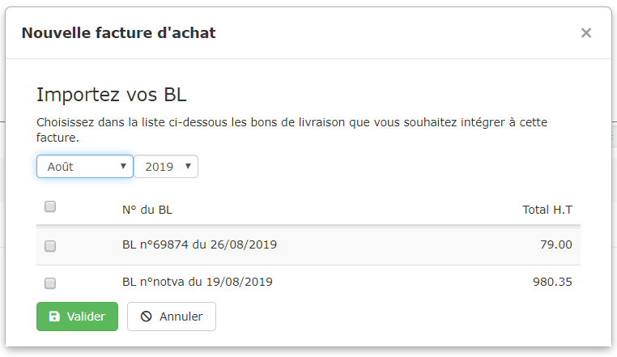
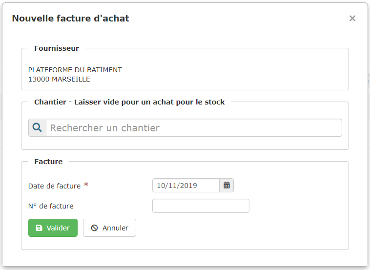
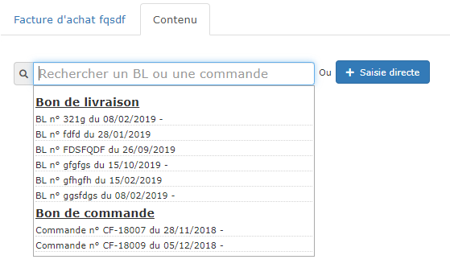
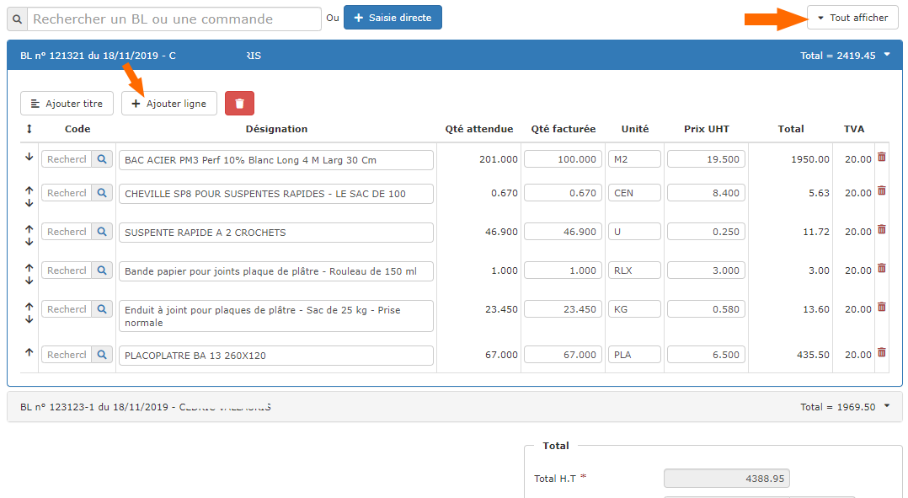

# Factures d'Achat

De nombreux systèmes permettent de scanner ou  télécharger directement vos factures d'achat, qui sont automatiquement reconnues et comptabilisées.

Mais ces systèmes ne permettent pas d'analyser chaque ligne d'une facture pour identifier les articles, les affecter aux différents chantiers, ou encore rapprocher une facture de vos bons de livraison.

Si vous souhaitez analyser la rentabilité de vos chantiers et gérer vos achats, vous devez donc saisir vos factures dans le logiciel.


C'est le bon de livraison ou de réception de travaux qui est comptabilisé dans les dépenses de la fiche chantier, et qui vous permettra donc d'analyser la rentabilité du chantier, dès validation de la réception.

La saisie d'une facture d'achat sans bon de livraison en crée un automatiquement, et permet donc également d'analyser la rentabilité du chantier, dès validation de la facture d'achat.


## Créer une facture d'achat

:digit_one: Ouvrez le menu "Dépenses  >  Factures d'achat". Cliquez sur le bouton "Nouvelle facture d'achat"

**ou**

Depuis le bon de livraison, cliquez sur le bouton " Facturer"

:digit_two: Recherchez un fournisseur, un sous-traitant, ou un tiers d'une [catégorie personnalisée](../les-tiers/categories-et-groupes-de-tiers.md)

:digit_three: Renseignez la date et le numéro de la facture. Un formulaire s'ouvre :

:point_right: Si des bons de livraison / de réception de travaux existent pour ce fournisseur / sous-traitant, le logiciel vous propose de les sélectionner, pour les intégrer automatiquement à la facture :

:point_right: Si aucun bon de livraison n'est trouvé pour ce fournisseur, le logiciel vous propose d'associer un chantier à la facture, pour en calculer la rentabilité.\
Vous pouvez laisser le champ libre si vous ne gérez pas de chantiers, ou si la commande concerne votre stock.

## Contenu de la facture d'achat

### :point_right: Facturer un ou plusieurs bons de livraison

Vous pouvez rechercher un ou plusieurs bons de livraison / de réception de travaux, ou bien une commande, dans le champ de recherche :

### :point_right: Saisir une facture d'achat sans commande, ni bon de livraison

:digit_one: Cliquez sur le bouton "Saisie directe"

:digit_two: Vous pouvez choisir un chantier, pour lui affecter les achats que vous allez saisir

:digit_three: Vous pouvez laisser le choix du chantier vide, si vous ne gérez pas la rentabilité de vos chantiers, ou si ces achats concernent votre stock.

### :point_right: Saisir, consulter, modifier les lignes de la facture d'achat

Chaque bon de livraison, ou chaque saisie directe, est représentée par une section :

* Ouvrez une section pour ajouter, modifier ou supprimer des lignes d'achat :
  * Le bouton " Ajouter ligne " permet d'ajouter une nouvelle ligne d'achat
  * Le bouton " Ajouter titre " permet d'ajouter un titre si vous souhaitez organiser votre facture
  * Le bouton rougesupprime la totalité de la section, 
  *   La petite poubelle rougeen bout de ligne, supprime la ligne en question

* Cliquez sur le bouton "Tout afficher" en haut à droite pour ouvrir toutes les sections.

