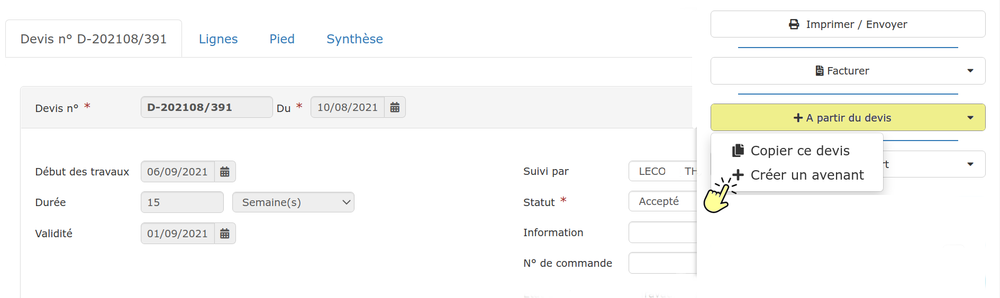
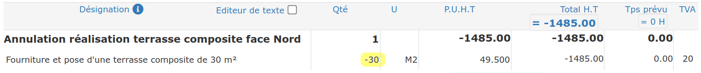
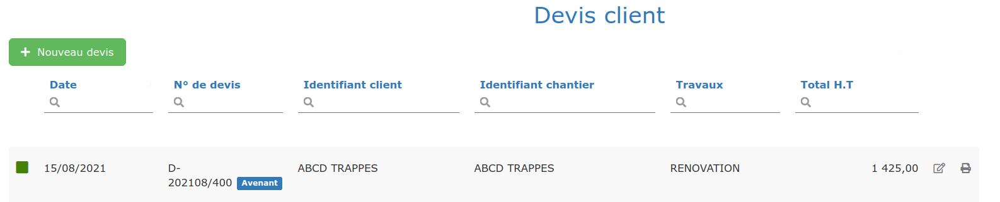
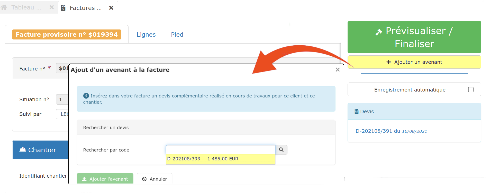
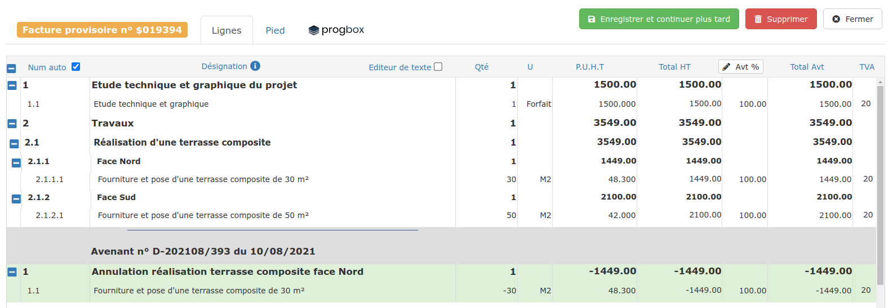
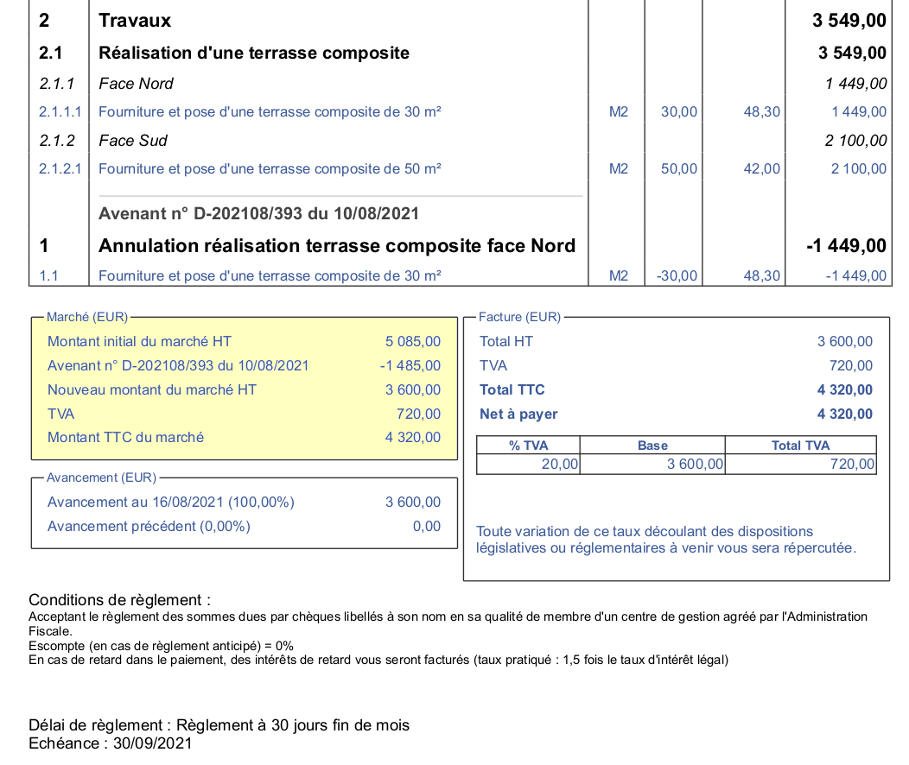

# Avenants

Un avenant est un devis que l'on réalise en cours de chantier, et qui vient modifier le devis initial :

:point_right: Travaux supplémentaires

:point_right: Modifications de quantités

:point_right: Plus ou moins values, modifications de prestations, etc...


**Ne faites jamais de travaux supplémentaires sans réaliser préalablement un avenant, signé et accepté par le client.**

Ceci évitera tout conflit et toute discussion au moment du règlement de la facture finale.


## Créer un avenant

La meilleure méthode est la suivante :

:digit_one: Ouvrez le devis initial

:digit_two: Cliquez à droite de la page sur le bouton "A partir du devis", et choisissez "Créer un avenant". Un nouveau devis sera créé, pour le même client, et le même chantier

 :digit_three:Saisissez le contenu de votre avenant, comme pour un simple devis.

:point_right: Pour que votre avenant "annule" un ouvrage_ _du devis initial : 

* ajoutez ce même ouvrage (ou saisissez librement un libellé)
* saisissez une quantité **ou** un prix en négatif

:digit_four: En revenant sur la liste des devis, vous constaterez que ce nouveau devis a une étiquette "Avenant"

__

__:bulb: **Vous pouvez également créer simplement un devis pour le même client et le même chantier que le devis initial, il se trouvera alors dans la liste des avenants à facturer.**

__

## Facturer un avenant

De manière générale, l'avenant est facturé sur la facture du devis initial.

Après avoir établi la facture à partir du devis initial, et tant que la facture est en mode provisoire :

:digit_one: Cliquez à droite de la page sur "Ajouter un avenant"

La liste propose tous les devis établis pour le même client et le même chantier, et qui n'ont pas été facturés. Votre avenant s'y trouvera, probablement même tout seul_._

:digit_two: Sélectionnez l'avenant (le devis) à ajouter à la facture

:digit_three: L'avenant est ajouté au bas de la facture, avec en commentaire le numéro et date de l'avenant

:digit_four: Vous pouvez ajouter autant d'avenants que nécessaire dans une facture de travaux, que se soit sur une situation ou sur la facture finale.

La liste des avenants sera clairement affichée au pied de la facture, au niveau des totaux, précisant le montant initial du marché, et le nouveau montant du marché :

