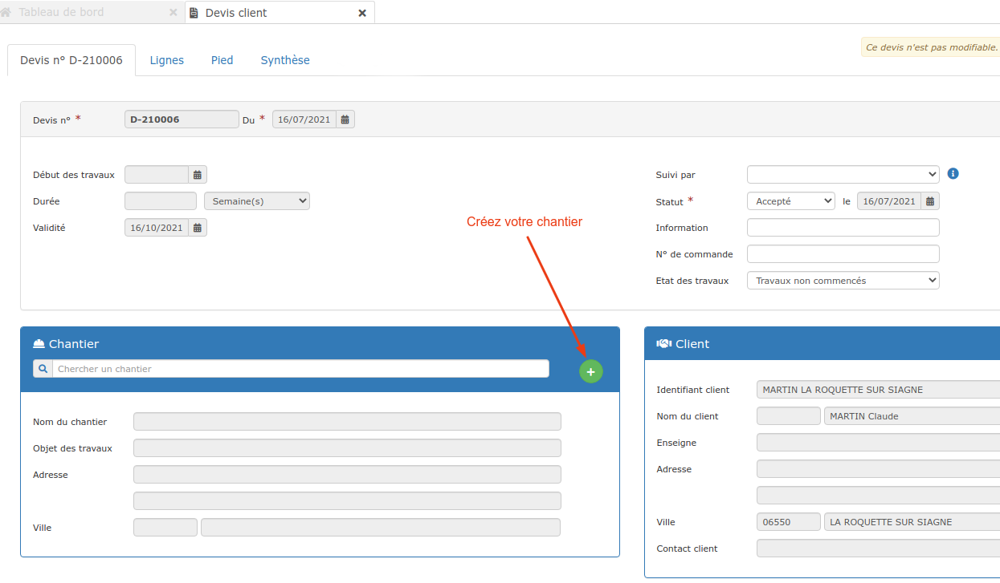

# Créer un chantier


La fiche chantier  va centraliser de très nombreuses informations, données et documents saisis sur le logiciel, durant toute la vie du chantier :\
Les devis et factures bien sûr, mais aussi les achats, les temps passés sur les chantiers, les matériaux utilisés, ...

C'est également sur la fiche chantier que vous pourrez suivre la rentabilité de chacun de vos chantiers, et même utiliser le "pilotage temps réel", outil graphique permettant d'anticiper très simplement un dérapage avant qu'il ne soit trop tard.


## Créer un chantier

### :digit_one: Au moment de la création d'un devis

Lorsque vous créez un devis, le logiciel vous propose de créer ou de choisir un client, puis de créer ou choisir un chantier.

Profitez de cette phase de création du devis pour créer la fiche chantier en moins d'une minute :

.png>)

Le formulaire s'ouvre, déjà pré rempli des informations client :

*   Si le chantier se trouve à la même adresse que celle du client, vous n'avez rien à modifier.

    Sinon, modifiez les informations nécessaires, ou cliquez sur "Effacer les données du formulaire" pour ressaisir les informations.

*   Le dernier champ "Travaux à réaliser" permet de préciser en quelques mots la nature des travaux que vous allez réaliser sur ce chantier.

    :warning: Cette donnée est obligatoire et indispensable, vous verrez plus loin qu'il est possible de créer plusieurs phases de travaux ou interventions au sein d'un même chantier.

### :digit_two: Depuis un devis déjà créé


Vous êtes nombreux à utiliser cette méthode.


Vous pouvez également créer un chantier à partir d'un devis déjà créé, que son statut soit "à l'étude", "en attente" ou même "accepté".

* Ouvrez le devis déjà créé
* Cliquez sur le bouton "+" au niveau du cadre "Chantier"
*   Le formulaire de création du chantier sera pré-rempli des informations manuellement indiquées au préalable ou à défaut de celles du client, ajoutez et/ou modifiez les informations nécessaires.

### :digit_three: Depuis la liste des chantiers

Vous pouvez aussi créer un chantier avant de créer le devis, par exemple le jour où vous faites la visite du chantier :

* Ouvrez le menu "Affaires > Chantiers", et cliquez sur "Nouveau chantier"
* Un chantier est obligatoirement rattaché à un client, sélectionnez le client concerné
*   Le formulaire de création du chantier s'ouvrira.

### :digit_four: Depuis la fiche client

Enfin, vous pouvez créer la fiche chantier en passant par la fiche client :

* Ouvrez la fiche du client pour lequel vous devez créer un nouveau chantier
* Ouvrez l'onglet activité, puis la section "Chantiers"
*   Cliquez sur "Nouveau chantier", et suivez les mêmes instructions que précédemment.

