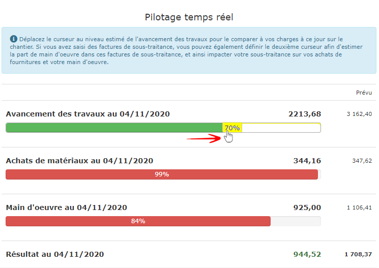

# Pilotage en temps réel

La vignette "Analyse du chantier" de la [page "Travaux"](la-fiche-chantier-en-detail.md#onglet-travaux) affiche un tableau de rentabilité de votre chantier. Mais bien souvent, si vous constatez une perte, il est déjà trop tard pour réagir.

## L'outil de pilotage

Ce petit outil graphique, extrêmement simple à utiliser, permet de s'assurer, à tout moment, que le chantier ne "dérape" pas, c'est à dire que les achats déjà réalisés et le temps passés correspondent à l'avancement du chantier, et soient cohérents par rapport aux prévisions de dépenses.

**Sur l'exemple ci-dessus, nous voulons estimer l'état du chantier lorsque l'avancement des travaux sera à 70%, simplement en déplaçant le premier curseur.**

### Le pilote met en évidence :

\*\*\*\*👉 **Les achats de matériaux sont pratiquement à 100%, alors que le chantier n'est qu'à 70% d'avancement :**

* Si tous les matériaux pour ce chantier ont déjà été achetés, tout est normal, puisque je n'aurais plus d'achat à faire jusqu'à la fin.
* Sinon, il faut s'inquiéter sur ce problème.

\*\*\*\*👉 **84% de la main d'œuvre prévue a déjà été utilisée :**

* Si le chantier nécessitait plus de monde au début qu'à la fin, cet écart peut être normal.
* Sinon, il faut là aussi s'inquiéter, le chantier est en train de déraper.


Que ces écarts soient justifiés ou non, le **pilotage temps réel** alerte immédiatement le responsable du chantier sur un éventuel dérapage, et met en évidence l'évolution des dépenses par rapport aux prévisions.


