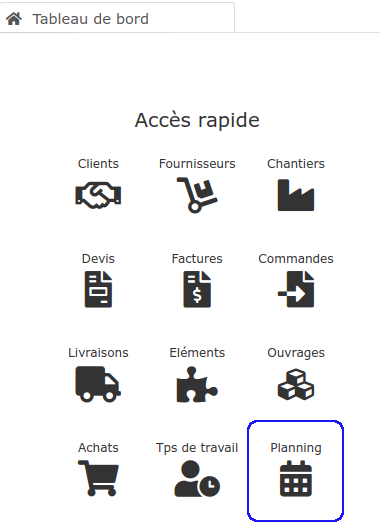
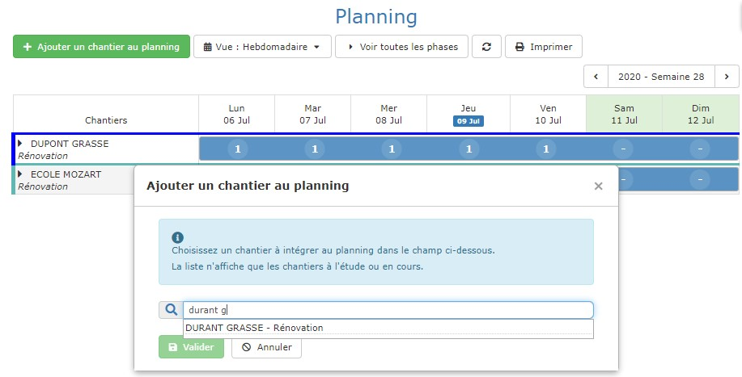
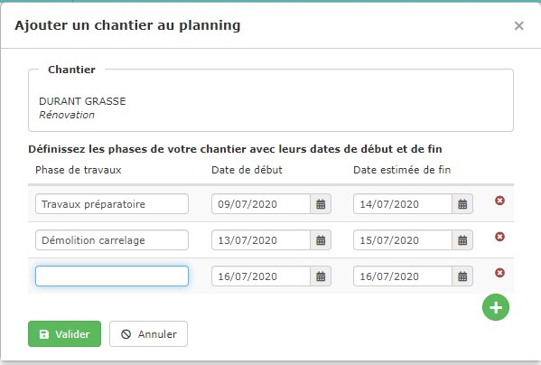
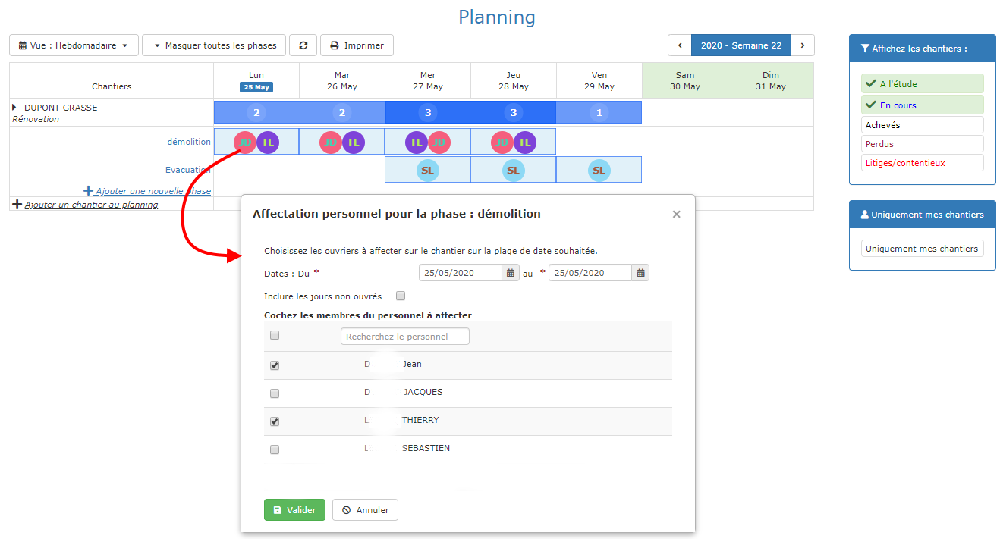

# 📎 Planning de chantiers

Le planning permet d'afficher sur une année, un mois ou une semaine la charge de travail de l'entreprise.

Les chantiers peuvent être découpés en phases pour plus de précision.

Enfin, les vues mensuelles et hebdomadaires permettent de prévoir le personnel qui sera affecté à chaque phase de chaque chantier.

## Ajouter un chantier au planning

:digit_one: Ouvrez le menu "Affaires > Planning"

:digit_two: Cliquez sur le bouton vert "Ajouter un chantier au planning"

:digit_three: Recherchez et sélectionnez un chantier à ajouter au planning

:digit_four: Ajoutez maintenant les différentes phases de votre chantier, en précisant pour chaque phase la date de début, et de fin.

## Affecter du personnel à un chantier

L'affectation du personnel aux phases du chantier permet au conducteur de travaux d'avoir une vue rapide du planning de la semaine et de l'affectation de son personnel.

Elle guide le personnel lors de leur [saisie des heures](../le-personnel/gestion-des-heures.md#saisie-des-heures-par-les-compagnons) sur smartphone, et simplifie votre validation de ces heures sous le logiciel.

