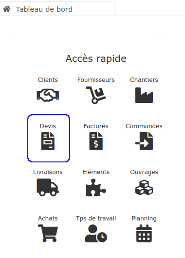

# 📝 Devis

Découvrez dans les chapitres suivants les outils mis à votre disposition pour gagner du temps et chiffrer vos chantiers avec précision, de manière simple. 

**Dans cette section, vous pourrez apprendre à : **

:point\_right: Ne pas oublier de [mention obligatoire au devis](les-indispensables-du-devis/mentions-obligatoires-au-devis.md)

:point\_right: [Créer un devis](les-indispensables-du-devis/creer-un-devis.md)

:point\_right: [Saisir correctement les lignes du devis](les-indispensables-du-devis/saisir-les-lignes-du-devis/), en apprenant à quoi sert le [menu de ligne](les-indispensables-du-devis/saisir-les-lignes-du-devis/le-menu-de-lignes.md), et comment [mettre en forme les lignes ](les-indispensables-du-devis/saisir-les-lignes-du-devis/mise-en-forme-des-lignes-traitement-de-texte.md)saisies (changer la police d'écriture, etc)

:point\_right: Proposer des [options et variantes](options-et-variantes.md) à vos clients

:point\_right: [Estimer automatiquement le temps à consacrer au chantier](les-indispensables-du-devis/prevoir-le-temps-passe.md)

:point\_right: Saisir [plusieurs taux de TVA](les-indispensables-du-devis/tva-multiple.md)

:point\_right: Gérer le [pied du devis](les-indispensables-du-devis/pied-du-devis.md), en ajoutant [remises](les-indispensables-du-devis/remise.md) et [déductions](broken-reference) 

:point\_right: Bénéficier de tous les avantages de la [synthèse du devis](les-indispensables-du-devis/synthese-du-devis.md)

Pour apprendre à créer un devis, à en saisir les lignes, et connaître tous les détails et avantages :


[Broken link](broken-reference)



[synthese-du-devis.md](les-indispensables-du-devis/synthese-du-devis.md)


Une fois votre devis créé :


[creer-une-attestation-de-tva.md](creer-une-attestation-de-tva.md)



[revision-et-copie-de-devis.md](revision-et-copie-de-devis.md)



[devis-type.md](devis-type.md)



[les-avenants.md](les-avenants.md)



[statut-des-devis.md](statut-des-devis.md)



[import-export.md](import-export.md)

